# SDRoxide User Manual

SDRoxide is a PowerSDR/Thetis-style software-defined-radio transceiver. It gives
you a panadapter and waterfall, dual VFOs, a full set of receive and transmit
controls, FT8/FT4 digital modes with an integrated logbook, a wideband CW
skimmer, and the ability to drive either a SoapySDR device or a CAT-controlled
radio (such as a Xiegu, Icom, or Yaesu) with audio over a USB sound card. The
same interface runs as a native desktop application, streams to a web browser,
or connects to a remote sdroxide server.

---

## Table of contents

1. [Feature overview](#1-feature-overview)
2. [Basic operation](#2-basic-operation)
3. [Digital modes (FT8, FT4, PSK31, RTTY, Olivia, THOR, FSQ, SSTV, RF Paint)](#3-digital-modes)
4. [Skimmers (CW, PSK, RTTY)](#4-skimmers)
5. [Radio and audio setup](#5-radio-and-audio-setup)
6. [Remote operation](#6-remote-operation)
7. [Web operation](#7-web-operation)
8. [Spotting, awards, and QSL upload](#8-spotting-awards-and-qsl-upload)
9. [Command-line reference](#9-command-line-reference)
10. [Configuration files](#10-configuration-files)
11. [Troubleshooting](#11-troubleshooting)
12. [Appendix: keyboard shortcuts, modes, bands](#12-appendix)

---

## 1. Feature overview

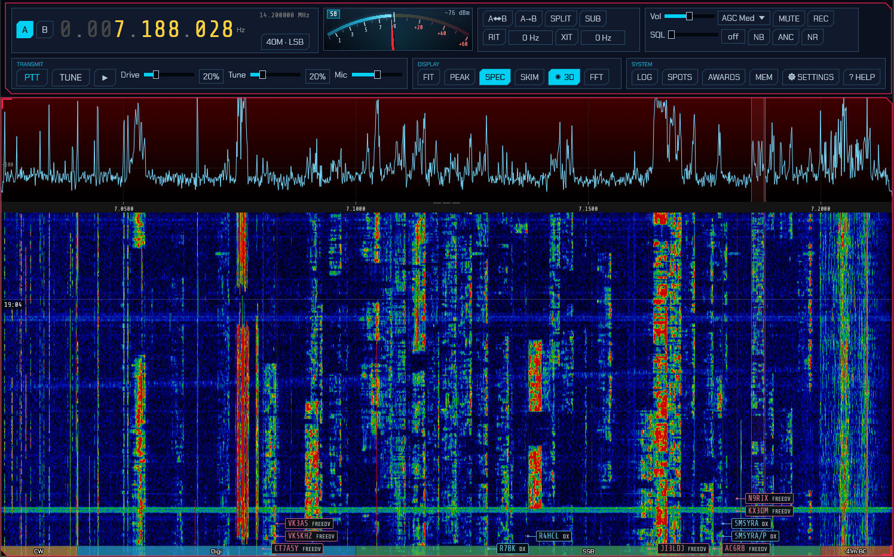

- **Panadapter and waterfall** with click/drag tuning, scroll-to-zoom, a
  draggable filter passband, a colour-coded band-plan strip, and eight
  selectable waterfall colour schemes (including an Icom-style palette).
- **Dual VFO (A/B)** with split operation, VFO swap/copy, and a sub-receiver on
  the inactive VFO.
- **All the common modes:** LSB, USB, CW, AM, SAM, NFM, WFM, DIGU, DIGL, DSB, a
  spectrum-only mode (SPEC), the automatic digital modes **FT8** and **FT4**, the
  keyboard modes **PSK31**, **RTTY**, **Olivia**, **THOR** and **FSQ**, image
  **SSTV**, and the transmit-only **RF Paint** (spectrum-painting) mode.
- **Receive controls:** AGC (Off/Slow/Med/Fast), volume, mute, squelch, an
  impulse noise blanker, an adaptive auto-notch (constant-tone canceller),
  noise reduction (neural RNNoise or spectral, three levels each), RIT, and a
  draggable filter passband.
- **Transmit** (on TX-capable rigs): PTT, TUNE, drive and tune-drive levels,
  mic gain, XIT, and a transmit meter (power / SWR / ALC). A ham-band-only
  transmit lockout is on by default. While transmitting, the panadapter shows a
  **monitor of your own signal**: wideband IQ rigs display it at its on-air
  frequency in the full span; CAT rigs and digital modes show a narrow
  transmit-sideband scope (an approximation built from the outgoing audio).
- **FT8 / FT4** with a live decode list, automatic QSO sequencing, a world map,
  a transcript, and automatic logging.
- **Integrated logbook** for digital and manual QSOs, with contest and QSL
  fields, a worked-before check, ADIF import/export and text export.
- **Live spotting** — a DX cluster (telnet) plus POTA, SOTA and PSK Reporter
  feeds shown as clickable markers on the panadapter and world map; click to tune
  and pre-fill a log entry.
- **Callsign lookup and QSL upload** — QRZ/HamQTH name/QTH/grid auto-fill, and
  one-click (or automatic) upload to eQSL, QRZ Logbook and Club Log, with LoTW
  ADIF export and confirmation download.
- **Award tracking** — live DXCC / WAS / WAZ / grid tallies, worked vs confirmed.
- **Wideband skimmers** — a CW skimmer plus PSK31 and RTTY skimmers that decode
  many signals at once and label them on the waterfall.
- **Four radio backends:** SoapySDR devices, OpenHPSDR (Hermes/Metis) Ethernet
  SDRs, a TCI server (ExpertSDR3/Thetis), or a CAT-controlled radio with audio
  over a USB sound card (demodulated audio or stereo IQ).
- **Memory channels** and per-band memory of your last frequency/mode/filter.
- **Solar system 3D view** (native only) — the Sun, Earth and Moon with their
  orbits, live NASA SDO solar imagery, sunspot regions and CME trajectory cones,
  an arrival estimate when one is headed our way, the live auroral oval standing
  over the globe with a Kp forecast for tonight, live amateur-satellite orbits
  with click-through pass predictions, your FT8 contacts arcing between stations,
  and a propagation panel with MUF, Kp/A, F10.7 and the current GOES X-ray level.
- **Remote and web operation:** run headless as a server and control it from a
  browser or from a second sdroxide instance over the network.

---

## 2. Basic operation

### 2.1 Launching

Start the native application with no arguments to use your configured radio:

```
sdroxide
```

To try the interface with no hardware, use the built-in signal generator:

```
sdroxide --siggen
```

See the [command-line reference](#9-command-line-reference) for all options.

### 2.2 The main window

The window has two parts: a **top control bar** of captioned modules that reflow
onto more rows as the window narrows, and the **panadapter** (spectrum plus
waterfall) filling the rest of the window. In FT8/FT4 the lower part of the
window is shared with the digital operating panel.


The control-bar modules, left to right, are: Frequency, S-meter, Band/Mode,
VFO, RIT/XIT, Receiver, Filter/Noise, Transmit (TX-capable rigs only), Display,
FFT, and System.

### 2.3 Tuning

**The frequency readout** is a ten-digit display. Hover over any digit and:

- **Scroll the mouse wheel** to tune that decade up or down.
- **Click the upper half** of a digit to increment it, the **lower half** to
  decrement it.

The smaller grey number below the readout is the *inactive* VFO's frequency.

**On the panadapter:**

- **Scroll the wheel** to zoom in and out around the cursor.
- Press **F** to reset the view to the full receiver span.
- **Left-click** tunes the active VFO to the clicked frequency. **Shift+click**
  tunes VFO B instead.
- **Left-drag** grabs the spectrum and slides it (the tuning moves with the
  content).
- **Right-drag** pans the view only, without changing tuning.
- **Shift+drag** measures bandwidth: a horizontal ruler with dotted vertical
  markers appears between where you pressed and the current pointer, showing the
  **start and end frequencies** at the markers and the **frequency span** (e.g. a
  signal's width) below. It works on both the spectrum and the waterfall. When you
  release the button the measurement lingers and fades out over about five
  seconds, so you can read it after letting go.


**Keyboard tuning** (ignored while typing in a text field):

- **Left / Right arrow:** ±100 Hz (with **Shift**, ±10 Hz).
- **Up / Down arrow:** ±1 kHz.
- **Page Up / Page Down:** ±10 kHz.


**Band-plan strip.** A colour-coded strip along the bottom of the waterfall
labels the allocations. Zoomed out it shows coarse bands (ham, broadcast, CB,
AM); zoomed into a ham band it splits into the CW / digital / SSB / beacon
sub-segments. When you zoom in close (a span of ~100 kHz or less), the digital
sub-band is broken out into the individual popular modes — **FT8, FT4, JS8,
WSPR, QRSS, PSK, RTTY, SSTV** — each in its own colour. Because several of these
overlap in frequency (for example WSPR and QRSS sit inside the RTTY sub-band),
overlapping modes are drawn as **separate stacked rows** above the main strip so
each stays readable.

### 2.4 Bands and modes

Click the **Band / Mode** chip (which reads, for example, `20M · USB`) to open a
popup with three rows:

- **BAND:** `160M 80M 60M 40M 30M 20M 17M 15M 12M 10M 6M 2M GEN`. Each band
  remembers your last frequency, mode, and filter.
- **MODE:** `LSB USB CW AM SAM NFM WFM DIGU DIGL DSB SPEC`.
- **DIGITAL:** `FT8 FT4 PSK RTTY OLIVIA THOR FSQ SSTV RFPAINT` (see
  [Digital modes](#3-digital-modes)).

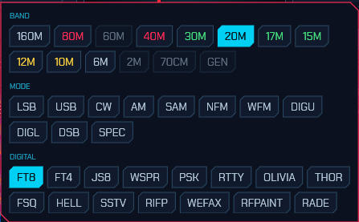

See the [appendix](#12-appendix) for what each mode is.

### 2.5 VFOs, split, and the sub-receiver

The **VFO** module has:

- **A / B** select chips in the Frequency module (the active VFO is highlighted).
- **Swap VFOs** — exchange A and B.
- **Copy A to B** — copy the active VFO to the other.
- **SPLIT** — transmit on one VFO and receive on the other.
- **SUB** — enable a second receiver on the inactive VFO (routed to the right
  ear). The inactive VFO's marker on the panadapter brightens when SUB is on.

### 2.6 RIT and XIT

The **RIT / XIT** module offsets receive (RIT) and, on TX-capable rigs, transmit
(XIT) without moving the dial. Toggle **RIT** (or **XIT**) on, then set the
offset in the adjacent field (±9999 Hz in 5 Hz steps).

When either is enabled, the offset is drawn on the panadapter: RIT shows a dashed
grey **dial reference** line (the receive marker and passband already sit at
dial + RIT) with a blue labelled bracket back to the dial, and XIT shows a green
**TX marker** line with a green labelled bracket from the transmit base to
dial + XIT — so you can see at a glance how far RX and TX are shifted.


### 2.7 Receiver controls

- **AGC** — a drop-down: `Off`, `Slow`, `Med`, `Fast`.
- **Vol** — audio volume.
- **MUTE** — mute the receiver (keyboard shortcut **M**).
- **SQL** (Filter/Noise module) — squelch; below the open threshold it reads
  `off`.
- **NB** — impulse noise blanker on the raw signal (keyboard shortcut **N**).
- **ANC** — automatic notch: an adaptive filter that cancels **constant tone
  elements** — heterodynes, carriers, and tuner-uppers — while leaving voice and
  noise. Toggle it on when a steady whistle is spoiling a voice signal. (Like NR,
  it affects only what you hear, not the digital decoders; leave it off for CW
  and data modes, whose signals *are* tones.)
- **NR** — noise reduction on the audio, with two selectable engines. Click it
  to cycle **Off → AI Low → AI Med → AI High → NR Low → NR Mid → NR High → Off**:
  - **AI Low/Med/High** — a neural **RNNoise** denoiser. Trained on speech, it
    recognises the *voice* and mutes everything else, so it clears non-stationary
    junk that spectral NR can't — babble, wind, keyboard/shack noise, fluttering
    hiss — with little of the underwater warble. The three levels are a
    wet/dry depth: AI High is the full effect, AI Low a lighter touch.
  - **NR Low/Mid/High** — the classic **spectral** noise reduction: it suppresses
    the stationary noise floor while letting the changing, speech-like parts
    through. Fast and predictable on steady static and hiss.

  Both make voice quieter to listen to and easier to copy with less fatigue.
  Higher settings remove more noise but can add faint artefacts on weak signals,
  so pick the lowest level that cleans the audio; on a noisy voice signal, start
  with **AI Med**. (NR affects only what you hear; the FT8/FT4/PSK/RTTY decoders
  still receive the untouched signal, and a steady unmodulated carrier — a
  heterodyne — is treated as noise and suppressed.)

**The receive filter** is set by dragging the passband edges directly on the
panadapter: two vertical grip lines mark the filter's low and high edges (they
brighten to orange when you can grab them). Drag an edge to widen or narrow the
passband. The grips work on both the spectrum and the waterfall.

### 2.8 The display and FFT controls

**Display module:**

- **FIT** — auto-set the waterfall floor and ceiling for the best contrast.
- **PEAK** — show a decaying peak-hold trace over the spectrum.
- **SPEC** — show or hide the spectrum line above the waterfall (lit when the
  spectrum is shown).
- **SKIM** — opens the skimmer popup (per-skimmer on/off and squelch); lit while
  any skimmer runs. See [Skimmers](#4-skimmers).
- **☀ 3D** — open the [solar system 3D view](#212-solar-system-3d-view) in its
  own window. Native only; the button is absent in the browser client.

**FFT module:**

- **floor** / **ceil** — the waterfall's dB range.
- **FFT** size — `2048`, `4096`, `8192`, `16384`, or `32768`.

The **waterfall colour scheme** and the **spectrum background gradient** are set
on the **UI** tab of the Settings window (see
[radio and audio setup](#5-radio-and-audio-setup)). The colour scheme is one of
`Classic`, `Viridis`, `Gray`, `Icom`, `Neon`, `Synthwave`, `Matrix`, or `Tron`;
the gradient fills the spectrum area from a top colour down to a bottom colour
(default dark red → black) and can be turned off.

You can also resize the split between the spectrum line and the waterfall by
dragging the frequency-scale strip between them.

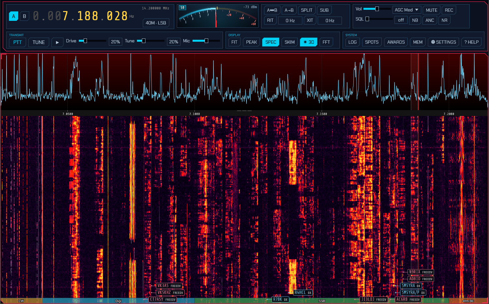

### 2.9 The S-meter

The **S-meter** reads S0 (−127 dBm) through S9 (−73 dBm) and beyond, with the
bar turning red past S9. It shows the S-unit (for example `S9+20`) and the level
in dBm. On transmit it is replaced by a transmit meter showing power, SWR, and
ALC as the rig reports them.

### 2.10 Transmit

On a TX-capable rig the **Transmit** module appears:

- **PTT** — key the transmitter.
- **TUNE** — send a carrier at the tune-drive level for tuning an ATU.
- **Drive** — transmit drive (0–100%).
- **Tune** — the (lower) drive level used by TUNE.
- **Mic** — microphone gain.

> **Transmit safety:** by default sdroxide refuses to transmit outside the
> amateur bands (`tx_ham_only`). Transmit hardware gains start at minimum and
> the tune drive defaults low. Raise drive deliberately.

On a rig with its own power control (TCI), Drive and Tune command the rig's
output power directly — and both sliders adopt the rig's current settings when
sdroxide connects, so a level you set in ExpertSDR3 carries over instead of
being overwritten.

### 2.11 Memory channels

Open **MEM** (System module) for the memory channels window. Type a name and
press **Store** to save the current frequency and mode. Each saved row has a
**RCL** (recall) button and a **DEL** (delete) button.


### 2.12 Solar system 3D view

The **☀ 3D** button in the Display module opens a second window showing the Sun,
Earth and Moon in three dimensions, with live solar imagery, sunspot regions and
coronal-mass-ejection trajectories. This enables operators to see if anything is 
on its way here, and when it will arrive.

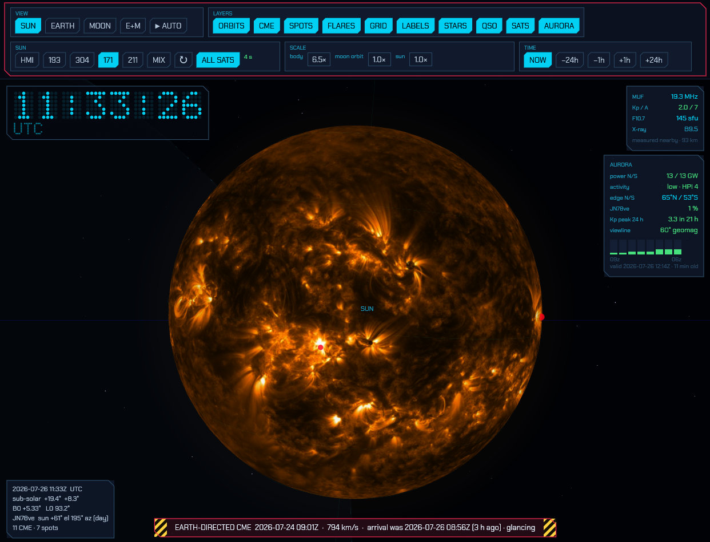

The Earth wears the same coastline data as the FT8 world map, lit by the real
Sun with a soft terminator, and your QTH is marked with a green ring once you
zoom in far enough for a point on the surface to mean anything.

The Earth carries the same coastlines as the FT8 map, your QTH is the green
ring, and the yellow dot is the point the Sun is directly overhead.

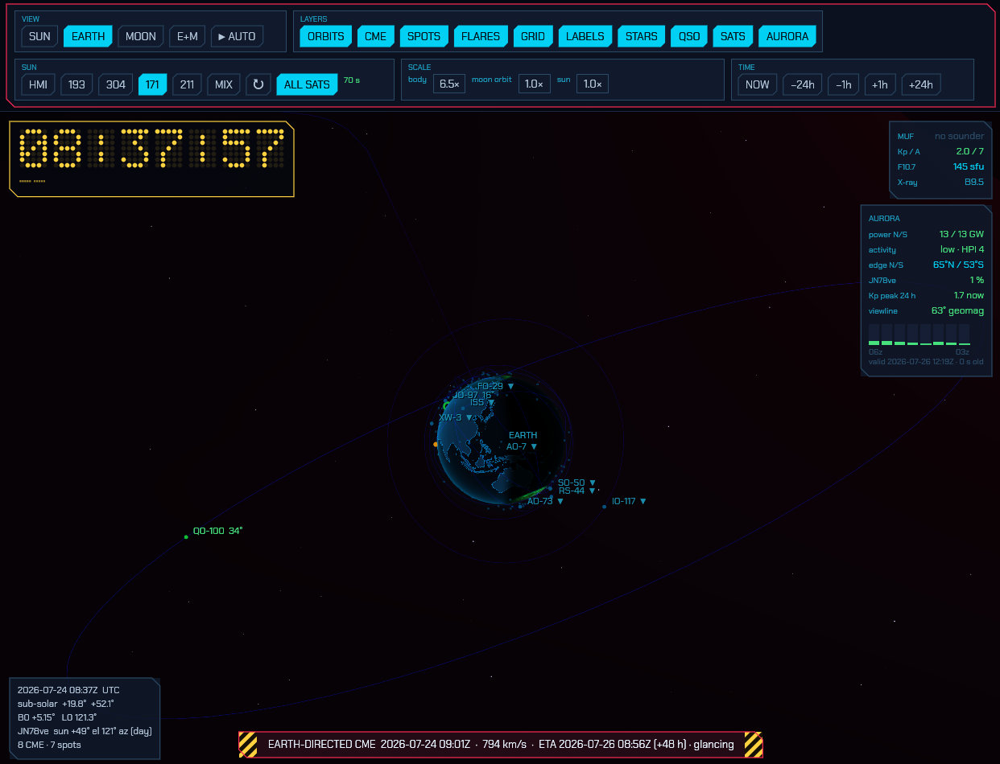

**Mouse:**

| Action | Effect |
| --- | --- |
| Drag | Rotate around the focused body |
| Scroll | Zoom in and out |

Any mouse input cancels **AUTO**.

**View** — pick what the camera pivots around: `SUN`, `EARTH`, `MOON`, or `E+M`
(the Earth–Moon midpoint). **▶ AUTO** flies a continuous camera path through
eight framed viewpoints — overhead of the whole system, over the Earth's
shoulder towards the Sun, face-on to the solar disk, along the day/night
terminator, over the Sun's pole, a diagonal on the Earth–Moon pair, a long look
back at the Earth from out by the Sun, and a wide inner-system view. The path is
a spline through those viewpoints, so the camera curves between them rather than
stopping and restarting at each. Moving between viewpoints that frame different
bodies flies the camera across the gap — Earth to Sun is a 1 AU trip — rather
than cutting; it holds each one for ten to sixteen seconds
with a slow drift, and the whole loop takes about two minutes. Re-enabling AUTO
picks up at whichever viewpoint is nearest your current view.

**Layers** — `ORBITS` (Earth and Moon paths, sampled from the real ephemeris, so
they are the true eccentric orbits), `CME`, `SPOTS`, `FLARES`, `GRID` (the solar
rotation axis, equator and heliographic parallels), `LABELS`, `STARS`, `QSO`,
`SATS` and `AURORA`.

**The AURORA layer** puts the auroral oval on the globe, live, from NOAA's
OVATION model — a 1°×1° grid of the probability of seeing aurora, issued every
few minutes and valid about forty minutes ahead.

It is drawn as a stack of glowing shells at the altitudes the atmosphere
actually radiates at, not as a texture painted on the surface, and everything
about how it looks falls out of that. The colour changes with height because the
emission lines do: green oxygen at 557.7 nm around 110 km, the forbidden red
line at 630 nm hundreds of kilometres above it, and a violet nitrogen fringe
underneath when the precipitation is hard — which is why a quiet oval is green
and a storm goes crimson at the top. The limb is far brighter than the disk,
because a grazing line of sight crosses a great deal more of every shell, giving
the thin bright ribbon on the horizon that is the most recognisable thing about
aurora seen from orbit. The fine structure runs in arcs along the oval and in
rays through the stack, because auroral precipitation is field-aligned. And
because the emission is only *drowned out* by daylight rather than stopped by
it, the sunlit half of the oval fades to a floor rather than to nothing — you
can still see where it is.

The structure is shaping, not invention: it multiplies what the grid says and
can never put aurora where NOAA has none. **The green contour on the surface is
the honest boundary** — the equatorward edge of the 10 % line, straight off the
grid, drawn to be compared against your own latitude. It bulges towards the
equator on the night side and over the magnetic poles, which is where it really
does; the southern oval reaches much lower geographic latitudes than the
northern one for exactly that reason.

**Aurora panel** — under the propagation numbers on the right:

| Row | What it is |
| --- | --- |
| `power N/S` | Gigawatts being deposited in each auroral zone. This is the number that says how big the event is. |
| `activity` | The same figure as NOAA's Hemispheric Power Index, 1–10, with a word for it. Yellow from HPI 6, pink from 8. |
| `edge N/S` | How far towards the equator the 10 % contour reaches in each hemisphere, read off the grid. |
| *your grid square* | The probability of visible aurora directly over your QTH. Green when there is anything at all, yellow past 10 %, pink past 25 %. |
| `Kp peak 24 h` | The worst three-hour bin still ahead of you in NOAA's planetary K forecast, and how far away it is. |
| `viewline` | Roughly how far towards the equator that Kp puts the aurora, as a **geomagnetic** latitude. A rule of thumb — see below. |

Under the rows, one bar per three-hour bin over the next day: the shape answers
"is it worth staying up" faster than eight numbers would. Green is quiet, yellow
worth watching, pink a storm. The footer says what the picture is *valid for*
and how old the fetch is — never what time it is now, because the grid is a
forecast for about forty minutes ahead and may itself be half an hour old.

The `viewline` row is the one number here that is not measured. It is a
straight-line fit to SWPC's published table (66.5° at Kp 0, falling about 2° per
unit of Kp) and it says nothing about cloud, moonlight or how dark your sky is;
geomagnetic latitude is also several degrees from geographic at most longitudes.
The oval on the globe needs none of those caveats, so prefer it when the two
seem to disagree.

**The SATS layer** puts amateur-radio satellites in orbit around the globe, live,
propagated with SGP4 from CelesTrak element sets. Ten popular ones are drawn by
default with their orbit rings — QO-100, the ISS, AO-7, FO-29, SO-50, AO-73,
JO-97, RS-44, XW-3 and IO-117. Geostationary orbits are green, low ones cyan.
`ALL SATS` in the Sun module adds every satellite in the amateur element set as a
plain dot; the orbit rings stay on the curated few, because ninety rings at once
is unreadable.

With `LABELS` on, each of the curated satellites is named with **its elevation
from your QTH right now** — a number means it is above your horizon and
workable, `▼` means it is not.

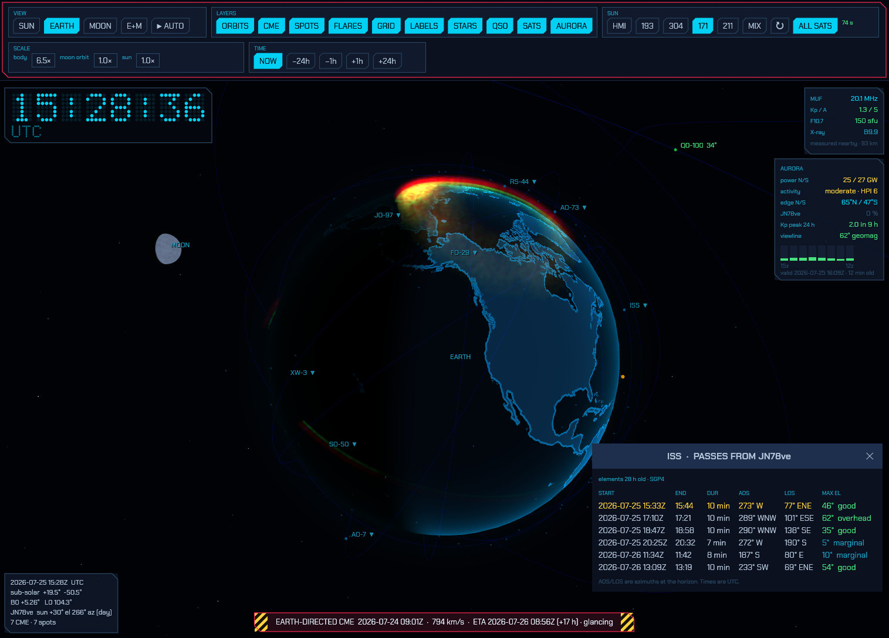

**Click a satellite's label** for its pass table:

| Column | Meaning |
| --- | --- |
| `START` / `END` | Rise and set times, UTC |
| `DUR` | How long the pass lasts |
| `AOS` / `LOS` | Azimuth at the horizon on acquisition and loss — where to point, and where it ends up |
| `MAX EL` | Highest elevation reached, with a word for how good that makes the pass |

A pass already under way is shown in green, one starting within the hour in
yellow. QO-100 is geostationary, so instead of a table it tells you the fixed
azimuth and elevation to point at — it never sets. A satellite whose orbit never
reaches your latitude says so rather than showing an empty table. Click the label
again, or close the window, to dismiss it.

Predictions come from SGP4 on the current element set, and the window shows how
old those elements are. A day-old TLE is good to a second or so on rise time; a
week-old one is not, which is why the age is on display.

**The QSO layer** puts your FT8/FT4 traffic on the globe. Every station decoded
in the last two minutes is a white dot that fades as it ages — the same set the
flat map in the FT8 panel shows, so the two never disagree. The station you are
working is joined to your QTH by a cyan arc, and a decode you have clicked but
not yet answered by a yellow one. The arcs are true great circles lifted off the
surface, bowing further out the longer the path: an antipodal contact springs
well clear of the planet, which is the only way both ends stay visible at once
on a sphere. While you transmit, a bright pulse runs along the arc.

**Sun** — which SDO product wraps the Sun:

| Chip | Product |
| --- | --- |
| `HMI` | HMI continuum — white light. **This is the one that shows sunspots.** |
| `193` | AIA 193 Å — corona and coronal holes |
| `304` | AIA 304 Å — chromosphere and filaments |
| `171` | AIA 171 Å — quiet corona and coronal loops |
| `211` | AIA 211 Å — active-region corona |
| `MIX` | The 211/193/171 composite |

`↻` fetches everything again immediately. Next to the chips is the age of the
solar image — green when it is current, yellow when the last fetch failed and
you are seeing a cached picture, pink when there is nothing at all. It always
tells you what you are actually looking at; a cached image is never presented as
a live one.

**Scale** — the Earth is 23 000 times smaller than its distance from the Sun, so
at true scale it is invisible whenever the Sun is in frame. `body` exaggerates
Earth and Moon radius (default 20×) and `moon orbit` stretches the
Earth–Moon distance. **Positions are never exaggerated** — only sizes — so the
orbits and the CME geometry stay physically truthful. Body scale is capped
against the moon-orbit scale, because past that point the enlarged Moon would
render inside the Earth. Every body also has a glow with a minimum on-screen
size, so nothing is ever invisible however you set these.

**Time** — `NOW`, `−24h`, `−6h`, `+6h`, `+24h` scrub the whole scene, bodies and
all, forwards and backwards.

**Clock** — a UTC time readout sits in the top-left corner. Scrubbing the time 
with the `±6h`/`±24h` chips turns it yellow and relabels it `SIM`, denoting  
that the time displayed is not the current real time.

**Propagation panel** — top right, the numbers worth checking before you call CQ:

| Row | What it is |
| --- | --- |
| `MUF` | Maximum usable frequency for a 3000 km path near your QTH, interpolated from the ionosonde network. Green above 24 MHz, cyan above 14, yellow below. |
| `Kp / A` | Planetary geomagnetic indices. Green when quiet, yellow from Kp 4, pink from Kp 5 (a storm — polar paths degrade and aurora becomes possible). |
| `F10.7` | 10.7 cm solar radio flux in solar flux units, the standard proxy for ionisation. Under about 90 the high bands stay shut; over 150 they open up. |
| `X-ray` | Current GOES soft X-ray class. Turns pink at M class and above, which is when the D layer starts absorbing HF on the daylit side. |

The line under the MUF says how far away the nearest contributing ionosonde is
and how much to trust the number. MUF is interpolated, not measured at your
location, and the ionosphere changes sharply across the day/night terminator —
a value drawn from sounders 3000 km away on the other side of it is a guess, and
the panel says so rather than hiding it. When no sounder is in range it reads
`no sounder`.

**Readouts** — the card at the bottom left gives UTC, the sub-solar point, the
solar disk's B0 and L0 angles, the Sun's elevation and azimuth from your QTH
(and whether it is day or night there), and how many CMEs and sunspot groups are
being shown. When an Earth-directed CME is in the data, a banner across the
bottom names it with its speed and estimated arrival:

```
EARTH-DIRECTED CME  2026-07-10 09:48Z  ·  516 km/s  ·  ETA 2026-07-12 14:20Z (+38 h)
```

Arrival is a straight-line constant-speed estimate from the fitted cone. Proper 
forecasts model the CME's drag against the solar wind and are typically good to 
about ±6 hours; treat this the same way.

**Where the data comes from.** This is the only part of sdroxide that makes
outbound internet connections, and it only does so **while this window is
open** — closing it stops the background fetcher entirely, and never opening it
means no request is ever made. Three hosts are contacted:

| Host | Data | Refresh |
| --- | --- | --- |
| `sdo.gsfc.nasa.gov` | Solar disk imagery (NASA SDO — AIA and HMI) | 10 min |
| `kauai.ccmc.gsfc.nasa.gov` | CMEs and solar flares ([NASA CCMC DONKI](https://ccmc.gsfc.nasa.gov/tools/DONKI/)) | 20 min |
| `services.swpc.noaa.gov` | Sunspot regions, planetary K/A, 10.7 cm flux, GOES X-ray level (NOAA SWPC) | 5–60 min |
| `services.swpc.noaa.gov` | The OVATION auroral oval grid, auroral hemispheric power, and the three-day planetary K forecast | 15–60 min |
| `prop.kc2g.com` | Ionosonde soundings for the MUF estimate (GIRO network, aggregated by KC2G) | 15 min |
| `celestrak.org` | Orbital element sets for the amateur satellites | 6 h |

Everything fetched is cached under `solar/` in the config directory and is
loaded *before* the first network request, so the window opens instantly with
the last data it had and stays useful with no connection at all.

The OVATION grid is issued every five minutes but fetched every thirty: it is
900 kB, by far the largest thing here after the solar imagery, and the oval does
not move far in half an hour. Nothing is hidden by that — the aurora panel says
what the picture is valid for, so a half-hour-old forecast is labelled as one
rather than presented as this instant's sky.

Sunspot markers are sized by each region's real spot area and coloured by NOAA's
own next-24-hour flare probability — grey for quiet, yellow for likely, pink for
a region worth watching. Regions on the far side of the Sun are hidden by the
Sun itself, as they should be. CME cones grow from the Sun at the measured
speed, so the picture is a direct read-out of where the plasma has got to; a
cone drawn faint has its direction estimated from the source region rather than
fitted, and cones are coloured cyan through pink with increasing speed.

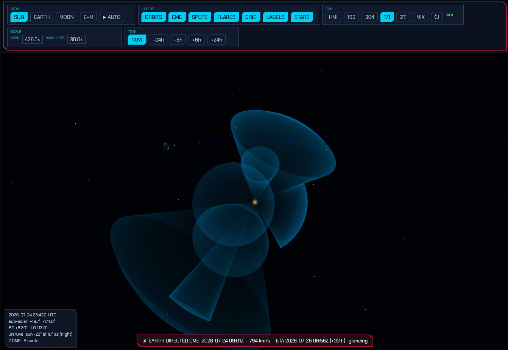

*Credits: solar imagery courtesy of NASA/SDO and the AIA and HMI science teams;
CME and flare data from NASA CCMC's DONKI; sunspot regions, geomagnetic indices,
solar flux, X-ray data and the OVATION aurora model from NOAA SWPC; ionosonde
soundings from the GIRO
network via [prop.kc2g.com](https://prop.kc2g.com/); satellite element sets from
[CelesTrak](https://celestrak.org/), propagated with SGP4.*

---

## 3. Digital modes

sdroxide has several families of digital mode. **FT8** and **FT4** are automatic,
timeslot-based modes with QSO sequencing, a world map, and automatic logging
(3.1–3.5). **PSK31**, **RTTY**, **Olivia**, **THOR** and **FSQ** are live keyboard
modes: you tune onto a signal, read the decoded text, and type a reply that
transmits as you go (3.6–3.7). **SSTV** is an image mode: received pictures build
up in a gallery and you transmit composed images (3.8). **RF Paint** is a
transmit-only mode that draws text and pictures directly onto the far station's 
waterfall (3.9).

### 3.1 Entering the mode

Open the Band/Mode popup and choose **FT8** or **FT4** from the DIGITAL row. The
panadapter locks to the digital sub-band (the audio range just above the dial),
and the FT8/FT4 operating panel appears in the lower part of the window. A
draggable divider sets how much height the panel gets.

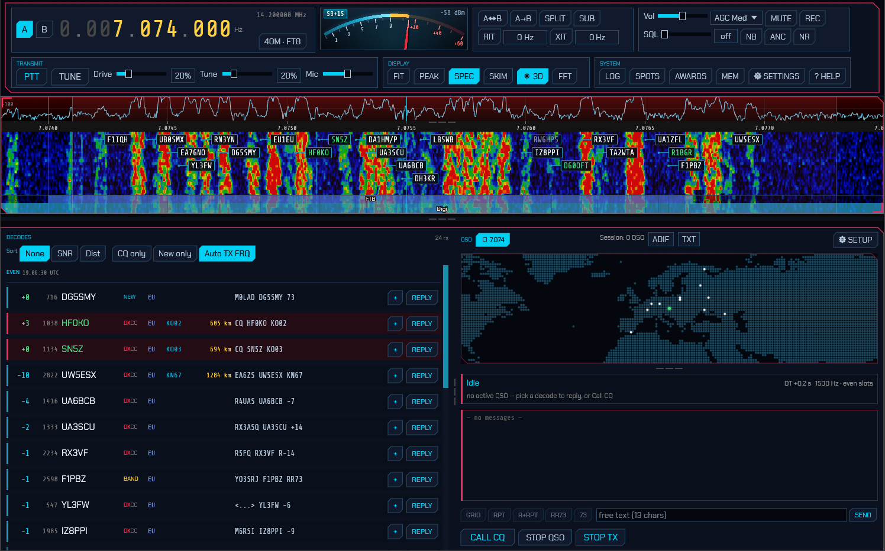

While in a digital mode a **FT8 FREQUENCIES** (or **FT4 FREQUENCIES**) row of
band chips appears in the Band/Mode popup. Click one to jump the dial to the
standard calling frequency for that band; a chip highlights when the dial is
already on it.

### 3.2 One-time setup: your callsign and grid

Click **SETUP** in the QSO area to open the **FT8 / FT4 Setup** window:

- **My callsign** — your call (entered in upper case).
- **My grid** — your Maidenhead grid locator (for example `FN42`).
- **TX period** — whether you call in the **Even** or **Odd** time slots.
- **Auto-sequence** — advance the QSO automatically (recommended on).
- **Message templates** — the CQ / Grid / Report / R+Report / RR73 / 73 lines,
  using the placeholders `{MYCALL}`, `{MYGRID}`, `{DX}`, and `{REPORT}`. The
  defaults follow standard FT8 practice; you rarely need to change them.


These settings are saved to `digi.json` (see [configuration files](#10-configuration-files)).

### 3.3 The operating panel

The panel has two halves:

- **DECODES** (left) — a live list of decoded stations. Each row shows the SNR
  (colour-coded by strength), the audio frequency, the callsign, the grid, and
  the full message, with a **REPLY** button on the right. CQ calls are
  highlighted. Decoded stations are also marked as boxes on the waterfall.
- **QSO** (right) — a world map (your location, the station you are working, and
  a transmit indicator), a station card showing the current step
  (`Idle`, `Calling CQ`, `Tx Grid`, `Tx Report`, `Tx R+Report`, `Tx RR73`,
  `Tx 73`, `Done`), and a transcript of the exchange (outgoing and incoming
  lines, plus the queued next message).

### 3.4 Working stations

- **Answer a call:** click **REPLY** on a decode. sdroxide adopts that station,
  picks the opposite time slot, and runs the exchange automatically.
- **Call CQ:** click **CALL CQ**. The first station that answers becomes your
  QSO.
- **Set your transmit tone:** click a decode row (or click a station box on the
  waterfall) to set your transmit audio frequency to that station's frequency.
  The audio frequency is clamped to 200–3500 Hz.
- **Stop:** **STOP QSO** ends the current QSO gracefully; **STOP TX** aborts the
  current transmission immediately and un-keys.

Transmission happens automatically in your chosen time slot (FT8 slots are 15 s,
FT4 slots are 7.5 s) and goes through the normal transmit path, so the ham-band
lockout and transmit safety still apply.

### 3.5 Logging and the logbook

Completed FT8/FT4 QSOs are logged automatically. Open the full logbook with the
**LOG** button (System module).

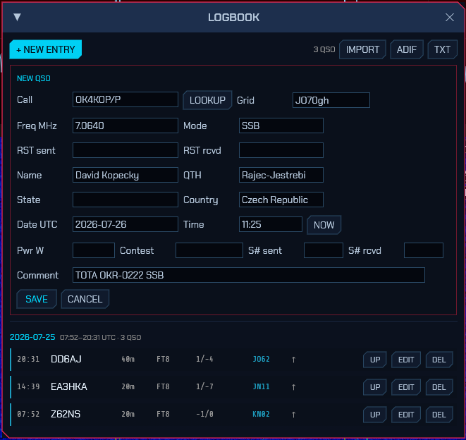

The logbook lists QSOs grouped by day (newest first) and covers both digital and
manual entries. You can:

- **+ NEW ENTRY** — add a manual QSO. Besides the basics (Call, Grid, Freq MHz,
  Mode, RST sent/received, Date/Time UTC with a **NOW** button, comment) the form
  carries **Name, QTH, State, Country**, transmit **Pwr**, and **Contest** fields
  (contest id and sent/received serial numbers). If you've already worked that
  call on the band, a **⚠ WORKED BEFORE** badge appears. Press **LOOKUP** to
  fill name/QTH/grid from your callsign-lookup provider (see
  [§8.2](#82-callsign-lookup)).
- **EDIT** / **DEL** — edit or delete an entry. Editing preserves fields the form
  doesn't show (resolved DXCC/zones, QSL status).
- **IMPORT** — load QSOs from an ADIF (`.adi`) file. Imported records are
  de-duplicated against the log (same call + band within two minutes are skipped).
- **ADIF** — export the whole log to `sdroxide-log.adi` (also the file you sign
  with TQSL for LoTW).
- **TXT** — export the whole log to `sdroxide-log.txt`.

A small status column on each row shows QSL state: a green **✓** once a QSO is
confirmed (LoTW, eQSL or card), a dim **↑** once it has been uploaded but not yet
confirmed. Hover it for the per-service detail.

Records also hold the fields used by lookup, upload and awards — DXCC entity,
CQ/ITU zones, IOTA and POTA/SOTA references, and per-service QSL status. See
[§8. Spotting, awards, and QSL upload](#8-spotting-awards-and-qsl-upload) for the
one-click upload buttons and award tracking.

The log is stored in `qso_log.json`.

### 3.6 PSK31 and RTTY

Choose **PSK** or **RTTY** from the DIGITAL row of the Band/Mode popup. As with
FT8/FT4 the panadapter switches to a zoomed sub-band waterfall, but the lower
panel is a live **messaging area** instead of a QSO sequencer.

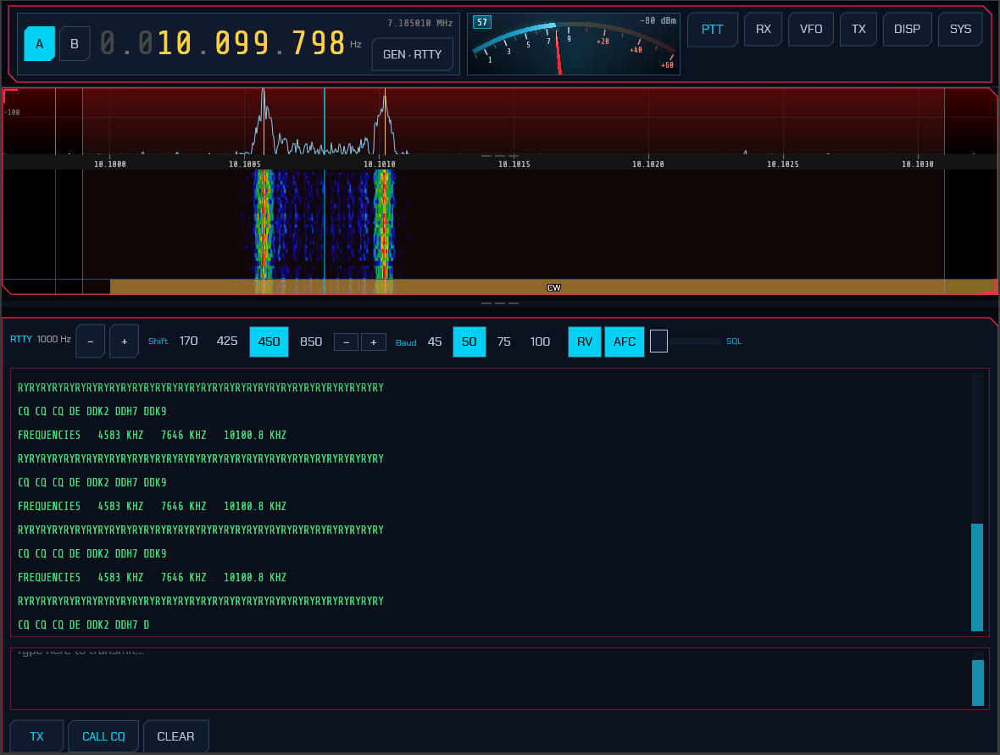

**Receiving:**

- Decoded text streams into the receive window as signals are copied.
- Tune exactly onto a signal with the **−/+** buttons (±10 Hz) — or click its
  skimmer label (see [Skimmers](#4-skimmers)). In RTTY, two amber
  lines on the waterfall mark the expected mark/space tones to tune between.
- The **SQL** slider in the panel header is a decode squelch: raise it until the
  window stops filling with garbage when no signal is present, lower it (to the
  left) to copy weaker signals. It applies to every keyboard mode
  (PSK/RTTY/Olivia/THOR/FSQ).

**Transmitting (type-ahead):**

- Type your reply in the transmit box and press **TX** to key up. Text is sent as
  you type; characters that have already gone out turn **green**, so you can
  watch the transmission catch up when you pause.
- **CALL CQ** loads a CQ macro and starts sending it; **CLEAR** empties the
  buffer and stops; pressing **TX** again unkeys.

**Settings (PSK/RTTY setup dialog):**

- **PSK** is BPSK31 — differential BPSK with the standard varicode alphabet.
- **RTTY** defaults to 45.45 baud, 170 Hz shift, Baudot (ITA2). **Shift**
  (170 / 425 / 850 Hz) and **Baud** (45 / 50 / 75) are selectable.
- Your callsign and grid (shared with the FT8/FT4 setup) fill the CQ macro.

**Skimmers:** the PSK and RTTY skimmers (see [Skimmers](#4-skimmers)) label
signals across each band's PSK/RTTY calling sub-bands. Clicking a label from any
mode switches to PSK or RTTY, tunes onto the signal, and opens this panel.

### 3.7 Olivia, THOR and FSQ

Three more keyboard modes are on the DIGITAL row. **Olivia** and **THOR** reuse
the same messaging panel as PSK/RTTY; each mode's submode is chosen on its setup
page (**⚙ SETUP**):

- **Olivia** — a slow, extremely robust MFSK mode with Walsh/Hadamard block
  coding. Choose the **tone count** (2, 4, 8, 16, 32, 64) and **bandwidth**
  (125–2000 Hz). The symbol rate is bandwidth ÷ tones; **32/1000** and **16/500**
  are the common combinations. Both stations must use the same tones/bandwidth.
- **THOR** — a DominoEX-family 18-tone mode using incremental frequency keying
  (IFK+) with convolutional forward error correction. Choose a submode
  (**THOR4 … THOR32**); THOR16 is the usual default. The tone bank edges are drawn
  on the waterfall.

**FSQ** (Fast Simple QSO) has its own panel for the directed **FSQCALL** layer.
It is a 33-tone incremental-FSK mode; choose the **speed** (FSQ-2/3/4.5/6) and an
**FSQ call** on the setup page (defaults to your callsign):

- **Heard list** (left) — every station whose transmission is decoded is listed,
  most-recent first. Click a callsign to make it the directed target.
- **Compose** (right) — the **To:** line shows the current target (or ALLCALL).
  Type a message and press **SEND** (or Enter); sdroxide prefixes your call and
  transmits one burst (`YOURCALL:TARGET message`). **? heard** asks the selected
  station to send its heard list; incoming `?` queries addressed to you are
  answered automatically. **CALL CQ** sends a broadcast CQ.
- **Contacts** — the **CONTACTS** button opens an address book (persisted in
  `contacts.json`). Add callsigns, give them names, click **TO** to target one, or
  **DEL** to remove.
- **Images** — **Send image…** picks a picture, which is scaled to grayscale and
  transmitted as an analog tone scan; received pictures appear in the image
  gallery below.

These three modems are native-Rust and self-contained. On-air interoperability
with fldigi is being validated; the first release targets clean-to-moderate
signals.

### 3.8 SSTV

Choose **SSTV** from the DIGITAL row to send and receive pictures. The panel has
a received-image gallery on the left and a transmit compositor on the right, with
a row of mode buttons across the top: **Auto**, **Scottie 1**, **Scottie 2**,
**Scottie DX**, **Martin 1**, **Martin 2**, **Robot 72**, and **Robot 36**.


**Auto** (the default) auto-detects the mode on receive — from the VIS header, or,
if you tune in mid-picture, from the sync cadence — and transmits in **Martin 1**
until a mode has been detected. Selecting a specific mode instead pins both the
receive decoder and the transmit compositor to that mode.

Band buttons tune to that band's common SSTV calling frequency (for example
14.230 MHz on 20 m, 7.171 on 40 m, 3.730 on 80 m), staying in SSTV.

**Receiving:**

- Incoming pictures decode scanline-by-scanline and appear in the **LIVE** view
  as they arrive, then land in the **RECEIVED** gallery (newest first).
- The **Signal** meter shows the receive audio level so you can confirm audio is
  reaching the decoder and set your input gain.
- In **Auto**, the mode is identified from the VIS header (or the sync cadence if
  you tuned in mid-picture) and pre-selected for your next transmission — no need
  to pick it.
- Received images are saved as PNG under `~/.config/sdroxide/sstv_rx/` and reload
  into the gallery next time.

**Transmitting:**

- The **TRANSMIT** side has five image slots that work like **tabs**. **Click** a
  slot to make it the active tab (highlighted with a cyan border and its number);
  the message box below then edits *that slot's* message. Use the **Load image…**
  button (or **double-click** a slot) to pick an image file, which is
  automatically cropped and scaled to the current mode's dimensions and stored
  under `~/.config/sdroxide/sstv_tx/`.
- Type a **message** for the active slot. Each slot keeps its own message —
  switching slots swaps the text — and the messages are saved to
  `~/.config/sdroxide/sstv_messages.json`, so they persist across restarts. The
  lines are drawn over the image in bold with a black outline for readability;
  the **first line is rendered at double size** as a title. A **live preview**
  shows exactly what will be transmitted,
  including a small red→black header strip with your **callsign** on the left and
  "SDRoxide" + version on the right. (Set your callsign on the **General**
  settings tab, or the FT8 setup dialog.)
- Press **TX** to transmit the composed image; **ABORT TX** stops a transmission
  in progress.
- **TX slant** trims the transmit clock (in ppm) to remove slant seen on a
  receiver whose sound-card clock differs slightly from yours — nudge it until a
  test picture decodes straight on the far end; **0** resets it. It applies to
  the next transmission and is persisted. (Received pictures are auto-deslanted
  by sdroxide, so this is only for the transmit direction.)

> **Note:** SSTV decode/encode runs in the server engine, so the panel works the
> same in the native app and the browser client. RX quality depends on signal
> conditions — clean signals decode well; weak or drifting signals may slant or
> show noise (ongoing refinement).

### 3.9 RF Paint (spectrum painting)

Choose **RFPAINT** from the DIGITAL row for **RF Paint** — a transmit-only mode
that draws text and pictures **directly onto a receiver's waterfall**. There is no
decoder and no message format: the picture *is* the signal. Anyone watching their
panadapter on your frequency simply *sees* what you paint, so it is a fun way to
put a callsign, a grid, or a small graphic on the band.


RF Paint transmits on **USB** and fills a 3 kHz audio band (about 300–3300 Hz),
so it sits inside a normal SSB channel. It has no calling frequency — use it on a
clear frequency where you are allowed to transmit, and tell the other station
where to look. The panel has two side-by-side areas:

- **TEXT PAINT** — type a line of text and it is rendered as upright letters that
  scroll up the far station's waterfall. The font size is fixed, so a longer
  message simply makes a wider banner (a longer transmission) rather than smaller
  letters. A live **preview waterfall** shows exactly how the text will look on
  the receiving end. Press **TRANSMIT** to send it.
- **IMAGE PAINT** — **Load image…** picks a picture (PNG or JPEG), which is
  reduced to a grayscale, contrast-stretched bitmap and shown in the image box.
  Its own **preview waterfall** shows how it will paint. Press **TRANSMIT** to
  send it.

**Scan speed** (the slider in the panel header) sets how fast the text or image is
scanned onto the waterfall, from 100% (the base rate — fastest, shortest
transmission) down to about 6%; **25%** (the default) is a good compromise. Slower
is more legible, because the receiver's waterfall gets more scan lines to draw the
picture — but it takes longer to send. A transmission runs from a few seconds to
a couple of minutes depending on the length and the scan-speed setting.

While painting, a **progress bar** and a **TX %** readout track the transmission,
and **Abort** stops it immediately. RF Paint goes through the normal transmit path,
so the ham-band lockout and the usual transmit safety still apply. Because it is
transmit-only, RF Paint receives nothing — you read other stations' paintings on
your own waterfall like any other signal.

---

## 4. Skimmers

The skimmers decode many signals at once across a wide (~192 kHz) window and
label each one on the waterfall. There are three: **CW**, **PSK31**, and
**RTTY**.


- The **SKIM** button in the Display module opens the skimmer popup: one row per
  skimmer (**CW**, **PSK**, **RTTY**), each with an on/off chip and its own
  **squelch** — the minimum SNR (dB) a decoded signal must reach before it earns
  a box. The SKIM chip stays lit while any skimmer runs, and a skimmer you switch
  off stops decoding entirely (it costs no CPU) and its boxes disappear. Like the
  band/mode popup, this one fades away by itself after a few seconds; keep the
  pointer on it to hold it open.
- On a SoapySDR (IQ) source all three skimmers are **on by default**, with
  squelch at `0 dB` — everything that decodes is spotted. Raise a squelch to keep
  only the stronger signals of that mode on the waterfall.
- Each decoded signal appears as a box next to its trace on the waterfall,
  showing the callsign (once resolved, for CW) and a rolling tail of decoded
  text. Boxes fade out a few seconds after a signal stops.
- **Click a skimmer box** to tune to that signal and switch to its mode — CW for
  a CW spot, PSK or RTTY for a digimode spot (which also opens the messaging
  panel, [3.6](#36-psk31-and-rtty)).

**Band-aware gating.** To avoid noise and false decodes, each skimmer only runs
where its mode is used: the CW skimmer in CW sub-bands, and the PSK and RTTY
skimmers in each band's PSK/RTTY calling sub-bands — with the FT8, FT4, WSPR, and
QRSS watering-holes excluded so their signals aren't mistaken for PSK or RTTY
(the WSPR window and the slow-CW/QRSS beacons just below it sit inside the RTTY
sub-band on several bands, so they're carved out explicitly). The skimmer-decoded
text is a coarse best-effort copy; switch to the mode (click a box) for a clean
decode.

> **Note:** the skimmers are a wideband feature and work only with true IQ/SDR
> sources (SoapySDR, HPSDR, TCI). They are unavailable when a CAT radio is
> feeding demodulated audio (see [radio and audio setup](#5-radio-and-audio-setup)),
> because that mode has only a narrow audio slice rather than a wide IQ span.

---

## 5. Radio and audio setup

Open the **SETTINGS** button (System module). The Settings window has four
tabs: **General**, **Radio**, **Audio**, and **UI**. The **General** tab holds
your **callsign** and **grid square** — the same values used by FT8/FT4, the SSTV
image header, and the logbook (and also editable from the FT8/SSTV setup dialog).

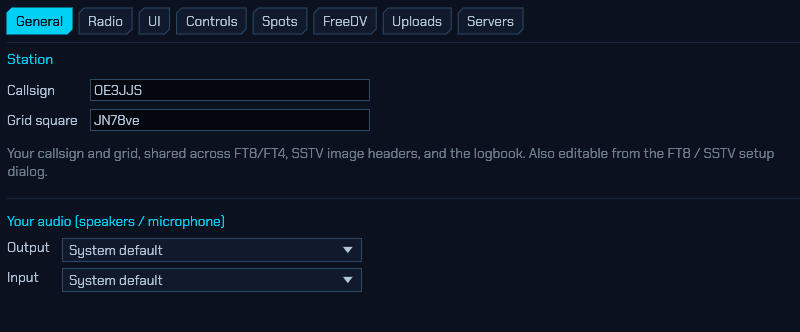

### 5.1 Choosing a backend

On the **Radio** tab, **Radio interface** selects how sdroxide talks to your
radio:

- **SoapySDR** — a SoapySDR device (wideband IQ). The default. See
  [5.2](#52-soapysdr-devices).
- **HPSDR (network)** — an OpenHPSDR (Hermes/Metis) Ethernet SDR on the LAN. See
  [5.4](#54-openhpsdr-network-radios).
- **CAT / Audio** — a CAT-controlled radio with audio over a USB sound card. See
  [5.3](#53-cat-radios-serial-control--usb-audio).
- **TCI (network)** — a TCI server such as ExpertSDR3 or Thetis. See
  [5.5](#55-tci-expertsdr3--thetis).

The controls shown below the selector change to match the chosen interface.

> After changing the radio interface, serial port, sound format, or
> radio-audio device, press **Apply / reconnect** at the bottom of the Radio
> tab (or under the CAT radio-audio settings). sdroxide rebuilds the radio
> live — no restart. If the new interface can't be opened, the previous one
> keeps running and an error is shown; your tuning resets to the new radio's
> default frequency, as it would on a fresh start.

### 5.2 SoapySDR devices

With the **SoapySDR** interface, the **Radio** tab shows the controls the device
exposes:

- **RX gains** — one slider per gain element (dB, with the device's own limits).
- **TX gains** — transmit gain sliders, if the device has them.
- **Antenna** — a drop-down when the device has more than one RX antenna.

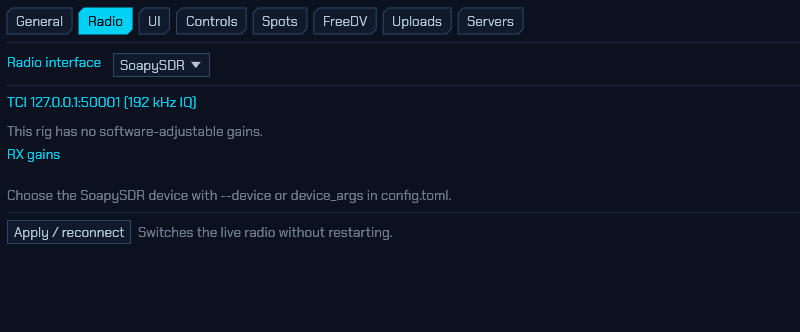

The device to open and the sample rate come from `config.toml`
(`device_args`, `sample_rate`). For example, `device_args = "driver=hackrf"`;
an empty value uses the first device found. You can also override the device on
the command line with `--device`.

### 5.3 CAT radios (serial control + USB audio)

A CAT radio is configured on the **Radio** tab (with the sound card chosen on
the **Audio** tab, [5.6](#56-radio-audio-devices)). The audio arrives over a USB
sound card, separately from your computer's speakers and microphone.

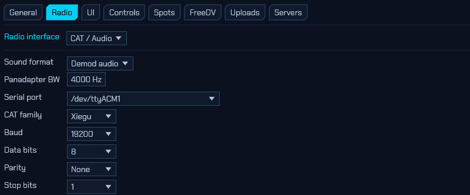

**Sound format** — how the radio's audio is interpreted:

- **Demod audio** — the radio sends already-demodulated (mono) audio. The
  panadapter shows a narrow slice of the audio band mapped to RF, whose width is
  set by **Panadapter BW**. This is the common case for rigs like the Xiegu
  X6100.
- **IQ (stereo)** — the radio sends a stereo IQ signal (I on the left channel, Q
  on the right). This gives a full panadapter but requires a **stereo** capture
  device (see the note below).

**Serial (CAT) settings:**

- **Serial port** — the radio's CAT serial port. On Linux, USB-style ports
  (`/dev/ttyACM*`, `/dev/ttyUSB*`) are listed first.
- **CAT family** — `Xiegu`, `Icom`, or `Yaesu`.
- **Baud**, **Data bits**, **Parity**, **Stop bits** — the serial line settings
  (for example 19200 8N1 for a Xiegu X6100).
- **Force RTS** / **Force DTR** — hold a control line high or low (some
  interfaces need this).
- **PTT method** — `CAT`, `DTR`, `RTS`, or `VOX` (how transmit is keyed).
- **Mode control** — `CAT` (sdroxide sets the radio's mode to match) or
  `Radio controlled` (you set the mode on the radio and sdroxide follows).
- **Digimode mode** — what to switch the rig to for FT8/FT4: `USB`, `DIGI`, or
  `Radio controlled`.
- **Poll rate** — how often (Hz) sdroxide reads the rig's frequency and mode.
- **Radio ID (hex)** — the CI-V address, for Icom and Xiegu radios.

### 5.4 OpenHPSDR (network radios)

With the **HPSDR (network)** interface, sdroxide reaches an OpenHPSDR
(Hermes/Metis-family) Ethernet SDR over the LAN — no sound card or serial port
involved. On the **Radio** tab:

- **Discover** — scan the local network for HPSDR devices and pick one from the
  list. Protocol 2 devices are selectable; Protocol 1-only devices (such as the
  Hermes Lite 2) are listed greyed-out.
- **Manual IP** — connect directly to a known address (for example
  `192.168.1.50`), skipping discovery.
- **Sample rate** — the DDC receive rate: 48, 96, 192, 384, 768, or 1536 kHz.
  Wider rates give a wider panadapter span at more CPU/network cost.

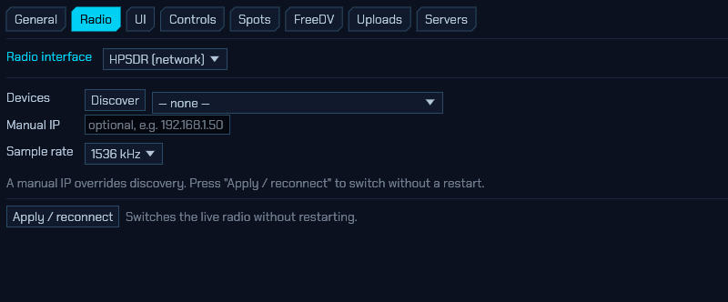

Receive is wideband IQ, so the full panadapter and the skimmers work.

> **Help wanted — the HPSDR backend is not yet hardware-verified.** The wire
> offsets were written against the OpenHPSDR protocol docs and the rustyHPSDR
> reference, but have not been confirmed on real hardware. If you own an HPSDR
> board, you can help by running with diagnostic logging and reporting what you
> see:
>
> ```sh
> RUST_LOG=sdroxide_hpsdr=debug sdroxide
> ```
>
> Use `sdroxide_hpsdr=trace` for per-packet detail. The log shows discovery
> replies (board, protocol, MAC, raw bytes), the protocol and sample rate chosen,
> the first RX datagram's structure, and a periodic *RX throughput* line
> (datagrams/samples/ksps). A plausible ksps close to the selected sample rate
> means the receive decode is working; `no … I/Q datagrams after 3 s` or an
> implausible rate points at a firewall or a wrong offset. Please attach that
> output to a bug report.

### 5.5 TCI (ExpertSDR3 / Thetis)

With the **TCI (network)** interface, sdroxide connects to a TCI server — such as
Expert Electronics **ExpertSDR3** or **Thetis** — over a WebSocket, receiving a
wideband IQ stream and transmitting audio back. On the **Radio** tab:

- **Server address** — the TCI `host:port`. The default `127.0.0.1:50001` is
  ExpertSDR3's TCI listener on the same machine; enable *TCI* in the SDR software
  first.
- **IQ sample rate** — the receive IQ stream rate: 48, 96, or 192 kHz.
- **Test connection** — verify sdroxide can reach the server and report what it
  found, without leaving the dialog.

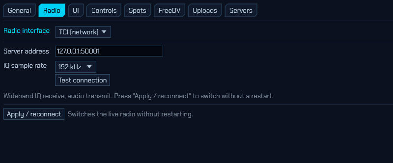

Receive is wideband IQ (full panadapter and skimmers); transmit sends audio to
the TCI server, which modulates it.

### 5.6 Radio audio devices

On the **Audio** tab, the *Radio audio* section selects the sound card the CAT
radio uses:

- **From radio (RX)** — the capture device carrying the radio's receive audio.
- **To radio (TX)** — the playback device carrying your transmit audio to the
  radio.


Device names include the manufacturer, model, ALSA card id, and USB id — for
example `C-Media Electronics Inc. USB Audio Device, USB Audio [Device · 0d8c:0012]`
— so two identical adapters can be told apart.

> **IQ needs a stereo device.** IQ format requires a two-channel capture
> interface (I and Q). A mono USB audio adapter cannot carry IQ; if you pick one
> for IQ, sdroxide refuses it and shows a warning banner. Use a stereo line-input
> interface for IQ, or choose **Demod audio**.

### 5.7 Your own audio devices

The *Your audio* section of the **Audio** tab selects the speakers and
microphone sdroxide uses for you (separate from the radio-audio devices):

- **Output** — where receive audio is played.
- **Input** — your microphone for voice transmit.

Each defaults to **System default**. These can be changed live. The equivalents
in `config.toml` are `audio_output` and `audio_input`.

### 5.8 Linux / PipeWire note for dedicated radio sound cards

On a PipeWire system, the desktop audio server can hold a USB radio codec's
capture device open, which intermittently blocks sdroxide from opening it (the
symptom is silent receive and a "waiting for spectrum" panadapter). For a
sound card dedicated to the radio, the reliable fix is to tell WirePlumber to
stop managing that card, leaving it for sdroxide. Create a drop-in such as
`~/.config/wireplumber/wireplumber.conf.d/51-radio.conf` that disables the
card, then restart WirePlumber. See [troubleshooting](#11-troubleshooting).

### 5.9 UI preferences

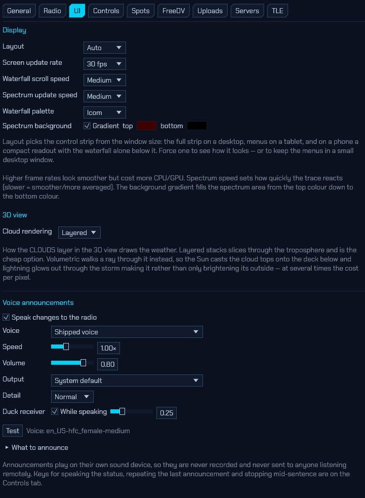

The **UI** tab holds display preferences (stored in `config.toml` under `[ui]`):

- **Screen update rate** — the GUI/spectrum frame rate (30, 60, or 90 fps).
- **Waterfall scroll speed** and **Spectrum update speed** — how fast the
  waterfall scrolls and how quickly the spectrum line reacts (slower = more
  averaged/smoother).
- **Waterfall palette** — the waterfall colour scheme (see [2.8](#28-the-display-and-fft-controls)).
- **Spectrum background** — a vertical gradient behind the spectrum line, with a
  top and bottom colour (default dark red → black); untick **Gradient** for a
  plain background.

---

## 6. Remote operation

sdroxide can run as a headless server and be controlled from a second sdroxide
instance (a native remote client) elsewhere on the network.

### 6.1 Start the server

```
sdroxide --server --port 4950
```

The server opens the configured radio, streams spectrum and audio, and accepts a
WebSocket control connection. The default port is **4950** and the default bind
address is **all interfaces** (`0.0.0.0`).

### 6.2 Connect a native remote client

On another machine:

```
sdroxide --connect HOST:4950
```

`--connect` accepts `host`, `host:port`, or a full `ws://…` URL. The remote
client is the full sdroxide GUI running against the server: control, state,
memories, meters, spectrum, FT8 decodes and logging, and skimmer spots all work.
Receive audio streams down (48 kHz mono), and your microphone is sent up to the
server while you transmit. The remote client uses your local speakers and
microphone for audio.

### 6.3 What to know

- **One client at a time.** A second connection is refused with a "server busy"
  message.
- **No authentication or encryption.** The server has no password and no TLS, and
  it binds to all interfaces by default, so anyone who can reach the port has
  full control of the radio, *including transmit*. Only expose it on a trusted
  network, or put it behind a VPN or an HTTPS reverse proxy that adds
  authentication.

---

## 7. Web operation

The same server serves a browser client, so you can operate from any device with
a web browser.


### 7.1 Serve the web client

Builds that bundle the web UI (compiled with the `embed-web` feature, including
the packaged binaries) serve it automatically:

```
sdroxide --server
```

Then open a browser at:

```
http://HOST:4950/
```

The page connects back to the server over a WebSocket at `/ws` automatically.

If you are running a build without the embedded web UI, point the server at a
trunk-built web directory:

```
sdroxide --server --web-root path/to/sdroxide-web/dist
```

### 7.2 What works in the browser

The web client mirrors the native UI: tuning, mode and band changes, the
panadapter and waterfall, receive audio, FT8/FT4, the logbook, memories, and
meters. Microphone transmit is supported where the browser grants microphone
access. The [solar system 3D view](#212-solar-system-3d-view) is native-only,
and its **☀ 3D** button does not appear in the browser client. The same
single-client and no-authentication notes as
[remote operation](#6-remote-operation) apply — put the server behind HTTPS with
authentication if it is reachable from an untrusted network.

---

## 8. Spotting, awards, and QSL upload

SDR Oxide features spots you can click to work, automatic callsign lookup, 
one-click QSO upload, and award tracking. These features are 
configured on the **Spots** and **Uploads** tabs of the Settings
window (the **⚙ SETTINGS** button, or the **⚙ SETUP** button in the SPOTS
window), and surfaced by the **SPOTS** and **AWARDS** buttons in the System
module.

All of this runs on the machine with the radio (the server, in remote/web mode),
so a browser or remote client uses it too. Credentials are stored in plaintext in
`net.json` (see [§10](#10-configuration-files)).

### 8.1 Spot feeds (DX cluster, POTA, SOTA, PSK Reporter)


Enable and configure the feeds on the **Spots** tab of Settings:

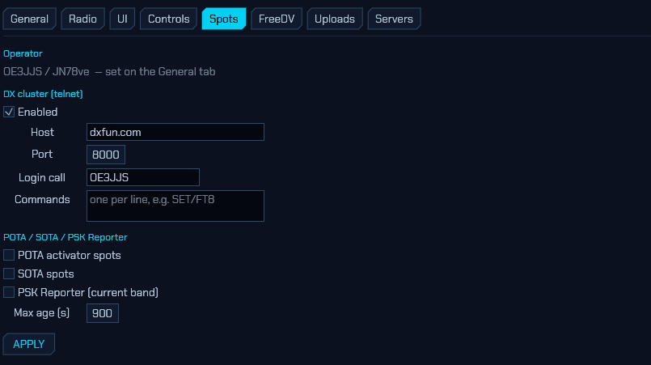

- **Operator** — your callsign and grid (defaults to the values from the General
  tab / FT8 setup). The callsign is used to log in to the DX cluster.
- **DX cluster (telnet)** — tick **Enabled**, then enter the node **Host** and
  **Port** (commonly 7300/7373/8000). **Login call** overrides the operator
  callsign if needed, and **Commands** (one per line, e.g. `SET/FT8`) are sent
  after login to set node-side filters.
- **POTA / SOTA / PSK Reporter** — tick each feed to poll it. POTA and SOTA show
  current activator spots; PSK Reporter shows who is being heard on your current
  band. **Max age** drops spots older than the given number of seconds.
- Press **APPLY** to connect/disconnect the feeds and save the settings.

Spots then appear two ways:

- **On the panadapter** — colour-coded, clickable boxes along the bottom of the
  waterfall (DX = cyan, POTA = green, SOTA = amber, PSK = violet), each with a
  leader line down to the spotted frequency. Located spots (POTA parks, PSK
  reporters) also appear as dots on the FT8 world map.
- **In the SPOTS window** — a filterable list (toggle **DX / POTA / SOTA / PSK**,
  or **IN VIEW** to show only spots inside the current panadapter span). Each row
  shows the source, callsign, frequency, mode, age and reference/comment, and a
  green **NEW** flag when it is a DXCC entity you haven't worked yet.

**Click a spot** — on the panadapter or in the SPOTS list — to tune your VFO onto
it, switch to its mode, and open a **pre-filled New Entry** in the logbook (call,
frequency, mode, and any grid/reference from the spot). If auto-lookup is on
(below), the name/QTH/grid are filled in too. CW spots are tuned a sidetone pitch
low so the signal lands in the CW passband.

### 8.2 Callsign lookup

Auto-fill operator details from an online callsign database. On the **Uploads**
tab of Settings, pick a **Provider** and enter its credentials:

- **QRZ.com** — needs a QRZ username and password with an active XML-data
  subscription.
- **HamQTH** — free; needs a HamQTH username and password.

Tick **Auto-fill name/QTH/grid on spot click & QSO** to look a call up
automatically when you click a spot, start an FT8 QSO, or finish typing a call in
the entry form. Either way, the **LOOKUP** button in the New/Edit Entry form does
it on demand. Lookups only fill fields you've left blank, so they never overwrite
what you typed; results also enrich the matching logged QSO (name, grid, DXCC,
zones).

### 8.3 Uploading QSOs (eQSL, QRZ, Club Log, LoTW)

Configure your upload services on the **Uploads** tab:

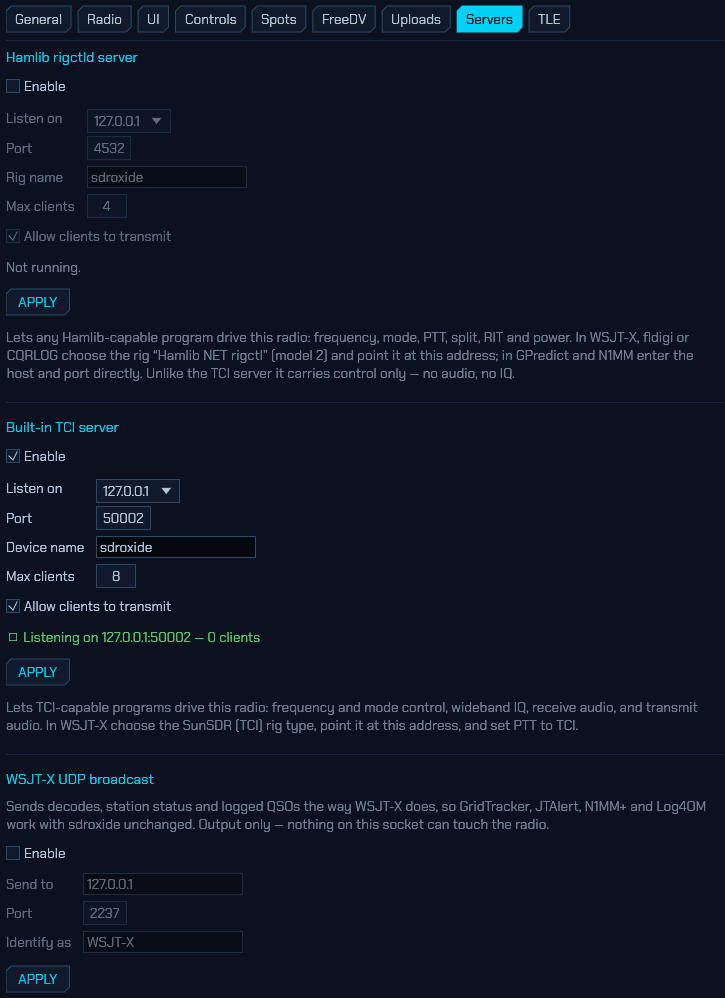

- **eQSL** — username and password.
- **QRZ Logbook** — the logbook **API key** (from your QRZ logbook settings; this
  is different from the XML-lookup login above).
- **Club Log** — the account email, password, and an application **API key**.
- Tick **Auto-upload each new QSO** and the target(s) to push every QSO as it is
  logged, or upload individual QSOs from the logbook with the per-row **UP**
  button. Each upload sets that QSO's status flag (the **↑** in the logbook), and
  failures are reported in the SPOTS window's status line.

**LoTW** upload is deliberately not automated — LoTW requires a signed upload via
ARRL's TQSL. Export your log to **ADIF** from the logbook and sign/upload it with
TQSL as usual.

**Confirmations** — enter your **LoTW** login (and/or use your eQSL credentials)
and press **SYNC CONFIRMATIONS**. sdroxide downloads your LoTW/eQSL confirmations
and matches them against the log to set the **✓** (confirmed) status, which drives
worked-vs-confirmed in the awards view. (LoTW upload stays manual; only the
confirmation download is automated.)

### 8.4 Award tracking

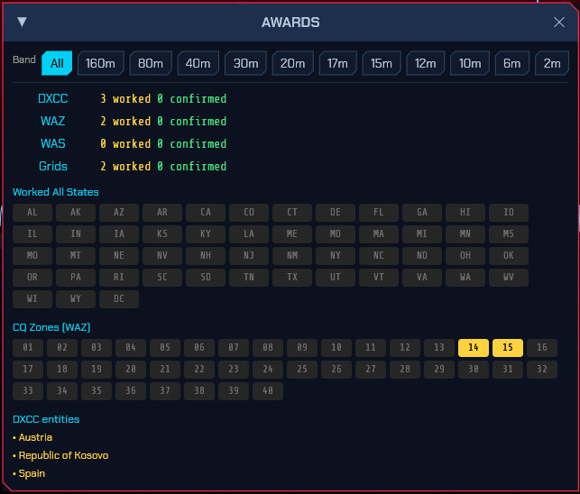

The **AWARDS** button opens a live tally computed from your log:

- **DXCC** (entities), **WAZ** (CQ zones), **WAS** (US states) and **grid
  squares**, each shown as *worked* and *confirmed* counts, with a per-band
  filter across the top.
- The WAS and WAZ grids colour each slot **grey** (not worked), **amber**
  (worked) or **green** (confirmed); the DXCC list marks confirmed entities.

DXCC entity and CQ/ITU zone are resolved from the callsign using a bundled
country file (`cty.dat`), so awards work even for QSOs you never looked up —
though a lookup adds exact zones and state. A QSO counts as *confirmed* once any
of LoTW, eQSL or a paper card is received for it. The same entity resolution
flags **new** DXCC entities in the SPOTS list, so you can spot an all-time-new
one at a glance.

---

## 9. Command-line reference

| Option | Description |
| --- | --- |
| `--device <ARGS>` | SoapySDR device args, e.g. `driver=hackrf` (default: config, then first device). |
| `--probe` | List devices and their probed capabilities, then exit. |
| `--console` | Terminal (text) waterfall instead of the GUI. |
| `--siggen` | Use the built-in signal generator instead of hardware. |
| `--file <PATH>` | Play a raw interleaved CF32 IQ file instead of hardware. |
| `--freq <HZ>` | Center frequency in Hz (default 14,200,000). |
| `--rate <HZ>` | Sample rate in Hz (default: from config). |
| `--gain <DB>` | Overall RX gain in dB (default: hardware AGC or a moderate value). |
| `--mode <MODE>` | Initial mode (USB, LSB, CW, AM, SAM, NFM, WFM, DIGU, DIGL, DSB, SPEC, FT8, FT4, PSK, RTTY, OLIVIA, THOR, FSQ, SSTV, RFPAINT). |
| `--server` | Run as a server (web client + WebSocket streaming backend). |
| `--connect <HOST[:PORT]>` | Connect as a native remote client to a running server. |
| `--port <PORT>` | Server port (default: from config, 4950). |
| `--web-root <DIR>` | Directory with the built web client (default: embedded assets). |
| `--fft <SIZE>` | Spectrum FFT size (default 4096). |
| `--fps <N>` | Console waterfall lines per second (default 15). |
| `--db-floor <DBFS>` | Display floor in dBFS (default −110). |
| `--db-ceil <DBFS>` | Display ceiling in dBFS (default −10). |
| `--width <CHARS>` | Console spectrum width in characters (default 100). |

**Testing without a radio:** `--siggen` (built-in signal generator), `--file`
(replay an IQ recording), `--probe` (list SoapySDR devices), and `--console`
(a text-mode waterfall) are handy for trying things out.

---

## 10. Configuration files

sdroxide stores its settings under the per-user config directory:

| Platform | Location |
| --- | --- |
| Linux | `~/.config/sdroxide/` |
| macOS | `~/Library/Application Support/org.sdroxide.sdroxide/` |
| Windows | `%APPDATA%\sdroxide\sdroxide\config\` |

| File | Format | Contents |
| --- | --- | --- |
| `config.toml` | TOML | General settings: `device_args`, `sample_rate`, `cal_offset_db`, `spectrum_fft`, `spectrum_fps`, `server_bind`, `server_port`, `tx_ham_only`, `audio_output`, `audio_input`. |
| `radio.json` | JSON | Radio backend: SoapySDR vs CAT, serial/CAT settings, sound format, and the radio's sound-card device names. |
| `digi.json` | JSON | FT8/FT4 operator settings: your callsign and grid, TX period, auto-sequence, and message templates. |
| `memories.json` | JSON | Saved memory channels. |
| `bandstacks.json` | JSON | Per-band memory of your last frequency/mode/filter (up to three per band). |
| `qso_log.json` | JSON | The logbook (digital and manual QSOs, with contest/QSL fields). |
| `net.json` | JSON | Network cockpit: DX cluster / POTA / SOTA / PSK feed settings, and callsign-lookup / eQSL / QRZ / Club Log / LoTW credentials (stored in plaintext). |
| `sstv_messages.json` | JSON | The overlay message stored for each of the five SSTV transmit slots. |
| `sstv_tx/` | dir | The five SSTV transmit-image slots (`slot0.png`…`slot4.png`). |
| `sstv_rx/` | dir | Received SSTV pictures, kept for the gallery. |
| `solar/` | dir | Cached solar imagery and space-weather JSON for the 3D view, with an index of HTTP validators so refreshes stay cheap. Safe to delete; it is re-fetched on demand. |

Every file has sensible defaults, so a missing or partial file always loads. You
normally edit these through the GUI rather than by hand.

---

## 11. Troubleshooting

**"Waiting for spectrum" and no receive audio (CAT radio).**
The radio's capture device could not be opened. Common causes:

- The device is being held by the system audio server (PipeWire/PulseAudio). On
  Linux, for a dedicated radio sound card, disable that card in WirePlumber so
  sdroxide can open it exclusively:

  ```
  # ~/.config/wireplumber/wireplumber.conf.d/51-radio.conf
  monitor.alsa.rules = [
    {
      matches = [ { device.name = "alsa_card.usb-<your-card>" } ]
      actions = { update-props = { device.disabled = true } }
    }
  ]
  ```

  Then run `systemctl --user restart wireplumber`. (Find the exact
  `device.name` with `wpctl status` or `pw-dump`.)
- The device is in use by another program, or was unplugged. sdroxide shows a
  warning banner naming the device; use **Dismiss** to hide it after fixing the
  device.

**IQ shows no spectrum, or a warning that the device is mono.**
IQ requires a two-channel (stereo) capture device. A mono USB adapter cannot
carry I and Q. Use a stereo line-input interface for IQ, or switch **Sound
format** to **Demod audio**.

**The CAT radio does not change mode.**
On the **Audio/CAT** tab, set **Mode control** to **CAT**. For FT8/FT4, set
**Digimode mode** to **USB** or **DIGI** as your rig expects. Check the serial
port, baud, and (for Icom/Xiegu) the **Radio ID**.

**Two identical USB sound cards are hard to tell apart.**
Device names include the manufacturer, model, ALSA card id, and USB id in
brackets (e.g. `… [Device_1 · 0d8c:0014]`), which disambiguates identical
adapters. Re-select the intended device in the **Audio** tab if the names
changed after an update.

**A setting did not take effect.**
Backend, serial, sound-format, and radio-audio-device changes apply when you
press **Apply / reconnect** (Radio tab, or under the CAT radio-audio settings).
Audio output/input device changes apply immediately. If a change still seems
stuck, press Apply / reconnect again.

---

## 12. Appendix

### Keyboard shortcuts

| Key | Action |
| --- | --- |
| Left / Right arrow | Tune ±100 Hz (with Shift, ±10 Hz). |
| Up / Down arrow | Tune ±1 kHz. |
| Page Up / Page Down | Tune ±10 kHz. |
| M | Toggle mute. |
| N | Toggle noise blanker. |
| F | Fit the view to the full receiver span. |

Shortcuts are ignored while typing in a text field.

### Modes

| Mode | Description |
| --- | --- |
| LSB / USB | Lower / upper sideband voice. |
| CW | Morse (continuous wave). |
| AM | Amplitude modulation. |
| SAM | Synchronous AM. |
| NFM / WFM | Narrow / wide FM. |
| DIGU / DIGL | Data over USB / LSB (general digital). |
| DSB | Double sideband. |
| SPEC | Spectrum only (no demodulation). |
| FT8 / FT4 | Automatic digital modes with decoding, QSO sequencing, and logging. |
| PSK | PSK31 keyboard mode (BPSK31 / varicode). |
| RTTY | RTTY keyboard mode (Baudot; selectable shift and baud). |
| OLIVIA | Robust MFSK keyboard mode (selectable tones/bandwidth). |
| THOR | DominoEX-family IFK keyboard mode with FEC (THOR4…THOR32). |
| FSQ | Fast Simple QSO — 33-tone IFK with directed (FSQCALL) messaging and images. |
| SSTV | Slow-scan TV image mode (Scottie, Martin, Robot). |
| RFPAINT | RF Paint — transmit-only spectrum painting of text and images onto the waterfall. |

### Bands

`160M`, `80M`, `60M`, `40M`, `30M`, `20M`, `17M`, `15M`, `12M`, `10M`, `6M`,
`2M`, and `GEN` (general coverage). Bands your device cannot receive are
disabled in the selector.

### Waterfall colour schemes

`Classic` (PowerSDR-style), `Viridis`, `Gray`, `Icom` (Icom-style palette,
peaking at red with no white blow-out), `Neon`, `Synthwave`, `Matrix`, and
`Tron`. Chosen on the **UI** tab of the Settings window ([5.9](#59-ui-preferences)).
