# SDRoxide User Manual

SDRoxide is a PowerSDR/Thetis-style software-defined-radio transceiver. It gives
you a panadapter and waterfall, dual VFOs, a full set of receive and transmit
controls, FT8/FT4 digital modes with an integrated logbook, a wideband CW
skimmer, and the ability to drive either a SoapySDR device or a CAT-controlled
radio (such as a Xiegu, Icom, or Yaesu) with audio over a USB sound card. The
same interface runs as a native desktop application, streams to a web browser,
or connects to a remote sdroxide server.

---

## Table of contents

1. [Feature overview](#1-feature-overview)
2. [Basic operation](#2-basic-operation)
3. [Digital modes (FT8, FT4, PSK31, RTTY, Olivia, THOR, FSQ, Hellschreiber, SSTV, RIFP, weather fax, JS8, RF Paint, WSPR)](#3-digital-modes)
4. [Skimmers (CW, PSK, RTTY)](#4-skimmers)
5. [Settings](#5-settings)
6. [Solar system 3D view](#6-solar-system-3d-view)
7. [Remote operation](#7-remote-operation)
8. [Web operation](#8-web-operation)
9. [Spotting, awards, and QSL upload](#9-spotting-awards-and-qsl-upload)
10. [Command-line reference](#10-command-line-reference)
11. [Configuration files](#11-configuration-files)
12. [Troubleshooting](#12-troubleshooting)
13. [Appendix: keyboard shortcuts, modes, bands](#13-appendix)

---

## 1. Feature overview


- **Panadapter and waterfall** with click/drag tuning, scroll-to-zoom, a
  draggable filter passband, a colour-coded band-plan strip, and eight
  selectable waterfall colour schemes (including an Icom-style palette).
- **Dual VFO (A/B)** with split operation, VFO swap/copy, and an independently
  tunable sub-receiver with its own mode and filter.
- **All the common modes:** LSB, USB, CW, AM, SAM, NFM, WFM, DIGU, DIGL, DSB, a
  spectrum-only mode (SPEC), the automatic digital modes **FT8** and **FT4**, the
  keyboard modes **PSK31**, **RTTY**, **Olivia**, **THOR** and **FSQ**, the image
  modes **SSTV**, **weather fax** and **RIFP** (draft-dulaunoy-rifp-00, a packetised image
  protocol on its own FSK modem), and the transmit-only **RF Paint**
  (spectrum-painting) mode.
- **Receive controls:** AGC (Off/Slow/Med/Fast), volume, mute, squelch, an
  impulse noise blanker, an adaptive auto-notch (constant-tone canceller),
  noise reduction (four engines, three strengths each), RIT, and a
  draggable filter passband. On NFM, the CTCSS tone or DCS stream under the
  signal is decoded and shown, and can be made a condition of the squelch.
- **Transmit** (on TX-capable rigs): PTT, TUNE, drive and tune-drive levels,
  mic gain, XIT, and a transmit meter (power / SWR / ALC). A ham-band-only
  transmit lockout is on by default. While transmitting, the panadapter shows a
  **monitor of your own signal**: wideband IQ rigs display it at its on-air
  frequency in the full span; CAT rigs and digital modes show a narrow
  transmit-sideband scope (an approximation built from the outgoing audio).
- **CW decode and keyboard sending** — a Morse decoder that finds the speed,
  the threshold and the spacing for itself rather than being told them, with a
  waterfall cursor that picks the signal to copy (and the frequency to answer
  on), and a type-ahead keyboard that sends as you type. The same decoder drives
  the wideband CW skimmer.
- **Voice keyer** — ten recorded messages, transmitted from a button, a numpad
  key, a MIDI pad or a Hamlib `send_voice_mem` command; works in the voice modes
  and in RADE digital voice.
- **FT8 / FT4** with a live decode list, automatic QSO sequencing, a world map,
  a transcript, and automatic logging.
- **Integrated logbook** for digital and manual QSOs, with contest and QSL
  fields, a worked-before check, ADIF import/export and text export.
- **Live spotting** — a DX cluster (telnet) plus POTA, SOTA, PSK Reporter and
  FreeDV Reporter feeds shown as clickable markers on the panadapter and world
  map; click to tune and pre-fill a log entry.
- **FreeDV Reporter** — report your station to
  [qso.freedv.org](https://qso.freedv.org/) and see who else is on FreeDV,
  including callsign exchange in the RADE End-of-Over frame.
- **Callsign lookup and QSL upload** — QRZ/HamQTH name/QTH/grid auto-fill, and
  one-click (or automatic) upload to eQSL, QRZ Logbook and Club Log, with LoTW
  ADIF export and confirmation download.
- **Award tracking** — live DXCC / WAS / WAZ / grid tallies, worked vs confirmed.
- **Wideband skimmers** — a CW skimmer plus PSK31 and RTTY skimmers that decode
  many signals at once and label them on the waterfall.
- **Many radio backends:** SoapySDR devices, OpenHPSDR (Hermes/Metis) Ethernet
  SDRs, a TCI server (ExpertSDR3/Thetis), a SmartSDR radio (FlexRadio
  FLEX-6000/8000), RTL-SDR, RX-888 and SDRplay RSP receivers over USB, a
  PlutoSDR, or a CAT-controlled radio with audio over a USB sound card
  (demodulated audio or stereo IQ).
- **Several radios at once** — each in its own tab with its own tuning, mode,
  panadapter and audio, sharing your memories, logbook and a station-wide
  transmit interlock. Multi-receiver hardware serves one tab per receiver from
  a single connection: a TCI rig's RX2, an HPSDR Protocol 2 board's DDCs, a
  2R2T PlutoSDR's second chain.
- **Memory channels** and per-band memory of your last frequency/mode/filter.
- **Solar system 3D view** — the Sun, the Earth and the Moon, the
  other seven planets and eighteen of their moons with their orbits, live NASA
  SDO solar imagery, sunspot regions and CME trajectory cones,
  an arrival estimate when one is headed our way, the live auroral oval standing
  over the globe with a Kp forecast for tonight, live amateur-satellite orbits
  with click-through pass predictions, your FT8 contacts arcing between stations,
  a propagation panel with MUF, Kp/A, F10.7 and the current GOES X-ray level,
  and a bar chart of how open each band is right now.
- **Spoken announcements:** the radio reads itself out — frequency, mode, band,
  split, AGC, the transmit levels, band-edge warnings, the SWR while you tune up,
  and FT8/JS8 messages addressed to you — so it can be operated without seeing
  it. The voice ships with the program and runs on your own machine. The window
  is also exposed to NVDA, Orca and VoiceOver. See
  [5.3](#53-ui-display-preferences-and-voice-announcements).
- **Remote and web operation:** run headless as a server and control it from a
  browser or from a second sdroxide instance over the network, behind a username
  and password.

---

## 2. Basic operation

### 2.1 Launching

Start the native application with no arguments to use your configured radio:

```
sdroxide
```

To try the interface with no hardware, use the built-in signal generator:

```
sdroxide --siggen
```

See the [command-line reference](#10-command-line-reference) for all options.

### 2.2 The main window

The window has two parts: a **top control bar** of captioned modules that reflow
onto more rows as the window narrows, and the **panadapter** (spectrum plus
waterfall) filling the rest of the window. In FT8/FT4 the lower part of the
window is shared with the digital operating panel.


The control-bar modules, left to right, are: Frequency, S-meter, Band/Mode,
VFO, RIT/XIT, Receiver, Filter/Noise, Transmit (TX-capable rigs only), Display,
FFT, and System.

### 2.3 Tuning

**The frequency readout** is a ten-digit display. Hover over any digit and:

- **Scroll the mouse wheel** to tune that decade up or down.
- **Click the upper half** of a digit to increment it, the **lower half** to
  decrement it.

The smaller grey number below the readout is the *inactive* VFO's frequency.

**On the panadapter:**

- **Scroll the wheel** to zoom in and out around the cursor.
- Press **F** to reset the view to the full receiver span.
- **Left-click** tunes the active VFO to the clicked frequency. **Shift+click**
  places the *second* receiver: the sub-receiver when SUB is on, VFO B otherwise.
  Unlike a plain click, it means the same thing everywhere — over a spot box it
  takes the spot's frequency, and in FT8/FT4 it still tunes rather than moving
  the transmit offset.
- **Left-drag** grabs the spectrum and slides it (the tuning moves with the
  content). Let go while the pointer is still moving and the dial keeps turning,
  coasting to a stop like a weighted VFO knob — the faster the flick, the further
  it runs. A slow, careful drag lands exactly where you release it, and pressing
  anywhere on the panadapter catches a coasting dial and stops it dead (that
  press does not tune). The sub-receiver's tuning drag has the same flywheel.
- **Right-drag** pans the view only, without changing tuning.
- **Shift+drag** measures bandwidth: a horizontal ruler with dotted vertical
  markers appears between where you pressed and the current pointer, showing the
  **start and end frequencies** at the markers and the **frequency span** (e.g. a
  signal's width) below. It works on both the spectrum and the waterfall. When you
  release the button the measurement lingers and fades out over about five
  seconds, so you can read it after letting go.


**Keyboard tuning** (ignored while typing in a text field):

- **Left / Right arrow:** ±100 Hz (with **Shift**, ±10 Hz).
- **Up / Down arrow:** ±1 kHz.
- **Page Up / Page Down:** ±10 kHz.


**Band-plan strip.** A colour-coded strip along the bottom of the waterfall (its
top when the waterfall is flipped — see [§2.8](#28-the-display-and-fft-controls))
labels the allocations. Zoomed out it shows coarse bands (ham, broadcast, CB,
AM); zoomed into a ham band it splits into the CW / digital / SSB / beacon
sub-segments. When you zoom in close (a span of ~100 kHz or less), the digital
sub-band is broken out into the individual popular modes — **FT8, FT4, JS8,
WSPR, QRSS, PSK, RTTY, SSTV, RIFP, FREEDV** — each in its own colour.

### 2.4 Bands and modes

Click the **Band / Mode** button (which reads, for example, `20M · USB`) to open a
popup with three rows:

- **BAND:** `160M 80M 60M 40M 30M 20M 17M 15M 12M 10M 6M 2M 70CM GEN`. Each band
  remembers your last frequency, mode, and filter. Once band conditions have
  been fetched the button are tinted by the published forecast — green Good,
  yellow Fair, pink Poor — and hovering one gives it in words. Bands the
  forecast does not cover are left uncoloured; see
  [§2.15](#215-band-conditions). In a digital mode, the bands where that mode
  has a standard calling frequency carry a cyan underline; see
  [§3.1](#31-general-considerations).
- **MODE:** `LSB USB CW AM SAM NFM WFM DIGU DIGL DSB SPEC`.
- **DIGITAL:** `FT8 FT4 PSK RTTY OLIVIA THOR FSQ HELL SSTV RIFP RFPAINT RADE` (see
  [Digital modes](#3-digital-modes)).


See the [appendix](#13-appendix) for what each mode is.

### 2.5 VFOs, split, and the sub-receiver

The **VFO** module has:

- **A / B** select buttons in the Frequency module (the active VFO is highlighted).
- **Swap VFOs** — exchange A and B.
- **Copy A to B** — copy the active VFO to the other.
- **SPLIT** — transmit on one VFO and receive on the other.
- **SUB** — enable a second receiver, routed to the right ear.

The sub-receiver tunes **independently of A/B**: swapping VFOs or turning the
dial leaves it where you parked it. Switching it on reveals a **SUB module** in
the top bar with everything it has of its own:

- **Frequency** — type it in MHz, or drag the field to tune in 10 Hz steps.
- **←DIAL** / **DIAL←** — send the sub to the main dial, or bring the main dial
  to whatever the sub has found.
- **Mode** and **Filter** — the sub demodulates independently of the main
  receiver, so you can listen to CW on one and SSB on the other. (Audio modes
  only: the digital modes decode on the main receiver.)
- **Vol** / **MUTE** — the sub's own level in the right ear.

On the panadapter the sub is drawn in **violet**, with the same passband wash,
draggable filter edges and tuning line the main receiver has, labelled `SUB`.
**Drag inside its passband** (or on its tuning line) to tune it — that drag moves
the sub instead of panning the view, so each receiver is tuned by dragging its
own filter area. Released mid-motion it coasts on like the main dial, stopping at
the edge of the receiver's span. **Shift+click** anywhere sends the sub straight
there.

Both receivers are tuned by DDCs on the same IQ stream, so the sub can reach
anything inside the receiver's span and nothing outside it. A band change that
moves the hardware out from under the sub re-parks it on the inactive VFO.

### 2.6 RIT and XIT

The **RIT / XIT** module offsets receive (RIT) and, on TX-capable rigs, transmit
(XIT) without moving the dial. Toggle **RIT** (or **XIT**) on, then set the
offset in the adjacent field (±9999 Hz in 5 Hz steps).

When either is enabled, the offset is drawn on the panadapter: RIT shows a dashed
grey **dial reference** line (the receive marker and passband already sit at
dial + RIT) with a blue labelled bracket back to the dial, and XIT shows a green
**TX marker** line with a green labelled bracket from the transmit base to
dial + XIT — so you can see at a glance how far RX and TX are shifted.


On an SDR, all three offsets — RIT, XIT and split — are software: the receiver
and transmitter are tuned inside the IQ stream and the hardware never moves. A
**CAT radio** has no such stream, only its dial, so sdroxide puts them on the
dial instead: it sits on your receive frequency (VFO + RIT) while you listen and
moves to the transmit frequency (the other VFO when split is on, plus XIT) for
the length of each over, then comes straight back. The radio's frequency display
follows, which is also how you can see it working. sdroxide switches the radio's
*own* RIT, XIT and split off when it connects, so an offset left over on the rig
can't quietly add itself to the one you set here.

### 2.7 Receiver controls

- **AGC** — a drop-down: `Off`, `Slow`, `Med`, `Fast`.
- **Man** — the fixed audio gain the receiver runs on while the AGC is `Off`,
  shown only then. Unlevelled audio is whatever the band delivered, and a weak
  SSB signal can sit tens of dB below anything the volume control can reach, so
  "AGC off" means *this gain* rather than no gain at all. Switching the AGC off
  seeds it from the level the AGC was holding at that moment, so nothing jumps;
  from there it is yours to set, and it stays put however the signal moves.
- **Vol** — audio volume.
- **MUTE** (Filter/Noise row) — mute the receiver (keyboard shortcut **M**).
- **SQL** (Filter/Noise module) — squelch; below the open threshold it reads
  `off`.
- **NB** — impulse noise blanker on the raw signal (keyboard shortcut **N**).
- **ANC** — automatic notch: an adaptive filter that cancels **constant tone
  elements** — heterodynes, carriers, and tuner-uppers — while leaving voice and
  noise. Toggle it on when a steady whistle is spoiling a voice signal. (Like NR,
  it affects only what you hear, not the digital decoders; leave it off for CW
  and data modes, whose signals *are* tones.)
- **NR** — noise reduction on the audio, with four selectable engines. The button
  reads what is running (`NR RNN Med`, `NR DFNR High`, `NR SPEC Low`, `NR Mid`);
  click it for a picker with an **Engine** row and a **Strength** row, so any
  setting is two clicks away. A keyboard or MIDI binding cycles the *strength*
  within whichever engine is selected — Off → Low → Med → High → Off — and never
  changes the engine underneath you.
  - **RNN** — a neural **RNNoise** denoiser. Trained on speech, it recognises the
    *voice* and mutes everything else, so it clears non-stationary junk that
    spectral NR can't — babble, wind, keyboard/shack noise, fluttering hiss —
    with little of the underwater warble. Cheap, and the safe default. The three
    strengths are a wet/dry depth: High is the full effect, Low a lighter touch.
  - **DFNR** — **DeepFilterNet3**, the strongest of the four. It adds a learned
    complex filter over the low bins on top of a band gain, so it recovers speech
    the others have already given up on. It also costs the most CPU by a wide
    margin, and the model is loaded the first time you select it — expect a
    short break in the audio at that moment. The strengths are the most
    attenuation it may apply: 6, 12 and 24 dB.
  - **SPEC** — a Rust port of **libspecbleach**'s adaptive denoiser. Spectral,
    but with a psychoacoustic model deciding where suppression would be audible,
    and a *whitened* noise floor: rather than carving the residue into birdies it
    flattens what is left into even hiss. Good on steady static where the neural
    engines sound processed.
  - **NR Low/Mid/High** — the built-in **spectral** noise reduction: it suppresses
    the stationary noise floor while letting the changing, speech-like parts
    through. Fast and predictable on steady static and hiss.

  All four make voice quieter to listen to and easier to copy with less fatigue.
  Higher strengths remove more noise but can add faint artefacts on weak signals,
  so pick the lowest that cleans the audio; on a noisy voice signal, start with
  **DFNR Med**, and drop to **RNN Med** if the machine is struggling. (NR affects
  only what you hear; the FT8/FT4/PSK/RTTY decoders still receive the untouched
  signal, and a steady unmodulated carrier — a heterodyne — is treated as noise
  and suppressed. Any NR engine also forces WFM to mono — see **ST** below.)
- **ST** (WFM only) — broadcast **stereo**. It lights when the station's 19 kHz
  stereo pilot is locked, and needs nothing from you: mono and stereo stations
  are handled automatically, at the same volume, so there is no jump when one
  hands over to the other. Click it to force mono.

  On a weak station sdroxide blends back toward mono by itself. That is not a
  compromise — the difference channel is recovered from a 38 kHz subcarrier,
  high on FM's noise slope, so it carries roughly 20 dB more hiss than the
  mono sum. Clean mono beats noisy stereo, and the blend is gradual enough that
  you will not hear it switch. Forcing mono is still worth doing on a marginal
  signal you want to listen to for a long time.
- **Tone** (NFM only) — the **CTCSS tone or DCS code** under the signal. Analog
  FM systems carry a sub-audible tone below the voice so a receiver can ignore
  traffic that is not theirs, and the button shows what is arriving: `88.5` for a
  CTCSS tone, or `DCS` for a digital coded squelch stream. On an idle or
  toneless channel it just reads `TONE`.

  It takes about a second of signal to appear. That is not slowness for its own
  sake: the closest pair in the standard table is 67.0 and 69.3 Hz, and telling
  2.3 Hz apart takes about a second however it is measured. Expect the tone
  roughly a second after a repeater keys up, and expect it to stay for about
  half a second after it drops.

  Clicking the button opens the **tone squelch** picker: choose a tone and the
  audio only opens when *that* tone is present, which is how you sit on a busy
  shared channel and hear one system. **USE 88.5** arms whatever is being
  received right now, which is usually what you want; **OFF** goes back to plain
  carrier squelch. While a tone squelch is armed the button turns yellow, and it
  lights when the required tone actually arrives. Note that the ordinary **SQL**
  slider still applies — tone squelch is an extra condition on the same gate,
  not a replacement.

  DCS is reported as `DCS` without its three-digit code. The code travels in a
  cyclic error-correcting codeword, so every one of the 23 possible word
  boundaries decodes to a valid code and picking the wrong one yields a
  different, equally plausible answer; without a transmitter to check against,
  a code shown here would be a coin toss between two of them. That the signal
  *is* DCS, on the other hand, follows from the data repeating exactly every 23
  bits, which needs no such assumption. Arming tone squelch on **ANY DCS** opens
  on any DCS-coded signal.

  The sub-audible tones no longer reach the speaker: NFM audio is high-passed at
  around 250 Hz, as it is in any FM receiver, so what used to arrive as a low
  rumble under the voice is now decoded instead of heard.

  Two things turn stereo off on purpose: switching on the **sub receiver**,
  which claims the right ear for itself, and switching on **NR** or **ANC**,
  which delay the audio in a way the stereo matrix cannot survive. Neither buys
  anything on a broadcast signal.

**The receive filter** is set by dragging the passband edges directly on the
panadapter: two vertical grip lines mark the filter's low and high edges (they
brighten to orange when you can grab them). Drag an edge to widen or narrow the
passband. The grips work on both the spectrum and the waterfall.

### 2.8 The display and FFT controls

**Display module:**

- **FIT** — auto-set the waterfall floor and ceiling for the best contrast.
- **PEAK** — show a decaying peak-hold trace over the spectrum.
- **SPEC** — show or hide the spectrum line above the waterfall (lit when the
  spectrum is shown).
- **WIDE** — show or hide the **full-band strip**: a shallow second waterfall
  above the panadapter covering everything the receiver can see at once, with a
  blue outline around the slice the panadapter is receiving and an amber line on
  the tuned frequency. Click anywhere on it to tune there. The button appears
  only on receivers that produce a full-band view — a direct-sampling front end
  such as the RX-888; on an RTL-SDR, HPSDR or TCI radio the panadapter span is
  all the hardware delivers — and the setting is remembered between sessions.
  The strip is not shown in the digital modes, whose layout gives the height to
  the operating panel instead.
- **SKIM** — opens the skimmer popup (per-skimmer on/off and squelch); lit while
  any skimmer runs. See [Skimmers](#4-skimmers).
- **SCAN** — opens the scanner window; lit while a scan is running, green while
  it has stopped on a signal. See [Scanning](#213-scanning).
- **☀ 3D** — open the [solar system 3D view](#6-solar-system-3d-view): a second
  window in the native app, a second browser tab in the web client.

**FFT module:**

- **floor** / **ceil** — the waterfall's dB range.
- **FFT** size — `2048`, `4096`, `8192`, `16384`, or `32768`.
- **FLIP** — scroll the waterfall *upwards* (keyboard shortcut **V**). The
  newest line is drawn at the bottom and history flows up off the top, the way
  several other SDR programs draw it. The minute gridlines, the skimmer / FT8
  boxes, the cluster-spot boxes and the band-plan strip all follow the flip, so
  the fresh decodes stay next to the fresh signals and nothing covers the newest
  lines. The setting is remembered between sessions.

The **waterfall colour scheme** and the **spectrum background gradient** are set
on the **UI** tab of the Settings window (see
[§5.3](#53-ui-display-preferences-and-voice-announcements)). The colour scheme is one of
`Classic`, `Viridis`, `Gray`, `Icom`, `Neon`, `Synthwave`, `Matrix`, or `Tron`;
the gradient fills the spectrum area from a top colour down to a bottom colour
(default dark red → black) and can be turned off. The same tab also themes the
UI itself — colour theme, button shape and window shape — independently of the
waterfall's palette; the screenshots in this manual show the **Default** theme.

You can also resize the split between the spectrum line and the waterfall by
dragging the frequency-scale strip between them.


### 2.9 The S-meter

The **S-meter** reads S0 (−127 dBm) through S9 (−73 dBm) and beyond, turning red
past S9. It shows the S-unit (for example `S9+20`) and the level in dBm.

Clicking the meter cycles three faces:

- **Needle** (the default) — an analog moving-coil instrument. The needle has a
  little inertia, so it swings into a reading and settles the way a real
  movement does.
- **Bar** — a horizontal gradient bar with a graduated scale beneath it and a
  peak-hold marker that falls back after a moment.
- **Trace** — the last fifteen seconds plotted as a scrolling graph, which is
  the one to watch for fading and QSB.

On transmit all three switch to a transmit meter. Where the rig reports SWR it
becomes the headline reading, on a logarithmic scale with 1:1 at the left stop,
3:1 at mid-scale and everything past 3:1 in red; forward power (or ALC, on a rig
with no wattmeter) is shown alongside. Rigs with no SWR bridge fall back to a
drive/ALC scale.

### 2.10 Transmit

On a TX-capable rig the **Transmit** module appears:

- **PTT** — key the transmitter.
- **TUNE** — send a carrier at the tune-drive level for tuning an ATU.
- **Drive** — transmit drive (0–100%).
- **Tune** — the (lower) drive level used by TUNE.
- **Mic** — microphone gain.

> **Transmit safety:** by default sdroxide refuses to transmit outside the
> amateur bands (`tx_ham_only`). Transmit hardware gains start at minimum and
> the tune drive defaults low. Raise drive deliberately. The band lockout can
> only be lifted from the command line, one run at a time, with `--oob-tx`
> ([10](#transmitting-outside-the-amateur-bands---oob-tx)).

On a rig with its own power control (TCI), Drive and Tune command the rig's
output power directly — and both sliders adopt the rig's current settings when
sdroxide connects, so a level you set in ExpertSDR3 carries over instead of
being overwritten.

### 2.11 Voice keyer

The **▶** button in the Transmit module opens the **voice keyer**: ten recorded
messages you can put on the air with one press — a CQ call, your callsign, a
contest exchange, a 73.

Each row is one slot:

- Type a **name** for the slot (optional; it is just a label).
- **REC** records from your microphone. Press it again to stop and store the
  message; recordings stop by themselves after two minutes.
- **PLAY** plays the message back through your speakers so you can check it.
  Nothing is transmitted, and it replaces the receive audio while it runs.
- **TX** keys the transmitter, sends the message and unkeys at the end.
  **STOP** ends it early — so does pressing PTT, TUNE, or Abort transmit.
- **✕** erases the recording.

Recordings are stored as plain 48 kHz mono WAV files in
`~/.config/sdroxide/voice` (see [11. Configuration files](#11-configuration-files)),
one per slot, so you can also record a message in an audio editor, name it
`slot3.wav`, and drop it in.

**Triggering a message.** Out of the box the digits **1**–**9** and **0** play
slots 1–10 and **−** stops one; on a full keyboard those are the numpad keys
(the platform reports numpad and top-row digits identically, so either works).
Like every other binding these can be changed — or moved onto a MIDI pad or
footswitch — on the **Controls** tab; see
[5.4](#54-controls-keyboard-mouse-and-midi). A key over an **empty** slot does
nothing at all, which is why the digits can ship bound when PTT deliberately
does not.

External programs can trigger the keyer too: with the built-in Hamlib server
running ([5.8](#58-servers-letting-other-programs-drive-the-radio)),
`\send_voice_mem <1–10>` plays a slot and `\stop_voice_mem` stops it.

> **NOTE:** The keyer is available in every voice mode and in
> **RADE** digital voice, where the message is fed to the codec exactly as a
> live over would be. The other digital modes generate their own transmit
> audio, so the button is hidden there (and the window closes if you switch
> into one). Recording is refused while you are transmitting — it is the same
> microphone.

### 2.12 Memory channels

Open **MEM** (System module) for the memory channels window. Type a name and
press **Store** to save the current frequency and mode. Each saved row has a
**RCL** (recall) button and a **DEL** (delete) button.

Memories can be sorted into folders. Type a name into the second field and
press **New folder**, then drag a memory row onto the folder to file it under
that folder — and drop it on the area below the folders to take it out again.
Every folder header has a **REN** button (rename in place — Enter or clicking
away keeps the new name, Escape abandons it) and a **DEL** button, which
deletes only the folder: the memories filed under it move back to the top
level. Folders collapse and expand with the arrow at the left of their header,
and a memory scan works through every memory regardless of the folder it
sits in.


---

### 2.13 Scanning

Open **SCAN** (System module) to work through channels and stop where somebody
is transmitting. Two kinds:

- **MEM** — the stored memory channels, each in its own mode and filter. Mark
  any of them **SKIP** to pass it over; a channel that is always busy with
  something you do not want to hear is what that is for.
- **RANGE** — a slice of a band on a channel grid. Give it a **From** and a
  **to** in MHz, a **Step** (5 / 6.25 / 8.33 / 10 / 12.5 / 25 kHz) and a mode.

**A range scan is fast**, and not in the way a handheld scanner is. A scanner
has one receiver and has to visit each channel in turn, which is why sweeping
2 m takes minutes. Here the FFT that already draws the panadapter sees over a
megahertz at once, so the radio moves one span at a time and reads every channel
in that span together — the whole of 2 m in well under a second. A CAT rig
feeding demodulated audio has no such span, so it falls back to visiting
channels one at a time, and behaves like the handheld.

**Stops at** is how loud a channel has to be. Either give a level directly, or
press **SQL** to use the receiver's own squelch, which makes the scan stop
exactly where the audio would have opened — one control instead of two. Note
that with the squelch slider at `off` the scan will stop on the first channel it
looks at, since every channel then counts as busy.

**Listens for** is how long it stays on a candidate before judging it. Below
about a tenth of a second the level meter has not settled and weak signals get
missed; the default 150 ms is a reasonable balance.

**Resumes** decides what ends a stop:

- **CARRIER** — carry on once the signal drops, plus a grace period. The grace
  is what keeps you on a conversation through the gaps between overs; two
  seconds is a good starting point.
- **TIMED** — carry on after a fixed time whether or not the signal is still
  there. Useful on a channel somebody is sitting on.
- **MANUAL** — stay until you press **NEXT**.

While a scan is running, **NEXT** moves on now and **SKIP** moves on and adds
the channel to the skip list. Touching the dial, changing band, recalling a
memory or transmitting all stop the scan where it is — as on any scanner, and so
that the radio is not fighting you for the VFO.

The **SCAN** button in the System module lights while a scan is running, in cyan
while it is sweeping and green while it is stopped on something, so you can
close the window and still see what it is doing. Settings are remembered in
`scanner.json`.

---

### 2.14 CW: decoding and keyboard sending

Choose **CW** from the Band/Mode popup and the panadapter gains a **cursor** and
a panel underneath it. CW is not a digital mode — the tone stays audible, the
waterfall stays on the whole band, and nothing about the way you tune changes —
but a decoder reads what you are listening to, and a keyboard sends.

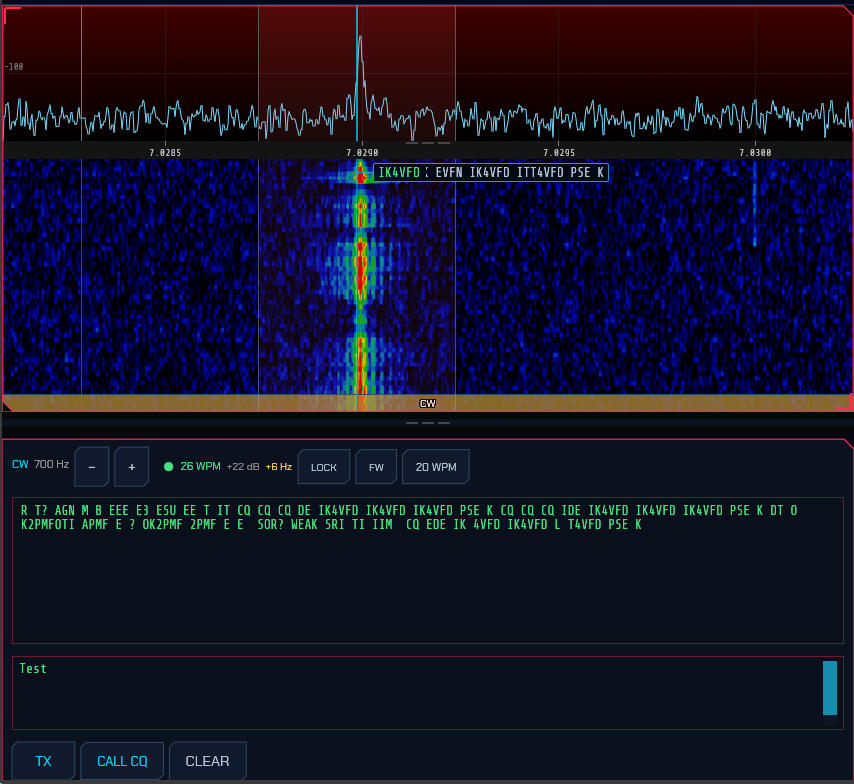

**The cursor is the frequency.** The cyan line on the waterfall marks the tone
being copied. It is also the tone you transmit on, because in CW those are the
same frequency: you answer a station where you heard it. Everything follows the
cursor together — the passband moves with it, so what is decoded is always what
is audible.

- **Click a signal on the waterfall** to bring it to the cursor. This tunes the
  dial so the signal lands at your pitch, which is what you want and what a bare
  click-to-tune does not do: the dial in CW sits a sidetone-pitch *below* what
  you hear, so tuning a signal onto the dial itself is the one place it is
  guaranteed to be inaudible.
- **−/+** in the panel header move the cursor 10 Hz at a time. This is your
  sidetone pitch, a personal preference; you will set it once.
- Clicking a **CW skimmer box** ([4](#4-skimmers)) does the same thing, so a
  station spotted across the band is one click from being copied.

**What the header tells you.** A CW decoder cannot fail quietly the way a
framed digital mode does — fed noise, a naive one produces confident nonsense —
so the panel says how sure it is:

- The **lamp** is lit while the decoder is actually copying: its timing fit is
  good and holding steady from one look at the signal to the next. Unlit, it
  says "listening" and prints nothing at all, which is the correct output for an
  empty frequency.
- **WPM** is the speed read off the signal, not a setting. It is worth watching:
  a decoder locked at the right speed is a decoder you can trust.
- **dB** is the signal-to-noise in 500 Hz — the same bandwidth a signal report
  is quoted in, so it is directly comparable with what another operator would
  tell you.
- A **±Hz** figure appears when the signal is more than a few hertz off your
  cursor. The decoder tracks it (and keeps copying), but the passband does not
  follow, so nudge the cursor if it grows.

**Sending.** Type in the lower box. Characters go out **as you type** rather
than a line at a time, and the ones already on the air turn **green** — so when
you pause you can watch the sending catch up.

- Typing keys the transmitter by itself; you do not have to press **TX** first.
- **TX** holds the key down between characters so nothing you type waits. It
  releases itself after five seconds with nothing left to send, so a transmitter
  is never left holding the frequency.
- **CALL CQ** loads and sends a CQ built from your callsign; **CLEAR** stops and
  drops whatever has not gone out.

**Speed and spacing** are set from the buttons at the right of the header:

- **WPM** — your keying speed.
- **FW** — Farnsworth: send the characters at full speed and stretch only the
  gaps between them, so they are heard at the right rhythm but arrive slowly
  enough to write down. Choose the overall speed to stretch to, or Off.
- **LOCK** — decode at your own speed instead of reading the speed off the
  signal. Worth turning on for a signal too weak for the speed search to settle
  when you already know how fast the other station sends.

> **Transmitting** needs an IQ radio (SoapySDR, HPSDR, TCI, SmartSDR): the keyer
> builds its own sideband signal. A CAT radio that takes demodulated audio will
> decode perfectly well but cannot be keyed this way — its CW keying is the
> rig's own.

### 2.15 Band conditions

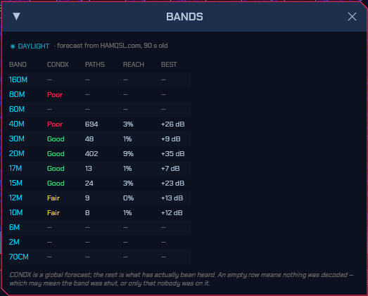

The [propagation heat map](#68-the-propagation-heat-map) answers "what has got
through". The **BANDS** window (the `BANDS` button in the System box) puts that
next to a second, different answer: the **calculated band conditions** published
by N0NBH at [hamqsl.com](https://www.hamqsl.com/), which are a forecast from the
solar indices rather than a measurement of anything.

| Column | What it is |
| --- | --- |
| `CONDX` | The published verdict — Good, Fair or Poor — for this band, for whichever half of the day it is at your QTH |
| `PATHS` | Decayed count of receptions in this band's field: *how much* got through |
| `REACH` | Share of the world with evidence on it: *how widely* it got through |
| `BEST` | Best decode margin anywhere in the band, dB above the mode's own floor |

`PATHS` and `REACH` are both there because either alone misleads: a contest
pile-up is a great many paths through one small piece of sky, and a band quietly
open everywhere is the reverse.

The same verdicts colour the band buttons in the **band/mode menu**, so choosing a
band shows its forecast where you are already looking. Green is Good, yellow
Fair, pink Poor. Hovering gives the verdict in words along with its source.

**Three things this deliberately does not do.**

- **Bands with no published verdict stay blank.** The feed covers four groups —
  80/40 m, 30/20 m, 17/15 m and 12/10 m — and nothing else. 160 m, 60 m, 6 m,
  2 m and 70 cm have no `CONDX` and no button colour, and never will: filling them
  in from a neighbouring group would be inventing data. 60 m sits *inside* the
  published frequency range and is still not covered.
- **A band with no paths is not called closed.** An empty row means nothing was
  decoded, which may mean the band was shut or only that nobody was on it. Those
  two look identical from here.
- **The forecast is global, not yours.** It is computed from the solar indices
  for the whole planet and says nothing about your antenna, your noise floor or
  any particular path. Where it and the measured columns disagree, the
  measurement is right.

Day or night is worked out from the Sun's elevation at your own locator, so the
correct half of the published table is read wherever you are.

**Where the numbers come from.** [hamqsl.com](https://www.hamqsl.com/), fetched
in the background once an hour for as long as the program is running. This is
the one exception to the rule that sdroxide's space-weather requests happen only
while the [3D view](#6-solar-system-3d-view) is open: the band menu is always
there, so these have to be too. It stays one request an hour — the two share a
cache, so with the 3D view open the second one comes back "not modified" —
and hourly is the interval the publisher asks for.

The document is cached on disk, so the last verdicts are on screen immediately
at startup and survive being offline. Everywhere they appear they are labelled
with their age.

### 2.16 Satellite operation (SAT)

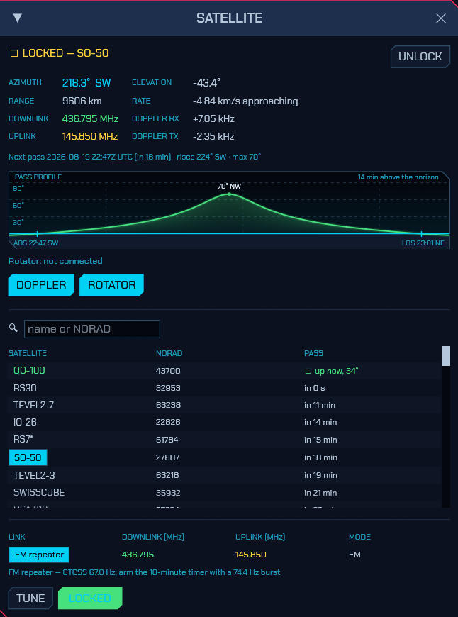

The **SAT** button in the System box opens the satellite window: pick a bird,
lock on, and every voice and digital mode works through it with Doppler
corrected continuously. The button glows green while a lock is running, because
the correction keeps being applied whether or not the window is open.

**The picker** lists every satellite the station tracks — the amateur group
subscription, anything you pasted into the TLE tab
([5.9](#59-tle-satellites-and-their-frequencies)), and the curated set — with
a search box and, once your grid locator is set, live elevation and the next
pass for each. Pick one and its published links appear: transponders,
repeaters, beacons, each with its passbands and mode, inverting transponders
marked `inv`. **TUNE** just sets the dial and mode to the link, nothing more.
**LOCK ON** is the mode itself.

**What a lock does.** The engine — not the screen — propagates the orbit with
SGP4 a few times a second and:

- **Corrects receive Doppler in the DSP.** The dial and the waterfall stay on
  the published frequency; the receiver quietly follows the moving signal. A
  NOAA APT pass, which sweeps several kilohertz, holds still on the waterfall
  while the correction readout sweeps instead — through zero exactly at
  closest approach.
- **Derives your uplink from the transponder.** Tune anywhere in the downlink
  passband and the transmit frequency follows the published mapping —
  reversed across an inverting transponder, with the sideband flipped for
  SSB, fixed for an FM bird. Split and VFO B are ignored while locked; XIT
  still works as a manual trim on the mapped uplink.
- **Pre-corrects transmit Doppler**, and keeps correcting *during* the over —
  the shift rides the transmitted IQ, so a long SSB over or an FT8 burst
  stays on frequency at the satellite from key-down to key-up.
- **Steers the antenna**, if a rotator is configured
  ([2.16.1](#2161-rotator-control)): tracks above your horizon, swings onto
  the rise azimuth in the last minute before AOS, parks after LOS.

The window shows it all live: azimuth and elevation with a compass point,
range and range rate, both corrections in hertz, the nominal downlink and the
computed uplink, and the pass in progress or the next one. Locks survive stale
elements gracefully — corrections are suspended (never frozen) and resume by
themselves when a TLE refresh brings a fresher set.

The [3D view](#66-satellites) joins in: the locked bird is highlighted with a
line drawn from your QTH to it — the sightline your antenna points along —
and with **AUTO** the camera flies to frame you and the satellite together and
holds the shot through the pass. The pass window there gets a **LOCK ON**
button of its own, so a satellite found by searching the globe is one click
from being operated.

Locking needs your **grid locator** (Settings ▸ General) and current element
sets (Settings ▸ TLE). On a CAT rig the lock still tracks, predicts and
steers the rotator, but Doppler stays uncorrected — riding a serial dial a few
times a second is not something most rigs enjoy; an IQ front end does it for
free in the DDC. And if satellite software is steering the dial through the
built-in rigctld server at the same time, the window warns you: two Doppler
corrections is one too many.

#### 2.16.1 Rotator control

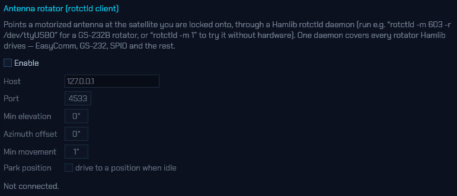

sdroxide points motorized antennas as a **Hamlib rotctld client** — configure
it in Settings ▸ Servers. Run a daemon next to the hardware, for example:

```bash
rotctld -m 603 -r /dev/ttyUSB0    # a Yaesu GS-232B interface
rotctld -m 202 -r /dev/ttyUSB0    # an EasyComm II controller (SatNOGS-style)
rotctld -m 1                      # Hamlib's dummy rotator, for trying it out
```

One protocol reaches everything Hamlib drives — GS-232, EasyComm, SPID,
AlfaSpid and the rest — without sdroxide needing a serial driver per
controller. The settings are the daemon's address, a minimum elevation below
which the rotator parks (set it to your local roofline), an azimuth offset for
a rotator whose north is off, the smallest movement worth commanding (motors
last longer not chasing tenths of a degree), and an optional park position.
The status line shows where the hardware actually reports itself pointing.

### 2.17 Running more than one radio

SDR Oxide can run several radios at once — an HF transceiver and a VHF dongle,
a network rig at the station and an RTL-SDR on the desk, or two receivers
inside the same box. Each radio is complete and independent: its own interface,
its own tuning, mode and band, its own panadapter and waterfall, its own
receive audio, its own sub-receiver, digital modes and scanner. They appear as
**tabs**, and with a single radio configured — the way every installation
starts — the tab strip stays out of the way entirely and the window looks
exactly as it always has.

**Adding a radio.** Open **Settings → Radio**. Across the top of the tab is a
row of buttons, one per radio, ending in **+**. Press **+** and a new radio is
created and focused, with the dialog already open on its (empty) Radio tab. A
new radio deliberately starts with **no interface** — silent, rather than
grabbing the first device it finds, which is usually the device another radio
is already using. Pick its interface, configure it, press **Apply /
reconnect**, and it is on the air. From then on the same strip appears across
the top of the main window as well.

**The tab strip.** Click a tab to switch to that radio. Everything else keeps
running behind the tab you are looking at — audio keeps playing, digital modes
keep decoding, skimmers keep skimming, the scanner keeps scanning. Each tab
carries, besides its name:

- **● TX** — this radio is transmitting. Visible from every tab on purpose:
  it is the one thing worth knowing about a radio you are not looking at.
- **⚠** — this radio has a problem (typically: its device is unreachable and
  it is retrying in the background).
- **🔊 / 🔇** — mute this radio's speaker audio. Muting is *only* the speaker:
  decoding, skimming, recording and everything else continue, so a muted
  background radio still fills its FT8 list and still spots.
- **×** — close the radio (every tab but the first has one; see below).

**Naming.** A tab names itself after its radio's interface — *PlutoSDR*,
*TCI*, *HPSDR* — so a strip full of different hardware needs no housekeeping
to be readable. To name one yourself, use the **Name** box under the button row
in Settings → Radio; clear the box and the tab goes back to naming itself.

**The first radio is the station.** The first tab is where the shared,
station-level things live: the spot feeds (DX cluster, POTA, SOTA, PSK
Reporter, FreeDV Reporter), WSPRnet, TLE refresh and the antenna rotator all
run on it, because a station has one of each of those no matter how many
radios it has. Its configuration also lives where a single-radio installation
keeps it, so adding and removing other radios never touches it. It is the one
tab that cannot be closed.

**One transmitter on the air at a time.** The radios share a station-wide
transmit interlock. Keying any radio — PTT, TUNE, a digital-mode sequence,
the voice keyer, or a program connected to one radio's built-in server —
claims it; while it is held, a key-up on any other radio is refused with a
notice naming the radio that is on the air, and nothing on the refused radio
changes state. The interlock releases on unkey.

**What is shared and what is per-radio.** Memory channels, memory folders,
band stacks, the digital-mode operator settings (callsign, grid, templates),
the logbook, spots and awards belong to the operator, and are shared: save a
memory on one radio and it appears on the others. The dial, mode, filter,
session restore, scanner setup and the built-in servers (TCI, rigctld,
WSJT-X) belong to each radio. Each radio's servers have their own
configuration precisely so two radios can serve two copies of WSJT-X on two
ports — which also means an additional radio's TCI server starts *disabled*,
because the default port would collide with the first radio's; enable it and
pick a free port in [§5.8.2](#582-built-in-tci-server).

**Background tabs.** A hidden radio's waterfall freezes — the pixels are only
drawn for the tab you are watching — and resumes with a clean gap when you
switch back; the spectrum data underneath it never stops. Keyboard shortcuts
and MIDI controls go to the focused tab only.

**Closing a radio.** The **×** on the tab (or in Settings → Radio) shuts the
radio down and removes it from the strip. Its configuration directory is kept
on disk — a closed tab is not a request to destroy the configuration behind
it — but a radio added later starts fresh rather than inheriting it.

**Several receivers from one box.** Some hardware carries more than one
receiver on a single connection, and each of those receivers can be a radio
tab of its own. Configure two radios with the same address and they *share*
the connection rather than fighting over it — closing either tab leaves the
other streaming, and the transmitter belongs to the first receiver's radio:

- **TCI** — a rig with two receivers (a SunSDR2DX) serves one radio on RX1
  and another on RX2, independently tunable, from one WebSocket. See
  [§5.2.4](#524-tci-network-expertsdr3-and-thetis).
- **HPSDR Protocol 2** — the board's DDCs are independently tunable
  receivers; run one radio per DDC on different bands from one Ethernet
  connection. (Protocol 1 boards have a single receiver.) See
  [§5.2.3](#523-hpsdr-network-radios).
- **PlutoSDR** — a 2R2T-capable board (a Pluto+, or a rev. C unlocked to two
  channels) serves a second radio from its second receive chain. The AD9361's
  chains **share one local oscillator**, so this is a second *antenna* on the
  same spectrum — retune either radio and both move. See
  [§5.2.7](#527-plutosdr-adalm-pluto).

**Remote and browser clients** connect to one radio — the first — for now;
multi-radio remote operation is a planned follow-up.

---

## 3. Digital modes

sdroxide has several families of digital mode. What they all share — how a mode
is entered, the calling-frequency buttons, and the bands with more than one
agreed frequency — is in 3.1. **FT8** and **FT4** are automatic, timeslot-based
modes with QSO sequencing, a world map, and automatic logging; they and the
logbook they write into — which also serves every other mode and your manual
QSOs — are 3.2. **PSK31**, **RTTY**, **Olivia**, **THOR** and **FSQ** are live
keyboard modes: you tune onto a signal, read the decoded text, and type a reply
that transmits as you go (3.3–3.4). **Hellschreiber** is a facsimile mode with
no decoder at all — it paints letters onto a scrolling strip and you read them
by eye (3.5). **SSTV** is an image mode: received pictures build up in a gallery
and you transmit composed images (3.6). **RIFP** carries pictures as numbered,
checksummed packets over its own FSK modem rather than as an analogue scan, and
is the one mode here that is not single sideband (3.7). **Weather fax** receives
the charts the meteorological services broadcast on short wave, and transmits
nothing (3.8). **JS8** uses FT8's waveform but carries a conversation instead of
a contest exchange (3.9). **RF Paint** is a transmit-only mode that draws text
and pictures directly onto the far station's waterfall (3.10). **WSPR** is not a
QSO mode at all — it is a beacon that measures propagation, and what it produces
is a list of paths rather than contacts (3.11).

### 3.1 General considerations

Every digital mode is entered the same way: open the Band/Mode popup and choose
the mode from the **DIGITAL** row. The panadapter locks to the digital sub-band
(the audio range just above the dial), and the mode's operating panel appears in
the lower part of the window; a draggable divider sets how much height the
panel gets.

While in a digital mode the **BAND** row of the Band/Mode popup doubles as a
frequency picker. Bands where the mode has a standard calling frequency carry
a **cyan underline**: clicking one jumps the dial straight to that frequency,
staying in the mode, and the button highlights when the dial is already on it.
Every band is available in every mode — clicking a band without an underline
jumps to that band's default frequency, also staying in the mode, and you tune
from there.

Two more things hold across the modes. Your **callsign and grid** are one
identity for the whole program: the General settings tab and the FT8/FT4 setup
window ([3.2.1](#321-one-time-setup-your-callsign-and-grid)) edit the same
values, and they fill the keyboard modes' CQ macros, the FT8/FT4 exchange, and
everything the station reports or uploads. And every digital transmission goes
through the normal transmit path, so the ham-band lockout and the usual
transmit safety apply in every mode.

#### Bands with more than one agreed frequency

Most modes have one agreed frequency per band, and the band buttons above are all
you need. Some have several — and where they do, a **⇵** button appears in that
mode's operating panel listing them:

| Mode | Where it happens |
| --- | --- |
| FT8 | The DXpedition (Fox/Hound) window on every HF band, and 6 m's second frequency at 50.323 |
| PSK31 | The 40 m region split: 7.040 in Region 1, 7.070 in Regions 2 and 3 |
| RTTY | The DX calling spots (3.590, 14.083) and the Region 2 slot at 7.080 |
| SSTV | The move-up-when-busy secondaries — a picture takes two minutes, so one frequency per band is occupied most of the time |

The button's face is the frequency you are on when the dial is already sitting on
one of them, and reads **⇵ FREQ** when it is not. Clicking a frequency moves the
**dial**; where you sit inside the audio passband is a separate control and is
left alone.

An entry shown in **amber** is one the IARU Region 1 band plan does not put
narrow data on. That is not a mistake in the list: the WSJT-X DXpedition
frequencies and the FSQCall set are global conventions built around the Region 2
band plan, and a few of them land in Region 1's CW or phone segments (1.845,
3.567 and 24.911 for FT8). The DX will be there and so will everyone chasing it
— but check your own band plan before you key, because sdroxide will not stop
you.

### 3.2 FT8 and FT4

**FT8** and **FT4** are the automatic modes: timeslot-based, with QSO
sequencing, a world map, a transcript, and automatic logging. Choose one from
the DIGITAL row ([3.1](#31-general-considerations)) and the FT8/FT4 operating
panel appears in the lower part of the window.


#### 3.2.1 One-time setup: your callsign and grid

Click **SETUP** in the QSO area to open the **FT8 / FT4 Setup** window:

- **My callsign** — your call (entered in upper case).
- **My grid** — your Maidenhead grid locator (for example `FN42`).
- **TX period** — whether you call in the **Even** or **Odd** time slots.
- **Auto-sequence** — advance the QSO automatically (recommended on).
- **TX watchdog / Give up after** — how long unattended transmitting may
  continue with no progress, and how many unanswered calls to one station are
  worth making. Both 0 to disable.
- **DXpedition** — which side of an FT8 pile-up you are on: **Normal**,
  **Hound**, or **Fox** (see [DXpedition mode](#324-dxpedition-mode-hound-and-fox)).
  **Fox signals** sets how many stations a Fox works at once.
- **Message templates** — the CQ / Grid / Report / R+Report / RR73 / 73 lines,
  using the placeholders `{MYCALL}`, `{MYGRID}`, `{DX}`, and `{REPORT}`. The
  defaults follow standard FT8 practice; you rarely need to change them.


These settings are saved to `digi.json` (see [configuration files](#11-configuration-files)).

#### 3.2.2 The operating panel

The panel has two halves:

- **DECODES** (left) — a live list of decoded stations. Each row shows the SNR
  (colour-coded by strength), the audio frequency, the callsign, the grid, and
  the full message, with a **REPLY** button on the right. CQ calls are
  highlighted. Decoded stations are also marked as boxes on the waterfall.
  A **CQ DX** call only counts as a CQ for you when you actually are DX for the
  caller — a different DXCC entity, or (when the prefix can't be resolved)
  3000 km or more away. Otherwise the row stays plain and the **CQ only** filter
  skips it, so the list isn't full of DX calls you shouldn't answer. You can
  still **REPLY** to such a station if you want to.
  A badge after the callsign says what the station would be worth against your
  log: **DXCC** (an entity you have never worked), **BAND** (worked before, but
  not on this band), **GRID** (a new grid square), **NEW** (a callsign you have
  never worked) or **DUPE** (already in the log for this band — the row fades
  back). The **New only** filter keeps just the rows that would put something new
  in the log.
  Neither filter ever hides a message addressed to your own station: a station
  calling you is not calling CQ, and may well be a dupe, but it is the one row
  in the list you owe an answer to.
- **QSO** (right) — a **⇵** frequency button when the band has more than one
  agreed frequency for the mode ([3.1](#31-general-considerations)), a world map
  (your location, the station you are working, and
  a transmit indicator), a station card showing the current step
  (`Idle`, `Wait CQ`, `Calling CQ`, `Tx Grid`, `Tx Report`, `Tx R+Report`,
  `Tx RR73`, `Tx 73`, `Confirming`, `Done`), and a transcript of the exchange
  (outgoing lines in gold, incoming in green, plus the queued next message).

Beyond the everyday exchange, the decode list understands the other FT8 message
layouts: **compound and non-standard callsigns** (`DL/W1AW`, `W1AW/P`), **hashed
callsigns** (shown as `<W1AW>` once that station has been heard, and as `<...>`
until then), **free text** (13 characters, listed as `TEXT` since it names no
sender), **contest exchanges** (ARRL RTTY Roundup, Field Day) and **DXpedition**
messages. Transmitting works the same way round: a message that the standard
layout can't carry is sent in the layout that can, and the transcript records
what actually went on the air — addressing a compound call sends your own
callsign hashed (`DL/W1AW <AB1CD> RR73`), which drops the signal report, and
free text is cut to 13 characters.

#### 3.2.3 Working stations

- **Answer a call:** click **REPLY** on a decode. sdroxide adopts that station,
  picks the opposite time slot, and runs the exchange automatically. If they
  have been calling *you*, the reply opens where their exchange actually stands
  rather than at the top: somebody repeating `<you> <them> -19` gets your
  R+report back, not your grid, and the report they sent is already in the log
  entry. So a station who calls again after you pressed **STOP QSO** — or who
  called while you were busy with someone else — is answered with one press.
- **Losing a pile-up:** if the station you called comes back to someone else
  instead, sdroxide stops calling and holds at `Wait CQ` rather than doubling
  into their QSO. The transcript shows a pink line — *"W9XYZ is working K1ABC"* —
  so it's clear they aren't talking to you, and calling resumes automatically
  when they call CQ again (or come back to you). The hold gives up after five
  minutes. A 73 / RR73 you already owe still goes out, so a finished contact is
  never dropped unlogged.
- **Call CQ:** click **CALL CQ**. When several stations come back in the same
  slot, sdroxide picks which to work first rather than taking whichever decoded
  first: a station already worked this session goes last, among signals of
  similar strength a new DXCC entity wins, and otherwise the strongest does —
  it is the one most likely to complete. The others are listed in the transcript
  ("also calling: …") so you can work them next. An answer that isn't a grid is
  still an answer: a station that comes back with a signal report (many do, and
  one that already knows your grid always will) puts you on the answering side
  of the exchange — R+report next — instead of leaving you calling CQ over the
  top of them. A late 73 from the contact you just finished is not a caller and
  is not adopted as one.
- **Set your transmit tone:** click a decode row (or click a station box on the
  waterfall) to set your transmit audio frequency to that station's frequency.
  The audio frequency is clamped to 200–3500 Hz.
- **Pick the message yourself:** the row under the transcript holds the five
  exchange messages — **GRID**, **RPT**, **R+RPT**, **RR73**, **73**. Clicking
  one jumps the exchange to that message and the sequencer carries on from
  there, the way WSJT-X's Tx1–Tx6 buttons do. The current step is highlighted,
  and the buttons are inactive until you are working someone.
- **Send free text:** type into the field beside those buttons and press
  **SEND** (or Enter). It goes out verbatim in the next transmit slot and then
  the exchange picks up exactly where it left off — a queued line never
  completes or logs a contact in place of your 73. FT8 carries 13 characters of
  free text, so that is what the field accepts.
- **Stop:** **STOP QSO** ends the current QSO gracefully; **STOP TX** aborts the
  current transmission immediately and un-keys.
- **The list says where the band is open.** Each decode carries its continent
  in its own colour, resolved from the callsign — so which way the band is
  running is legible down the column without reading a single callsign. Hover a
  row for the rest: DXCC entity, CQ and ITU zone, grid, distance and beam
  heading from your own grid, whether the station is new or already in your log
  and on which band, who a directed CQ is aimed at, and the raw signal report,
  frequency and DT.
- **Auto TX FRQ picks where you transmit.** On by default (the button above the
  decode list, or the setup window). Answering on the frequency of the station
  you are calling looks right and isn't: they transmit in the period opposite
  yours, so their frequency says nothing about who is transmitting there when
  *you* key — and whoever is will not hear you. Instead sdroxide picks the
  quietest spot in your own transmit period, from the stations it has decoded
  there, and moves no further than it has to. While it is on, clicking a decode
  or a station label on the waterfall no longer drags your transmit frequency
  onto that station; the click just selects. Turn it off to hold a frequency by
  hand. It has no effect in DXpedition mode, where both roles have their
  frequencies decided for them.
- **Queue a run of stations.** The **+** button on each decode marks that
  station to be worked; mark as many as you like in one pass over a busy slot.
  They appear in a `QUEUE` strip above the transcript, next one in green, and
  the sequencer starts each in turn as soon as it is free — after a contact
  completes, after it gives up on a station that never answers, or in place of
  a CQ nobody is answering. Click a queued call to drop it, or **CLEAR** to
  empty the queue. The transmit watchdog still stops the run: it exists to stop
  an unattended station transmitting, and the queue does not override it.
- **Directed CQs are read as directed.** `CQ DX`, `CQ EU`, `CQ JA`, `CQ POTA`,
  `CQ TEST` — sdroxide works out whether the call names you. One that does gets
  a thicker accent bar than a plain CQ; one aimed at somebody else is neither
  coloured as a CQ nor listed under **CQ only**. Continents (`EU`, `NA`, `AS`…)
  are matched against your own entity's continent, country prefixes (`JA`,
  `DL`…) against your entity, and activity calls (`POTA`, `SOTA`, `TEST`,
  `QRP`, `FD`, `WW`, `RU`…) are open to everyone. Anything it can't judge is
  shown rather than hidden. You can send one too: put it in the CQ template on
  the setup window, e.g. `CQ EU {MYCALL} {MYGRID}`.
- **The decoder knows who you are waiting for.** Once you are working someone,
  both callsigns in their next message are already known — 58 of its 77 bits.
  sdroxide hands them to the decoder as *a-priori* bits, which recovers replies
  a few dB weaker than a blind decode manages. It runs only where an ordinary
  decode has already failed and the result still has to pass its checksum, so it
  can add decodes but never invent one. Nothing to switch on.
- **Watch your clock.** The station card shows `DT` — how far your slot timing
  sits from the stations you are hearing, taken from the decodes themselves. It
  stays grey while you are inside half a second, turns amber past that and pink
  past 1.5 s. FT8 and FT4 need both ends to agree where a slot begins, and a
  clock far enough out that nobody can decode you looks exactly like a dead band
  from your side, so this is the first thing to check when nobody answers.
  Positive means you transmit early. The figure covers the whole receive path,
  so a slow audio or network chain counts the same as a wrong clock.
- **Unattended transmitting stops itself.** Two limits, both on the FT8 setup
  window: the **TX watchdog** (6 minutes by default) stops the sequencer when
  nothing has come back and you haven't touched anything, and **Give up after**
  (10 calls) abandons a station that never answers. `WATCHDOG` appears on the
  station card when the first one fires; calling CQ or picking a message clears
  it and starts the clock again. Repeating a CQ doesn't count as an unanswered
  call — that is what the watchdog is for. Set either to 0 to disable it.

Transmission happens automatically in your chosen time slot (FT8 slots are 15 s,
FT4 slots are 7.5 s) and goes through the normal transmit path, so the ham-band
lockout and transmit safety still apply.

#### 3.2.4 DXpedition mode (Hound and Fox)

FT8's answer to a rare-entity pile-up. One station — the **Fox** — transmits up
to five signals at once in the low part of the passband and works a queue of
callers; everyone calling it — the **Hounds** — calls from above 1000 Hz. That
split is what keeps the pile-up off the one station everybody wants. Set your
role in the FT8 setup window. It applies to FT8 only.

While either role is selected the panadapter shades the two halves of the
passband, `FOX` below 1000 Hz and `HOUNDS` above it, with the half you transmit
in tinted more strongly.

**As a Hound**, click **REPLY** on the DXpedition's decode and call from
wherever in the calling zone you have set your transmit frequency — sdroxide
refuses to move it down into the Fox's half, and does not follow the Fox down
when you answer it. Three things then differ from ordinary operation:

- You keep calling while the Fox works other stations, instead of standing down
  the way you would for a station that took someone else's call.
- When the Fox comes back to you, your transmit frequency moves *onto the Fox*
  automatically for the rest of the contact — that is what the Fox is listening
  for at that point.
- The Fox's `RR73` completes and logs the contact and you send nothing further.
  It usually arrives inside a message addressed to the next Hound
  (`YOURCALL RR73; W9XYZ <DX1FOX> +03`), which sdroxide reads for you.

**As a Fox**, **CALL CQ** starts the pile-up and **STOP QSO** stands it down.
Callers appear in a `PILE-UP` strip above the transcript — green for the
stations being worked, grey for those waiting — and are taken strongest and
rarest first, with anyone already in your log going last. Each transmission
carries as many signals as **Fox signals** allows, spaced 60 Hz apart and
sharing the transmitter's power, so more signals means each one is weaker.
Contacts are logged as their `RR73` goes out; where a caller is waiting, that
`RR73` shares its signal with the report opening the next contact.

#### 3.2.5 Reporting what you hear

Enable **Upload my FT8/FT4 decodes** on the Network settings tab to report every
station you decode to [pskreporter.info](https://pskreporter.info), where your
station then shows up as a receiver and your reports feed everyone else's
propagation maps. Reports are batched and uploaded every five minutes (the
interval the collector asks for), keeping the strongest report per station per
band. The callsign and grid come from the General tab — both are required, since
a report with no location can't be placed on the map. The optional **Antenna**
line is shown on your station's page. The **Collector** host and port are there
for testing: port 14739 is the project's test collector, which accepts reports
without publishing them.

#### 3.2.6 Logging and the logbook

Completed FT8/FT4 QSOs are logged automatically. Open the full logbook with the
**LOG** button (System module).


The logbook lists QSOs grouped by day (newest first) and covers both digital and
manual entries. You can:

- **+ NEW ENTRY** — add a manual QSO. Besides the basics (Call, Grid, Freq MHz,
  Mode, RST sent/received, Date/Time UTC with a **NOW** button, comment) the form
  carries **Name, QTH, State, Country**, transmit **Pwr**, and **Contest** fields
  (contest id and sent/received serial numbers). If you've already worked that
  call on the band, a **⚠ WORKED BEFORE** badge appears. Press **LOOKUP** to
  fill name/QTH/grid from your callsign-lookup provider (see
  [§9.2](#92-callsign-lookup)).
- **EDIT** / **DEL** — edit or delete an entry. Editing preserves fields the form
  doesn't show (resolved DXCC/zones, QSL status).
- **IMPORT** — load QSOs from an ADIF (`.adi`) file. Imported records are
  de-duplicated against the log (same call + band within two minutes are skipped).
- **ADIF** — export the whole log to `sdroxide-log.adi` (also the file you sign
  with TQSL for LoTW).
- **TXT** — export the whole log to `sdroxide-log.txt`.

A small status column on each row shows QSL state: a green **✓** once a QSO is
confirmed (LoTW, eQSL or card), a dim **↑** once it has been uploaded but not yet
confirmed. Hover it for the per-service detail.

Records also hold the fields used by lookup, upload and awards — DXCC entity,
CQ/ITU zones, IOTA and POTA/SOTA references, and per-service QSL status. See
[§9. Spotting, awards, and QSL upload](#9-spotting-awards-and-qsl-upload) for the
one-click upload buttons and award tracking.

The log is stored in `qso_log.json`.

### 3.3 PSK31 and RTTY

Choose **PSK** or **RTTY** from the DIGITAL row of the Band/Mode popup. As with
FT8/FT4 the panadapter switches to a zoomed sub-band waterfall, but the lower
panel is a live **messaging area** instead of a QSO sequencer.


**Receiving:**

- Decoded text streams into the receive window as signals are copied.
- Tune exactly onto a signal with the **−/+** buttons (±10 Hz) — or click its
  skimmer label (see [Skimmers](#4-skimmers)). In RTTY, two amber
  lines on the waterfall mark the expected mark/space tones to tune between.
- The **SQL** slider in the panel header is a decode squelch: raise it until the
  window stops filling with garbage when no signal is present, lower it (to the
  left) to copy weaker signals. It applies to every keyboard mode
  (PSK/RTTY/Olivia/THOR/FSQ).

**Transmitting (type-ahead):**

- Type your reply in the transmit box and press **TX** to key up. Text is sent as
  you type; characters that have already gone out turn **green**, so you can
  watch the transmission catch up when you pause.
- **CALL CQ** loads a CQ macro and starts sending it; **CLEAR** empties the
  buffer and stops; pressing **TX** again unkeys.

**Settings (PSK/RTTY setup dialog):**

- **PSK** is BPSK31 — differential BPSK with the standard varicode alphabet.
- **RTTY** defaults to 45.45 baud, 170 Hz shift, Baudot (ITA2). **Shift**
  (170 / 425 / 850 Hz) and **Baud** (45 / 50 / 75) are selectable.
- Your callsign and grid (shared with the FT8/FT4 setup) fill the CQ macro.

**Skimmers:** the PSK and RTTY skimmers (see [Skimmers](#4-skimmers)) label
signals across each band's PSK/RTTY calling sub-bands. Clicking a label from any
mode switches to PSK or RTTY, tunes onto the signal, and opens this panel.

### 3.4 Olivia, THOR and FSQ

Three more keyboard modes are on the DIGITAL row. **Olivia** and **THOR** reuse
the same messaging panel as PSK/RTTY; each mode's submode is chosen on its setup
page (**⚙ SETUP**):

- **Olivia** — a slow, extremely robust MFSK mode with Walsh/Hadamard block
  coding. Choose the **tone count** (2, 4, 8, 16, 32, 64) and **bandwidth**
  (125–2000 Hz). The symbol rate is bandwidth ÷ tones; **32/1000** and **16/500**
  are the common combinations. Both stations must use the same tones/bandwidth.
- **THOR** — a DominoEX-family 18-tone mode using incremental frequency keying
  (IFK+) with convolutional forward error correction. Choose a submode
  (**THOR4 … THOR32**); THOR16 is the usual default. The tone bank edges are drawn
  on the waterfall.

**FSQ** (Fast Simple QSO) has its own panel for the directed **FSQCALL** layer.
It is a 33-tone incremental-FSK mode; choose the **speed** (FSQ-2/3/4.5/6) and an
**FSQ call** on the setup page (defaults to your callsign):

- **Heard list** (left) — every station whose transmission is decoded is listed,
  most-recent first. Click a callsign to make it the directed target.
- **Compose** (right) — the **To:** line shows the current target (or ALLCALL).
  Type a message and press **SEND** (or Enter); sdroxide prefixes your call and
  transmits one burst (`YOURCALL:TARGET message`). **? heard** asks the selected
  station to send its heard list; incoming `?` queries addressed to you are
  answered automatically. **CALL CQ** sends a broadcast CQ.
- **Contacts** — the **CONTACTS** button opens an address book (persisted in
  `contacts.json`). Add callsigns, give them names, click **TO** to target one, or
  **DEL** to remove.
- **Images** — **Send image…** picks a picture, which is scaled to grayscale and
  transmitted as an analog tone scan; received pictures appear in the image
  gallery below. Nothing here is written to disk, so clearing it is local and
  immediate: right-click a picture to remove it, or **CLEAR** to forget the lot.

These three modems are native-Rust and self-contained. On-air interoperability
with fldigi is being validated; the first release targets clean-to-moderate
signals.

### 3.5 Hellschreiber

Choose **HELL** from the DIGITAL row for **Hellschreiber** — the oldest digital
mode still in regular amateur use, and the only one you read with your eyes
instead of a decoder.

Hell does not send characters. It sends *pictures* of characters: the
transmitter scans a 7-column by 14-row dot matrix per letter, top to bottom then
left to right, switching the carrier on and off as it goes. The receiver simply
free-runs at the same dot rate and paints whatever it hears onto a scrolling
strip. There is no synchronisation, no framing and no error correction — which is
exactly why Hell stays readable in conditions that break real decoders. A burst of
noise smudges a few dots instead of corrupting a whole character, and your eye
does the rest.

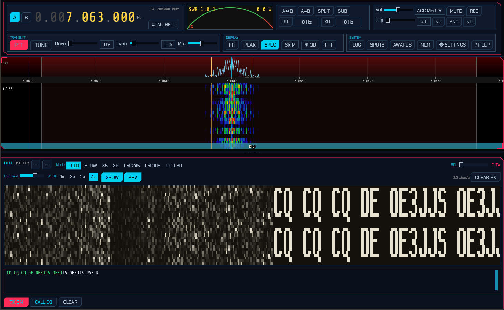

**Reading the strip.** Received text scrolls in from the right. Because nothing
synchronises the vertical position, a character can straddle the top and bottom
of the strip — so, like fldigi, sdroxide draws **every column twice, stacked**.
Whatever the alignment happens to be, one complete legible copy of the text is
always on screen. That is what the **2ROW** button controls; turn it off for a
single-height strip and drag the raster up or down to line the text up yourself.

**Panel controls.** The header carries the audio-tone readout with **−**/**+**
nudges, the variant buttons, and the decode squelch. Below that:

- **Contrast** — hardens or softens the dots. It redraws the entire scrollback,
  not just what arrives next, so you can rescue text that has already gone by.
- **Width** — `1×` to `4×` screen pixels per received column. Square dots would
  fit only about eighteen characters across the panel; the default `2×` shows
  around sixty.
- **2ROW** — the doubled display described above (on by default).
- **REV** — reverse video: light dots on dark paper instead of the classic look.
- **CLEAR RX** — wipe the strip.

**Transmitting** works like the other keyboard modes: type in the box and press
**TX**. Characters already sent turn green. **CALL CQ** loads a CQ using your
callsign, and **CLEAR** empties the buffer and stops. While TX is held with
nothing to send, Hell transmits blank paper rather than dropping the carrier,
which is how it holds a channel between overs — so press **TX** again to release.
Your own transmission is painted onto the same strip as it goes out, which is the
only confirmation Hell offers that your timing and font are right.

**Variants.** Seven, matching fldigi's set:

| Variant | Speed | Bandwidth | Keying |
| --- | --- | --- | --- |
| **FELD** | 2.5 char/s | 295 Hz | on/off keyed |
| **SLOW** | 0.3 char/s | 35 Hz | on/off keyed |
| **X5** | 12.5 char/s | 1470 Hz | on/off keyed |
| **X9** | 22.5 char/s | 2645 Hz | on/off keyed |
| **FSK245** | 2.5 char/s | 490 Hz | frequency-shifted |
| **FSK105** | 2.5 char/s | 220 Hz | frequency-shifted |
| **HELL80** | 5 char/s | 1200 Hz | frequency-shifted |

**FELD** (classic Feld Hell) is what essentially all on-air activity uses; the
others are worth knowing about but you will rarely meet them. **SLOW** trades
speed for a 35 Hz bandwidth that survives conditions nothing else will. **X5** and
**X9** are fast but wide — X9 occupies nearly the whole SSB passband, so the tune
control clamps it near the middle where it fits. The **FSK** variants keep the
carrier up and shift it instead of keying it, which suits a linear amplifier
better and gives a noticeably cleaner raster.

Hell transmits on **USB**. The band buttons are preset from the
[hellschreiber.com](https://www.hellschreiber.com/hellschreiber-frequencies.htm)
narrow-band digimode band plan (18 March 2019), using its *common calling and
operating* frequencies:

| Band | Preset | Band | Preset |
| --- | --- | --- | --- |
| 160 m | 1.840 | 17 m | 18.104 |
| 80 m | 3.574 | 15 m | 21.063 |
| 60 m | 5.3515 | 12 m | 24.924 |
| 40 m | 7.040 | 10 m | 28.063 |
| 30 m | 10.144 | 6 m | 50.286 |
| 20 m | 14.073 | | |

**These are IARU Region 1 values** where that band plan splits by region, matching
the Region 1 band edges sdroxide uses elsewhere; Region 2 and 3 differ on 160 m
and 80 m in particular. Bands quoted as a range use its low edge, so tune *up*
from the preset to find activity. 6 m is not in that band plan and comes from the
[Feld Hell Club](https://sites.google.com/site/feldhellclub/Home/frequencies).

On 15 m and 10 m the presets are 21.063 and 28.063 rather than the 21.074 /
28.074 the band plan names as calling frequencies, because those two sit squarely
in the FT8 sub-band — and fall outside the operating ranges the same table lists
beside them.

Hell is a "fuzzy mode" (J2B), so it may be sent in either the CW or the phone
segments; band plans are recommendations, and listening before you key matters
more here than the numbers do. Check them against a current plan for your region.

---

### 3.6 SSTV

Choose **SSTV** from the DIGITAL row to send and receive pictures. The panel has
a received-image gallery on the left and a transmit compositor on the right, with
a row of mode buttons across the top: **Auto**, **Scottie 1**, **Scottie 2**,
**Scottie DX**, **Martin 1**, **Martin 2**, **Robot 72**, and **Robot 36**.


**Auto** (the default) auto-detects the mode on receive — from the VIS header, or,
if you tune in mid-picture, from the sync cadence — and transmits in **Martin 1**
until a mode has been detected. Selecting a specific mode instead pins both the
receive decoder and the transmit compositor to that mode.

Band buttons tune to that band's common SSTV calling frequency (for example
14.230 MHz on 20 m, 7.171 on 40 m, 3.730 on 80 m — and above HF, 144.500 on
2 m and 432.500 on 70 cm, the narrow-band SSTV activity centre), staying in
SSTV.

**Receiving:**

- Incoming pictures decode scanline-by-scanline and appear in the **LIVE** view
  as they arrive, then land in the **RECEIVED** gallery (newest first).
- The **Signal** meter shows the receive audio level so you can confirm audio is
  reaching the decoder and set your input gain.
- In **Auto**, the mode is identified from the VIS header (or the sync cadence if
  you tuned in mid-picture) and pre-selected for your next transmission — no need
  to pick it.
- Received images are saved as PNG under `~/.config/sdroxide/sstv_rx/` and reload
  into the gallery next time.
- **Deleting.** Most of what a night on 20 m leaves behind is noise. **Right-click**
  a thumbnail and choose *Delete this picture*, or open one and use **Delete…** in
  the enlarged window — which asks a second time, because the file goes for good
  and there is no undo. The picture is removed from the store on the machine the
  radio is plugged into, so it is gone from every screen attached to it, and a
  browser client can clear the collection down without going near that machine.
  Deleting the picture you are looking at leaves the window on the next-older one,
  so a run of blank frames can be thrown away in a sequence of clicks.

**Transmitting:**

- The **TRANSMIT** side has five image slots that work like **tabs**. **Click** a
  slot to make it the active tab (highlighted with a cyan border and its number);
  the message box below then edits *that slot's* message. Use the **Load image…**
  button (or **double-click** a slot) to pick an image file, which is
  automatically cropped and scaled to the current mode's dimensions and stored
  under `~/.config/sdroxide/sstv_tx/`.
- Type a **message** for the active slot. Each slot keeps its own message —
  switching slots swaps the text — and the messages are saved to
  `~/.config/sdroxide/sstv_messages.json`, so they persist across restarts. The
  lines are drawn over the image in bold with a black outline for readability;
  the **first line is rendered at double size** as a title. A **live preview**
  shows exactly what will be transmitted,
  including a small red→black header strip with your **callsign** on the left and
  "SDRoxide" + version on the right. (Set your callsign on the **General**
  settings tab, or the FT8 setup dialog.)
- Press **TX** to transmit the composed image; **ABORT TX** stops a transmission
  in progress.
- **TX slant** trims the transmit clock (in ppm) to remove slant seen on a
  receiver whose sound-card clock differs slightly from yours — nudge it until a
  test picture decodes straight on the far end; **0** resets it. It applies to
  the next transmission and is persisted. (Received pictures are auto-deslanted
  by sdroxide, so this is only for the transmit direction.)

> **Note:** SSTV decode/encode runs in the server engine, so the panel works the
> same in the native app and the browser client. RX quality depends on signal
> conditions — clean signals decode well; weak or drifting signals may slant or
> show noise (ongoing refinement).

### 3.7 RIFP (Radio Image Framing Protocol)

Choose **RIFP** from the DIGITAL row to send and receive pictures over
[draft-dulaunoy-rifp-00](https://datatracker.ietf.org/doc/draft-dulaunoy-rifp/) —
a packetised image protocol, and the only mode here that is *not* single
sideband. Its `rifp-cpfsk-4800` radio profile keys the carrier itself:
continuous-phase binary FSK, 4800 baud, ±4 kHz deviation, in a channel about
25 kHz wide. **The dial is the middle of the signal, not its lower edge.**

The panel is the SSTV panel — the same live picture, the same received gallery,
the same five transmit slots with their own overlay messages — with a RIFP
control strip in place of the SSTV mode buttons. Pictures you load are shared
between the two modes.

> ⚠ **Bandwidth.** 25 kHz does not fit in a narrow-band segment. sdroxide will
> transmit RIFP wherever you tune it, and the panel says so in red whenever the
> dial is somewhere the channel does not fit. The segments it treats as wide
> enough are **10 m FM (29.510–29.700)**, the **6 m all-modes part
> (50.5–52.0)**, the **2 m all-modes part (144.500–144.794)** — where the image
> and facsimile modes have always lived — and **70 cm (430–440)**. The band
> buttons in the Band/Mode popup land in each of those while staying in RIFP,
> and the **433.920** button jumps to the calling frequency the draft names.
> Allocations differ by country and your own licence may be narrower than
> 25 kHz even inside those — checking that is yours to do, not the software's.

**The controls:**

- **CPFSK 4800** — the radio profile. One is defined so far.
- **Size** — the transmitted picture size (RIFP fixes none of its own).
  Everything is time: 320×240 at 4 bits takes a couple of minutes.
- **Encode** — how the picture becomes the object RIFP carries: **G4** (CCITT
  Group 4 facsimile, bilevel, usually the smallest for line art), **PNG**,
  **Zlib** or **RLE8** (compressed packed raster), **Raw** (the packed raster
  itself), **JPEG** (lossy), or **Auto**, which tries each and sends the
  smallest — never the lossy one unless you ask for it.
- **Gray** — grayscale depth, 1/2/4/8 bits. RIFP's raster is grayscale by
  definition: its manifest has no way to describe colour. **Dither** diffuses
  the quantisation error, which is worth having below 8 bits.
- **Repeat data** — how many times each data frame is sent. RIFP is
  unidirectional with no repair requests, so repetition is the *only* recovery a
  receiver gets; two is the default. **Chunk** sets the payload octets per frame
  (192 is what the profile recommends).

**Receiving:**

- The **Signal** meter is a modem lock indicator, not an audio level: it rises
  when the receiver is actually reading FSK symbols rather than noise.
- Each transfer appears in the control strip as the sender's ID (or the start of
  the session ID), the chunks received against the total, and a **chunk map** —
  one lit cell per chunk that has arrived, so you can see where the holes are.
  **✕** forgets an incomplete transfer.
- With the **Raw** encoding the picture paints row by row as chunks land. The
  other encodings cannot be decoded until they are whole, so they appear all at
  once.
- A picture is only shown after the reassembled object matches the manifest's
  size, CRC-32 *and* SHA-256. Nothing partial or unverified reaches the gallery.
  Enlarge a received picture to see who sent it, how it was carried, and how
  many chunks arrived first time.
- The counters read **frames** (valid), **bad** (failed their CRC and were not
  recovered) and **pictures** (complete and verified).
- Received pictures are saved as PNG under `~/.config/sdroxide/sstv_rx/`,
  alongside the SSTV ones — and are deleted the same way (3.6): right-click a
  thumbnail, or **Delete…** in the enlarged window.

**Transmitting:** identical to SSTV — pick a slot, load an image, type its
message, press **TX**. The status line shows which frame of how many is going
out and how long is left. Your callsign travels as the protocol's Sender ID
extension.

### 3.8 Weather fax (WEFAX / radiofax)

Choose **WEFAX** from the DIGITAL row to receive the weather charts the
meteorological services broadcast on short wave — surface analyses, wave
heights, ice edges, satellite composites. It is **receive only**: these are
commercial and military transmitters, and an amateur station has nothing to send
back.

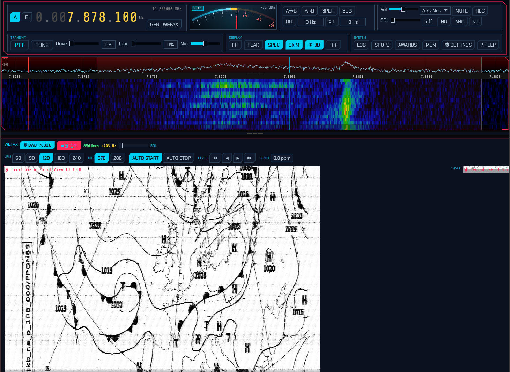

**Finding a signal.** The **STATIONS** button lists the schedules — DWD
Pinneberg, Northwood, the US Coast Guard transmitters, Halifax, Tokyo, the two
Australian ones — and picking a frequency tunes the dial. Note that the
frequencies in every published schedule are the **assigned carrier**, and USB
reception needs the dial **1.9 kHz below** it: 7880 kHz is tuned at 7878.1. The
picker does that subtraction for you, which is worth knowing because getting it
wrong is the commonest reason a chart comes out as a blank page.

Schedules change and stations close, so treat the list as where to start looking
rather than as a timetable.

**Tuning.** The `+0 Hz` readout beside the START button is the subcarrier's
offset from where it should be. Tune for roughly zero, green: a fax subcarrier
runs 1500 Hz for black to 2300 Hz for white, and a receiver a few hundred hertz
off clips the picture to solid black or solid white. You will hear the signal as
a warbling two-tone note.

**Starting and stopping.** A transmission opens with a five-second start tone
and closes with a stop tone, and with **AUTO START** and **AUTO STOP** on
sdroxide uses both — leave the mode running and charts appear on their own.
Since a chart takes a quarter of an hour, though, you will usually have tuned to
one already in progress: press **START** to begin recording mid-chart, and
**STOP** to end it and save. Turn **AUTO STOP** off to record straight through a
station sending several charts back to back.

**Geometry.** Nothing in the signal states the line rate, so:

- **LPM** — lines per minute. **120** is what essentially every weather service
  uses; the others are there for the occasional 60 or 240 LPM transmission.
- **IOC** — index of cooperation, which fixes the line length: 576 gives 1809
  pixels per line and is what charts use, 288 gives 904. The start tone
  announces this one (300 Hz for 576, 675 Hz for 288), so with AUTO START on it
  is chosen for you.

**Straightening the picture.** Two controls, and both are normal to need:

- **PHASE** ◀ ▶ shifts the picture sideways in 10- or 100-pixel steps. A chart
  begins with about thirty seconds of phasing signal that tells sdroxide where a
  line starts; if you tuned in after that went by, the chart arrives cut
  vertically and wrapped, and this is what puts it back together.
- **SLANT** trims the sample clock in parts per million. If the chart leans to
  the left, increase it; to the right, decrease it. A sound card a hundred ppm
  off — well within tolerance — walks a fifteen-minute chart most of a line
  sideways, so this is the setting every fax operator ends up with a value for.
  Once you have found yours it is remembered.

**On the globe.** While you are tuned to a station in the list, the 3D solar
view ([6](#6-solar-system-3d-view)) draws the path from your QTH to that
transmitter, exactly as it draws the station you are working in FT8. Weather fax
carries no callsign and no grid square, so this is the only thing that turns an
anonymous chart into "this came 900 km across the North Sea" — and it makes the
propagation obvious when a station you can hear all night in winter vanishes at
noon.

**The picture.** The chart paints line by line as it arrives, in a view you can
scroll and zoom while it is still coming in — a chart takes a quarter of an
hour, and there is no reason to wait for the bottom of it before reading the
top. The **VIEW** controls decide how it is shown:

- **FIT** scales it to the panel width, **WHOLE** shrinks it until all of it is
  in view at once, and **50% / 1:1 / 2×** are fixed magnifications. At 1:1 one
  screen pixel is one fax pixel, which is what you want for reading small print
  on a chart.
- **HEIGHT** stretches the picture vertically, ×0.25 to ×4. A chart that comes
  out squashed or stretched is being decoded at the wrong line rate — this makes
  it readable, and the LPM buttons fix it properly.
- **FOLLOW** keeps the newest lines in sight. Scrolling up turns it off so you
  can read what has already arrived without the view snapping back every half
  second; scrolling back to the bottom turns it on again.

**The gallery.** Completed charts are written as grayscale PNG to
`~/Pictures/sdroxide/wefax/` — with your pictures rather than in a hidden config
directory, because a weather chart usually gets printed, mailed or opened next
to a routing program, and all of that happens in a file manager. Each is named
for when it was received and what it was tuned to:

```
wefax-20260729-141530Z-7878.1kHz-DWD.png
```

that is, UTC date and time, the dial frequency, and the station's callsign when
the dial is on a published schedule. The strip on the right of the panel lists
them newest first, each labelled with its date, time and station; click one to
open it full size, which you will need to — the fronts and isobars are
unreadable at thumbnail scale — and **◀ NEWER** / **OLDER ▶** step through the
rest without closing the window. **PATH** copies the directory.

A station that keys up over a dead band fills the directory with grey pages, so
charts can be thrown away from the panel: **right-click** a card and choose
*Delete this chart*, or use **DELETE** in the open chart's window, which asks a
second time before the file goes. The chart is deleted on the machine the radio
is plugged into and disappears from every screen attached to it. Deleting the
chart you are viewing leaves the window on the next-older one — the same place
**OLDER ▶** would have gone — so a run of blank pages goes in a sequence of
clicks.

Charts saved by earlier versions in `~/.config/sdroxide/wefax_rx/` are still
listed alongside the new ones, so nothing you have already received disappears.
Deleting one takes both copies, so a chart that was in the old directory too
does not reappear on the next listing.

### 3.9 JS8

Choose **JS8** from the DIGITAL row. JS8 uses FT8's waveform — the same eight
tones in the same 79-symbol frame — but carries a conversation instead of a
contest exchange: free text, questions you can ask another station, and a
periodic "I am here" heartbeat. Because it is slotted like FT8 it decodes far
below the noise floor, and because it is a conversation it is slow. A sentence
takes about a minute. That is the trade.

**Speeds.** Four of them, on buttons in the panel header:

| Speed | Slot | Width | Use |
|---|---|---|---|
| NORMAL | 15 s | 50 Hz | The band convention; nearly all traffic |
| FAST | 10 s | 80 Hz | Good conditions, shorter waits |
| TURBO | 6 s | 160 Hz | Local and VHF work |
| SLOW | 30 s | 25 Hz | The weak-signal end |

Both stations must be on the same speed — they are different waveforms, not
different settings, and a NORMAL station cannot hear a TURBO one. Normal is
what you want unless you have agreed otherwise.

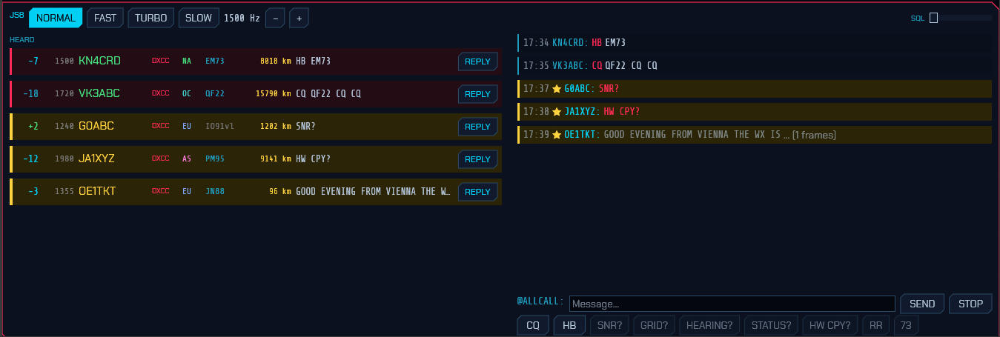

**The panel.** Stations heard are listed on the left in the same rows the FT8
decode list uses — report, frequency, callsign, what they would be worth
(DXCC / BAND / GRID / NEW / DUPE), continent, grid, distance, and the last thing
they said — so a band you have learned to read in FT8 reads the same way here.
Hovering a row brings up the full station card: entity, zones, bearing, and
whether you have worked them before. A row addressed to you is boxed in gold; a
heartbeat or a CQ, which are invitations, get the red CQ background.

The conversation is on the right, newest at the bottom, with anything addressed
to you marked ★. A message still arriving is shown greyed with a frame count,
because a half-received sentence should not read like a complete one.

**Replying.** Clicking a message — or a station's **REPLY** button — aims the
composer at that station and drafts the reply the exchange expects. A heartbeat
or a CQ is asking "can anyone hear me?", so it drafts a signal report; `SNR?`,
`GRID?`, `STATUS?` and `HEARING?` draft their answers; `HW CPY?` drafts a
report; `RR` and `QSL` draft `73`; `AGN?` puts back the last thing you sent. It
is only ever a draft — it lands in the text box and you are free to rewrite it,
because most of JS8 is conversation and there is no standard answer to "good
evening from Vienna". Free text drafts nothing and only selects the station.
Clicking a row rather than its REPLY button selects without touching what you
have already typed.

**Sending.** Type in the box and press Enter. Beside the send button is an
estimate — `3f · 45s` — of how many frames the message needs and how long it
will be on the air. Watch that number before you press send; it is the thing
newcomers to JS8 find most surprising. With a station selected, the query buttons
ask it directly: **SNR?** for a signal report, **GRID?**, **HEARING?** for what
it is copying, **STATUS?** for its status message, **HW CPY?** for "how do you
copy me", and **RR** / **73** to acknowledge and sign off. **CQ** calls
generally, **HB** sends a single heartbeat.

Anything addressed to a callsign — typed, drafted or from a button — goes out
as a JS8 *directed* frame, so the station at the other end sees a message meant
for them rather than words that happen to name them. When the message opens
with a command the mode knows, that command travels in the frame too; when it
carries more than the frame can hold (a grid, a status line, a sentence) the
rest follows as free text. The framing is byte-identical to JS8Call's own,
which is what the tests check it against. Relay and message-store commands are
the exception: this station does not act on them, so it does not originate them
either, and they go out as ordinary text.

**On the map.** Heard stations appear on the 3D globe (**3D** in the DISPLAY
row) exactly as FT8 decodes do, and the station the composer is aimed at gets
the contact arc from your QTH. Most JS8 traffic carries no locator — only
heartbeats, CQs and `GRID` replies do — so if callsign lookup is configured
(⚙ SETTINGS → Network → Uploads) the rest are resolved through it, one at a
time, and their grid is shown greyed to mark it as looked up rather than heard.
Because JS8 beacons every ten or fifteen minutes rather than every slot, a
station stays lit far longer here than in FT8.

**Answering automatically.** In ⚙ SETUP, *Auto-reply* answers SNR?, GRID?,
STATUS? and HEARING? queries addressed to you or to @ALLCALL — with the answer,
not just the acknowledgement: a report rides in the frame itself, and a grid or
a status line follows it as text. This is what makes a JS8 station worth leaving
switched on, and it is on by default. It never answers another station's
traffic, and never answers itself.

*Heartbeat reply* answers a heard heartbeat with a signal report, so the station
beaconing learns who copied them and how well. It is **off** by default, and
deliberately hedged about: a busy band carries a heartbeat every slot, and a
station that answered all of them would flood exactly the band heartbeats exist
to keep quiet. So it answers a given station at most once every 15 minutes,
never while a multi-frame message is still arriving, and never while you have
something of your own queued to send — an answer that waited behind a long
message would carry a stale report anyway. A CQ is never answered automatically
at all: it asks for a contact, and starting one is your decision.

**Beaconing.** *Heartbeat* transmits your callsign and grid on an interval so
others know you are receivable — off, 10, 15, 30 or 60 minutes, the choices
JS8Call offers. It is **off** by default: an unattended beacon is something you
should choose, not something a mode switches on for you. **HB AUTO** in the
panel header turns it on and off without opening SETUP, and the countdown beside
it says when the next one goes out — a transmitter that keys itself should say
so where you are already looking.

The first heartbeat is a whole interval away rather than immediate, so choosing
an interval never keys the radio before you can change your mind. Each one is
scheduled with up to a slot of jitter, because stations that share an interval
and started together would otherwise collide on every beacon. Turbo does not
beacon at all, and cannot acknowledge one: it is the local and VHF speed, and an
unattended transmitter there spends a lot of a small band to reach nobody far
away.

**Where beacons go.** Not on your working frequency. Heartbeats and their
acknowledgements move to a free slot in the **500–1000 Hz sub-band**, the same
convention JS8Call follows: it is where stations watching for beacons look, and
it keeps an unattended transmitter off somebody else's QSO. The slot is chosen
at the moment the beacon goes out — a beacon can wait behind a long message for
minutes, and a frequency picked when it was queued would be somebody else's by
then. A slot counts as taken if anything was decoded within one signal width of
it in the last half-minute (longer at Slow, whose transmissions are longer than
that), and if the whole sub-band is busy the beacon takes whichever slot has
been quiet longest.

So a beacon appears on the waterfall somewhere other than your transmit marker.
The panel header says where the last one went — `HB 750 Hz` beside the
countdown — so you can tell your own beacon from a stranger's. If you would
rather keep everything you transmit in one place, ⚙ SETUP → *Beacon frequency*
→ **Working freq** switches it off.

Relayed messages and stored-message requests are decoded and shown, but this
station will not act on them — forwarding traffic on someone else's behalf is a
decision for the operator.

### 3.10 RF Paint (spectrum painting)

Choose **RFPAINT** from the DIGITAL row for **RF Paint** — a transmit-only mode
that draws text and pictures **directly onto a receiver's waterfall**. There is no
decoder and no message format: the picture *is* the signal. Anyone watching their
panadapter on your frequency simply *sees* what you paint, so it is a fun way to
put a callsign, a grid, or a small graphic on the band.


RF Paint transmits on **USB** and fills a 3 kHz audio band (about 300–3300 Hz),
so it sits inside a normal SSB channel. It has no calling frequency — use it on a
clear frequency where you are allowed to transmit, and tell the other station
where to look. The panel has two side-by-side areas:

- **TEXT PAINT** — type a line of text and it is rendered as upright letters that
  scroll up the far station's waterfall. The font size is fixed, so a longer
  message simply makes a wider banner (a longer transmission) rather than smaller
  letters. A live **preview waterfall** shows exactly how the text will look on
  the receiving end. Press **TRANSMIT** to send it.
- **IMAGE PAINT** — **Load image…** picks a picture (PNG or JPEG), which is
  reduced to a grayscale, contrast-stretched bitmap and shown in the image box.
  Its own **preview waterfall** shows how it will paint. Press **TRANSMIT** to
  send it.

**Scan speed** (the slider in the panel header) sets how fast the text or image is
scanned onto the waterfall, from 100% (the base rate — fastest, shortest
transmission) down to about 6%; **25%** (the default) is a good compromise. Slower
is more legible, because the receiver's waterfall gets more scan lines to draw the
picture — but it takes longer to send. A transmission runs from a few seconds to
a couple of minutes depending on the length and the scan-speed setting.

While painting, a **progress bar** and a **TX %** readout track the transmission,
and **Abort** stops it immediately. RF Paint goes through the normal transmit path,
so the ham-band lockout and the usual transmit safety still apply. Because it is
transmit-only, RF Paint receives nothing — you read other stations' paintings on
your own waterfall like any other signal.

---

### 3.11 WSPR (Weak Signal Propagation Reporter)

Choose **WSPR** from the DIGITAL row. This is the one mode here that is not
trying to make a contact. A WSPR transmission is 110.6 seconds of four-tone FSK
six hertz wide, carrying a callsign, a four-character grid and a power level and
nothing else, sent in a two-minute slot. It decodes about ten decibels below
FT8 — well under the noise — and what comes out of it is a measurement of a
path, not a message anybody sent you.

The dial goes to the band's WSPR frequency (14.095 600 MHz on 20 m, and so on);
every transmission in the world sits in the 200 Hz window 1400–1600 Hz above it.
The receiver's passband is narrowed to that window on purpose: with signals this
weak, letting the QRSS beacons just below it work the AGC would cost you
decodes.

The panel has three panes. On a wide screen the receptions run full height down
the left and the **map** takes the top right, with the beacon's status under it;
narrower, the tab row picks one.

#### Receiving

The **SPOTS** pane lists receptions, newest first:

| Column | What it is |
| --- | --- |
| `←` / `→` | `←` a beacon this station decoded; `→` a station that decoded *this* one |
| Callsign, grid | The far end of the path |
| km | Great-circle distance from your locator |
| dB | Signal-to-noise in a 2500 Hz bandwidth, as WSPR reports it |
| power | What the beacon declared it was radiating |

The report colours are WSPR's own scale, not FT8's: green above −10 dB, cyan to
−20, yellow to −26, and pink below that — because −25 dB here is a perfectly
good path rather than a marginal one.

A slot takes seconds of work to decode, so the status pane says **decoding…**
rather than leaving you to wonder whether the band is shut.

#### The map, and the propagation heat on it

The **MAP** pane shows every station heard, fading over ten minutes — a WSPR
beacon is heard every few minutes at best, so the FT8 map's two-minute fade
would leave this one blank almost always.

Above the map is the **PROP** button. It shades the map by where signals are
actually getting through; pressing it reveals the rest of the controls —
`ALL BANDS` or `ONE BAND`, which band, and the absolute path count the brightest
cell stands for. [§6.8](#68-the-propagation-heat-map) explains what the
shading means. The same picture, with more control over it, is on the 3D globe.

Drag the strip under the map to resize it against the status pane.

#### Transmitting

Off until you ask for it: selecting a mode is not consent to put a carrier on
the air.

Everything is in the `STATUS` pane; WSPR has no separate setup dialog.

- **TRANSMIT** is the switch and the setting at once: `OFF` is receive-only, and
  `10% / 20% / 33% / 50%` is the fraction of two-minute slots this station
  beacons in. **20%** is the convention — enough to be heard, sparse enough that
  a hundred beacons can share two hundred hertz. The slots are drawn from your
  callsign, so two stations running sdroxide do not pick the same ones.
- **POWER** is what you actually radiate, in watts. Only the nineteen levels
  WSPR's fifty-bit message can name are offered — 1 mW through 1 kW in 1-2-5
  steps — because the figure goes out on the air and everyone who hears you
  judges the path by it. An optimistic number here makes *their* measurements
  wrong as well as yours.
- **ROAM** picks a different offset inside the 200 Hz window for every
  transmission. On by default: two hundred hertz shared by everyone only works
  if nobody parks in the middle of it.

Your **callsign and grid come from the General tab of Settings** — the same
identity the rest of the program reports under. The panel says which it is
transmitting as, and says so in yellow if either is still blank.

WSPR's message carries a plain callsign and a **4-character** locator and has
room for nothing else. A longer locator is simply shortened — `JN47cb` goes out
as `JN47`, which is what the extra precision means anyway — and the panel shows
which form it is transmitting as. A **compound callsign** (`PJ4/K1ABC`) genuinely
cannot be sent: it needs a message layout this station cannot encode, and the
panel says so rather than transmitting something that is not you. Receiving is
unaffected either way — all three message types decode.

One receive limitation worth knowing: a **Type-3** message spends its callsign
field on a 15-bit hash so it can carry a six-character grid instead of four.
That hash is not invertible, and sdroxide cannot currently compute it either, so
such a station is listed as `<#0a3f7>` rather than by name. Its **grid arrives
in the clear**, so the path is real, the map places it and the propagation heat
map counts it — only the name is missing. Those spots are deliberately *not*
uploaded to WSPRnet: posting a placeholder would put a station that does not
exist into a database everybody reads.

#### Band hopping

**BAND HOP** moves the dial from band to band between slots, so one receiver
samples the whole spectrum instead of one slice of it. A row of band buttons
appears under it when it is on, for choosing which bands the cycle visits.
Turning the VFO yourself pauses it and says so —
a beacon and its operator fighting over the dial is the one thing this must not
do — and applying the setup again resumes it. It never moves under a
transmission, and a band the radio cannot reach is skipped silently.

#### WSPRnet

- **UPLOAD** sends what you decode to <https://wsprnet.org>. On by default: it
  puts nothing on the air, and reporting what you hear is what makes a WSPR
  receiver part of the network rather than a private curiosity. A slot that
  decoded nothing is reported too, which is how the network tells a shut band
  from a receiver that was switched off.
- **WHO HEARD ME** polls wsprnet.org for reports of your own callsign. WSPR has
  no acknowledgement of any kind, so this is the only way a beacon learns
  anything about its own reach. Those reports appear in the list with a `→` and
  place the *reporter* on the map — the far end of the path, which is the end
  worth drawing.

Both are on the **Spots** tab of the Settings dialog as well as the panel, and
both use the callsign and grid from the General tab.

---

## 4. Skimmers

The skimmers decode many signals at once across a wide (~192 kHz) window and
label each one on the waterfall. There are three: **CW**, **PSK31**, and
**RTTY**.


- The **SKIM** button in the Display module opens the skimmer popup: one row per
  skimmer (**CW**, **PSK**, **RTTY**), each with an on/off button and its own
  **squelch** — the minimum SNR (dB) a decoded signal must reach before it earns
  a box. The SKIM button stays lit while any skimmer runs, and a skimmer you switch
  off stops decoding entirely (it costs no CPU) and its boxes disappear. Like the
  band/mode popup, this one fades away by itself after a few seconds; keep the
  pointer on it to hold it open.
- On a SoapySDR (IQ) source all three skimmers are **on by default**, with
  squelch at `0 dB` — everything that decodes is spotted. Raise a squelch to keep
  only the stronger signals of that mode on the waterfall.
- Each decoded signal appears as a box next to its trace on the waterfall,
  showing the callsign (once resolved, for CW) and a rolling tail of decoded
  text. Boxes fade out a few seconds after a signal stops.
- **Click a skimmer box** to tune to that signal and switch to its mode — CW for
  a CW spot (which lands it on the CW panel's cursor, [2.14](#214-cw-decoding-and-keyboard-sending)),
  PSK or RTTY for a digimode spot (which also opens the messaging panel,
  [3.3](#33-psk31-and-rtty)).

**Band-aware gating.** To avoid noise and false decodes, each skimmer only runs
where its mode is used: the CW skimmer in CW sub-bands, and the PSK and RTTY
skimmers in each band's PSK/RTTY calling sub-bands — with the FT8, FT4, WSPR, and
QRSS watering-holes excluded so their signals aren't mistaken for PSK or RTTY
(the WSPR window and the slow-CW/QRSS beacons just below it sit inside the RTTY
sub-band on several bands, so they're carved out explicitly). The skimmer-decoded
text is a coarse best-effort copy; switch to the mode (click a box) for a clean
decode — the CW skimmer runs the same decoder as the CW panel, but over hundreds
of signals at once and re-reading each one only twice a second, so a signal you
care about is always better copied on the panel.

> **Note:** the skimmers are a wideband feature and work only with true IQ/SDR
> sources (SoapySDR, HPSDR, TCI). They are unavailable when a CAT radio is
> feeding demodulated audio (see [settings](#5-settings)),
> because that mode has only a narrow audio slice rather than a wide IQ span.

---

## 5. Settings

Everything that configures sdroxide lives in one window, opened with the
**⚙ SETTINGS** button in the System module (the **⚙ SETUP** button in the SPOTS
window opens the same dialog on its Spots tab). Nine tabs run across the top:

| Tab | What it holds |
| --- | --- |
| **General** | Which version this is, your callsign and grid, the sound devices, and who may connect remotely. [5.1](#51-general-station-audio-and-remote-access) |
| **Radio** | Which rig sdroxide talks to, and how. [5.2](#52-radio-choosing-and-configuring-the-rig) |
| **UI** | Frame rate, waterfall palette, spectrum background, 3D cloud rendering, and the spoken announcements. [5.3](#53-ui-display-preferences-and-voice-announcements) |
| **Controls** | Keyboard, mouse and MIDI bindings. [5.4](#54-controls-keyboard-mouse-and-midi) |
| **Spots** | DX cluster, POTA, SOTA and PSK Reporter feeds, and the broadcast station list. [5.5](#55-spots-spot-feeds) |
| **FreeDV** | FreeDV Reporter (qso.freedv.org). [5.6](#56-freedv-freedv-reporter) |
| **Uploads** | Callsign lookup, QSL upload, confirmation download. [5.7](#57-uploads-callsign-lookup-and-qsl-services) |
| **Servers** | Hamlib rigctld, the built-in TCI server, and the WSJT-X UDP broadcast. [5.8](#58-servers-letting-other-programs-drive-the-radio) |
| **TLE** | Satellites to track beyond the amateur set, and their frequencies. [5.9](#59-tle-satellites-and-their-frequencies) |

Most settings take effect the moment you change them. The ones that open or
rebind a connection — the radio itself, the spot feeds, FreeDV Reporter, and the
two servers — have their own **APPLY** or **Apply / reconnect** button, noted in
each section below. Nothing here needs a restart.

Settings are written to the per-user config directory ([§11](#11-configuration-files)):
display preferences to `config.toml`, the radio to `radio.json`, key/mouse/MIDI
bindings to `input.json`, feeds and credentials to `net.json`, the two servers
to `rigctld.json`, `tciserver.json` and `wsjtx.json`, and the satellite
additions to `satellites.json`.

Most of those files describe the *station*, not the screen: the feeds it
connects to, the servers it offers, the satellites it tracks. They live on the
machine the radio engine runs on, and the engine tells every client what they
say — so the **Spots**, **FreeDV**, **Uploads**, **Servers** and **TLE** tabs
show, and change, the real thing whether you are at the shack machine, on a
native remote client or in a browser tab. `input.json` and the `[ui]` half of
`config.toml` are the exception, and belong to the screen in front of you: a
display preference and a knob on your desk have nothing to do with the radio in
the other room. The rest of `config.toml` — including the `[remote_access]`
sign-in — belongs to the engine's machine, which is why the **Remote access**
section of the General tab is only shown there.

### 5.1 General: station, audio and remote access


At the top is **SDRoxide** and the version number this copy was built from —
the one to quote in a bug report, so there is no need to go looking for the
binary to ask it.

**Station** — your **Callsign** and **Grid square**. This is the identity the
whole program uses: FT8/FT4 exchanges, the SSTV image header, the logbook, the
DX cluster login, and FreeDV Reporter. The same pair is editable from the FT8 /
SSTV setup dialog; there is only one copy of it.

**Your audio (speakers / microphone)** — the devices sdroxide uses for *you*,
separate from any sound card wired to a radio:

- **Output** — where receive audio is played.
- **Input** — your microphone for voice transmit.

Both default to **System default** and can be changed live. In `config.toml`
they are `audio_output` and `audio_input`.

**Radio audio (sound card)** — a third section appears below those two, but
*only when the radio interface is CAT / Audio* ([5.2.2](#522-cat-radios-serial-control--usb-audio)):
every other backend carries its audio in-band and needs no sound card, which is
why the screenshot above (taken with a TCI rig) does not show it.

- **From radio (RX)** — the capture device carrying the radio's receive audio.
- **To radio (TX)** — the playback device carrying your transmit audio to the
  radio.
- **Apply / reconnect** — reopens the CAT rig with the chosen cards.

Device names include the manufacturer, model, ALSA card id, and USB id — for
example `C-Media Electronics Inc. USB Audio Device, USB Audio [Device · 0d8c:0012]`
— so two identical adapters can be told apart.

> **IQ needs a stereo device.** IQ format requires a two-channel capture
> interface (I and Q). A mono USB audio adapter cannot carry IQ; if you pick one
> for IQ, sdroxide refuses it and shows a warning banner. Use a stereo line-input
> interface for IQ, or choose **Demod audio**.

On a PipeWire system, the desktop audio server can hold a USB radio codec's
capture device open, which intermittently blocks sdroxide from opening it (the
symptom is silent receive and a "waiting for spectrum" panadapter). For a
sound card dedicated to the radio, the reliable fix is to tell WirePlumber to
stop managing that card, leaving it for sdroxide. Create a drop-in such as
`~/.config/wireplumber/wireplumber.conf.d/51-radio.conf` that disables the
card, then restart WirePlumber. See [troubleshooting](#12-troubleshooting).

**Remote access** — the **Username** and **Password** a remote client has to
give before this station will let it operate: the browser page, another sdroxide
started with `--connect`, and the 3D view's tab. See
[§ 7.3 Sign-in](#73-sign-in-who-may-operate-the-station).

- Both boxes empty leaves the server **open** — anyone who can reach the port
  can operate the radio, transmit included. The tab says so in yellow.
- A password with an empty username is a complete setting; clients are then
  asked only for the password. Most single-operator stations want this.
- Typing here writes `config.toml` straight away, and the server re-reads it for
  every sign-in — so a password change holds without restarting the server or
  dropping whoever is already connected. There is no **APPLY**.
- The section only appears when the engine is running in *this* process. These
  credentials are a file on the machine the radio is attached to, so a remote
  client is not shown them: a box there would edit its own machine's file and
  look as though the station's password had changed when it had not. Set them at
  the shack machine, or edit `[remote_access]` in `config.toml` by hand.

Like every other password sdroxide stores — the cluster login, QRZ, eQSL — it is
kept in the clear, so `config.toml` is worth the same file permissions as the
rest of your config directory.

### 5.2 Radio: choosing and configuring the rig

In the native application the very top of the tab carries the **radio
roster** — one button per radio, with the same TX / warning / mute markers as
the main window's tab strip, an **×** on every radio but the first, and **+**
to add one ([§2.17](#217-running-more-than-one-radio)). Everything below the
roster configures the **highlighted** radio; click another button and the whole
application switches to that radio, this dialog included. The **Name** box
under the buttons renames the highlighted radio's tab — left empty, the tab
names itself after the interface selected below.

**Radio interface**, under the roster, selects how sdroxide talks to your
radio. Everything below the selector changes to match the choice:

- **SoapySDR** — a SoapySDR device (wideband IQ). The default, and listed only
  when SoapySDR support is compiled in. See [5.2.1](#521-soapysdr-devices).
- **HPSDR (network)** — an OpenHPSDR (Hermes/Metis) Ethernet SDR on the LAN. See
  [5.2.3](#523-hpsdr-network-radios).
- **CAT / Audio** — a CAT-controlled radio with audio over a USB sound card. See
  [5.2.2](#522-cat-radios-serial-control--usb-audio).
- **TCI (network)** — a TCI server such as ExpertSDR3 or Thetis. See
  [5.2.4](#524-tci-network-expertsdr3-and-thetis).
- **SmartSDR / FlexRadio (network)** — a FLEX-6000 or FLEX-8000 on the LAN. See
  [5.2.6](#526-smartsdr-flexradio-network-radios).
- **RTL-SDR (USB)** — an RTL2832U dongle, driven by sdroxide's own USB driver
  with no SoapySDR involved. See [5.2.5](#525-rtl-sdr-usb-dongles).
- **PlutoSDR (network)** — an ADALM-Pluto, driven by sdroxide's own IIOD client
  with no SoapySDR and no libiio involved. See
  [5.2.7](#527-plutosdr-adalm-pluto).

There is no auto-detect: you pick the interface, and an interface that cannot be
opened falls back to a silent source rather than guessing at another one.

> After changing the radio interface, serial port, sound format, or
> radio-audio device, press **Apply / reconnect** at the bottom of the Radio
> tab (or under the CAT radio-audio settings on the General tab). sdroxide
> rebuilds the radio live — no restart. If the new interface can't be opened,
> the previous one keeps running and an error is shown; your tuning resets to
> the new radio's default frequency, as it would on a fresh start.

**Apply / reconnect is for *changing* the radio, not for attaching it.** If the
radio you already configured isn't there when sdroxide starts — a network rig
still booting, ExpertSDR3 launched a moment later, a USB cable plugged in
afterwards — sdroxide keeps trying it in the background and attaches by itself,
retrying at first every second and then more slowly. The same happens if the
link drops mid-session: it reconnects when the radio comes back.

**Converter** and **Offset**, under the interface selector, are for an external
frequency converter in the antenna line — an HF upconverter such as the Ham It
Up or SpyVerter, a transverter, or a satellite LNB. Pick a converter from the
list and the offset fills itself in; pick nothing and type one, which the list
then shows as **Manual**.

The offset is **in hertz**, and it is the same number, with the same sign, that
the converter's own documentation and every other SDR program (SDR++, SDR#,
GQRX) states: how far the converter moves the signal on its way to the receiver.
A Ham It Up is `125000000`. Positive means an upconverter — you type 10.1008 MHz
and sdroxide quietly sends the receiver to 135.1008 MHz. Negative means a
down-converter: a universal Ku-band LNB is `-9750000000`, so a 10.489 GHz
downlink is received at 739 MHz while the dial reads 10.489 GHz. Dragging the
box trims a hertz at a time, which is what a converter whose oscillator is a
little off wants. The offset takes effect when you press **Apply / reconnect**,
not as you type it.

Everything downstream follows the dial, not the hardware: band buttons, the band
plan, memories, the logbook, cluster and PSK Reporter spots, what gets uploaded
after a digital contact, and the tuning range quoted if you ask for a frequency
the radio cannot reach. Nothing needs a second correction anywhere.

Three things to know:

- **Transmit is switched off while a converter is set.** A converter sits between
  the antenna and the receiver's *input*, so it is not in the transmit path.
  Keying through it would put the radio 125 MHz away from the frequency on the
  dial — legal on 30 m, an aeronautical band up there — so sdroxide withdraws
  transmit entirely rather than risk it. Bidirectional transverters are not
  supported yet.
- **Frequencies you saved before setting the offset are now wrong.** If you have
  been doing this arithmetic by hand, your memories, band stacks and last-used
  frequency all hold the receiver's numbers (135.1008 MHz). Once the offset is
  set those are read as dial frequencies and everything jumps 125 MHz. Re-enter
  them once and they stay right.
- **RTL-SDR Blog V4 owners:** the V4 has an upconverter of its own that switches
  in below 28.8 MHz. A positive offset is fine — the converter's output lands
  well above that — but a *negative* offset that drops the hardware frequency
  below 28.8 MHz would be shifted a second time by the dongle.

This has been tested against sdroxide's own simulated front ends, not against a
physical converter. If you have one, reports are welcome.

**RX range** and **TX range**, below the offset, are where you tell sdroxide
which frequencies this radio actually covers. They are **in megahertz**, written
low-high and separated by commas — `144-146, 430-440`, which is
144000000-146000000 Hz and 430000000-440000000 Hz. (The offset above them is the
one field on this tab in hertz.) Edges may be as fine as a hertz: `10.1-10.15`
and `144.0-144.035` are both fine. An entry that doesn't parse is named in red
under the box, and the ranges take effect on **Apply / reconnect** like the
offset.

Leave both empty — the default — and sdroxide uses whatever the device says
about itself. There are two reasons to fill them in:

- **The device says nothing.** Publishing a tuning range is optional in
  SoapySDR, and a good many drivers never implement it; `sdroxide --probe` shows
  `not published by this driver` for those. An unpublished range is treated as
  *unknown*, not as *nothing* — the driver is taken at its word, every band
  button stays live and transmit is allowed — so a transceiver whose driver is
  silent, such as the SXceiver, works without touching these boxes at all. Fill
  them in when you would rather have a limit than none.
- **What it says is the button, not the radio.** A transceiver whose filters, PA
  and antenna port cover one band often reports whatever its synthesiser can
  reach. Stating the real range holds the dial and the transmit gate to the
  hardware you actually have.

Two things a stated TX range is not. It is not a licence: transmitting outside
the amateur bands is refused whatever you write here, unless you have set
`tx_ham_only = false` in `config.toml`. And it does not give a receive-only
device a transmitter — a device with no TX channel stays receive-only.

Ranges describe the radio, on the hardware side of any converter offset, which
is the same side the device's own answer comes from. With a converter set they
are shifted onto the dial along with everything else — and transmit is off
regardless, as above.

#### 5.2.1 SoapySDR devices


With the **SoapySDR** interface the tab shows the controls the device itself
exposes, and nothing it does not:

- **RX gains** — one slider per gain element (dB, with the device's own limits).
  A rig with no software-adjustable gains says so instead, as in the screenshot
  above.
- **TX gains** — transmit gain sliders, if the device has them.
- **Antennas** — an **RX** drop-down when the device has more than one receive
  port, and a **TX** one when it has more than one transmit port. A LimeSDR
  receives on `LNAH`/`LNAL`/`LNAW` and transmits on `BAND1`/`BAND2`; a HackRF
  has a single `TX/RX` port and gets no drop-down at all.

Whichever ports you pick are remembered in `session.json` and selected again the
next time you start, and re-selected if the radio drops out and the engine
reconnects it — a freshly opened device is on whatever port its driver defaults
to, which need not be the feedline you were listening on. To pin them at start
instead — on a headless server, where nobody is at the machine to pick — use
`--antenna` and `--tx-antenna`; `--probe` lists the names a device offers.

These are the one part of this tab a **remote client** can also reach: the
interface and its configuration belong to the machine the server runs on, but
the gains and antennas ride ordinary commands to the running device, so an
operator away from the shack can still swap to the beam.

The cyan heading above the gains names the device that is *open right now*, not
the one selected — which is why the screenshot still reads
`TCI 127.0.0.1:50001 (192 kHz IQ)`: the interface has been switched to SoapySDR
but **Apply / reconnect** has not been pressed yet.

The device to open and the sample rate come from `config.toml`
(`device_args`, `sample_rate`). For example, `device_args = "driver=hackrf"`;
an empty value uses the first device found. You can also override the device on
the command line with `--device`.

**Why your VFO does not sit in the middle of the waterfall.** On a SoapySDR
device with a wide enough span, sdroxide parks the hardware LO a quarter of the
span *above* the dial and tunes down to the signal in software, so your VFO
marker sits a quarter of the way in from the left rather than dead centre. That
is deliberate. Most SoapySDR hardware mixes straight to baseband, which piles
its own LO leakage, converter offset and flicker noise up at the centre of the
span — precisely where the dial would otherwise be. A narrow mode never notices,
because that junk falls outside the demodulator's passband, but an FM
discriminator has no passband to hide behind: on a HackRF One tuned straight
onto a strong FM broadcast station, the offset measures about the same amplitude
as the station itself, and what comes out of the speaker is static. Moving the
LO clear of the dial is worth about 14 dB of recovered signal over simply
subtracting the offset, so sdroxide does both. Narrow streams (under 1 Msps) and
devices whose analogue filter is too narrow to reach the offset keep the LO on
the dial and rely on the offset subtraction alone.

The whole span is still yours — three quarters of it now sits above the dial,
which is where band activity usually is — and the LO moves only when the dial
would otherwise leave the usable span or come too close to the centre. Other
interfaces (RTL-SDR, HPSDR, TCI, CAT) are unaffected: none of them puts the dial
on a dirty LO.

#### 5.2.2 CAT radios (serial control + USB audio)


A CAT radio is controlled over a serial port while its audio arrives over a USB
sound card — chosen on the **General** tab ([5.1](#51-general-station-audio-and-remote-access)),
separately from your computer's own speakers and microphone.

**Sound format** — how the radio's audio is interpreted:

- **Demod audio** — the radio sends already-demodulated (mono) audio. The
  panadapter shows a narrow slice of the audio band mapped to RF, whose width is
  set by **Panadapter BW**. This is the common case for rigs like the Xiegu
  X6100.
- **IQ (stereo)** — the radio sends a stereo IQ signal (I on the left channel, Q
  on the right). This gives a full panadapter but requires a **stereo** capture
  device (see the note in [5.1](#51-general-station-audio-and-remote-access)).

**Serial (CAT) settings**, in the order they appear:

- **Serial port** — the radio's CAT serial port. On Linux, USB-style ports
  (`/dev/ttyACM*`, `/dev/ttyUSB*`) are listed first.
- **CAT family** — `Xiegu`, `Icom`, or `Yaesu`.
- **Baud**, **Data bits**, **Parity**, **Stop bits** — the serial line settings
  (for example 19200 8N1 for a Xiegu X6100).
- **Force RTS** / **Force DTR** — hold a control line high or low (some
  interfaces need this).
- **PTT method** — `CAT`, `DTR`, `RTS`, or `VOX` (how transmit is keyed).
- **Mode control** — `CAT` (sdroxide sets the radio's mode to match) or
  `Radio controlled` (you set the mode on the radio and sdroxide follows).
- **Digimode mode** — what to switch the rig to for FT8/FT4: `USB`, `DIGI`, or
  `Radio controlled`.
- **Poll rate** — how often (Hz) sdroxide reads the rig's frequency and mode.
- **Radio ID (hex)** — the CI-V address, for Icom and Xiegu radios.

Scroll down for **Apply / reconnect**, which reopens the rig with the new
settings.

> **Note:** RIT, XIT and split are driven over the same serial link, by moving
> the radio's dial — see [2.6](#26-rit-and-xit). Set them in sdroxide rather than
> on the radio: sdroxide clears the rig's own copies on connect so the two can't
> stack up.

#### 5.2.3 HPSDR (network radios)


With the **HPSDR (network)** interface, sdroxide reaches an OpenHPSDR
(Hermes/Metis-family) Ethernet SDR over the LAN — no sound card or serial port
involved:

- **Devices / Discover** — scan the local network for HPSDR devices and pick one
  from the list. Both protocols are driven: Protocol 1 (the Metis framing used
  by the Hermes Lite 2 and the older Metis/Hermes boards) and Protocol 2. Which
  one a board speaks is detected when the connection opens.
- **Manual IP** — connect directly to a known address (for example
  `192.168.1.50`), skipping discovery. A manual IP overrides whatever discovery
  found.
- **Sample rate** — the DDC receive rate: 48, 96, 192, 384, 768, or 1536 kHz.
  Protocol 1 boards top out at 384 kHz. Wider rates give a wider panadapter span
  at more CPU/network cost.
- **Receiver (DDC)** — which of the board's receivers this radio runs. A
  Protocol 2 board carries several independently tunable DDCs on one
  connection, so a second radio tab configured with the **same address** and
  **DDC2** gives you a second band from the same board
  ([§2.17](#217-running-more-than-one-radio)) — the two radios share the
  Ethernet connection, and closing either leaves the other streaming. The
  transmitter belongs to the DDC1 radio. Sample rate, LNA gain and the filter
  board belong to the *connection*: whichever radio opens it first sets them,
  and later ones adopt them. A Protocol 1 board has DDC1 only and refuses
  anything else with a message saying so.
- **LNA gain** — the front-end gain of a Hermes Lite 2, −12 to +48 dB. It takes
  effect immediately, with no reconnect, and is remembered as the level the
  radio starts at. It is the only analogue gain the board has: too high and the
  ADC clips, which smears spurious signals across the whole band; too low and
  the receiver goes deaf. Start around +20 dB and work from there. The same
  control also appears as **Gain** next to the volume slider in the main window,
  and on the **Device** tab.
- **Invert spectrum (Swap I/Q)** — mirrors the board's spectrum about the tuned
  frequency, on transmit as well as receive. **On by default**, because a
  Hermes Lite 2 needs it. Turn it *off* only if signals appear on the wrong side
  of the dial and nothing decodes: the giveaway is a waterfall full of
  convincing-looking traces while SSB comes out on the wrong sideband and FT8
  returns no decodes at all (or a handful of CQs from callsigns that don't match
  their grid).
- **Filter board** — which accessory board is fitted to the Hermes Lite 2's J16
  header. Leave this at **None** unless one really is fitted. Those seven pins
  are general-purpose open-collector outputs, and operators also use them for
  amplifier PTT, antenna relays and transverter switching; driving them from
  band data would start operating whatever is connected. With the **N2ADR filter
  board** selected, the low-pass filter follows the band you are on (the
  transmit band while keyed) and the board's 3 MHz receive high-pass is switched
  in above 3 MHz.

Receive is wideband IQ, so the full panadapter and the skimmers work.

> **Help wanted — the HPSDR backend is not fully tested yet.** 
> If you own an HPSDR board, you can help by running with diagnostic logging 
> and reporting what you see:
>
> ```sh
> RUST_LOG=sdroxide_hpsdr=debug sdroxide
> ```
>
> Use `sdroxide_hpsdr=trace` for per-packet detail. The log shows discovery
> replies (board, protocol, MAC, raw bytes), the protocol and sample rate chosen,
> the first RX datagram's structure, and a periodic *RX throughput* line
> (datagrams/samples/ksps). A plausible ksps close to the selected sample rate
> means the receive decode is working; `no … I/Q datagrams after 3 s` or an
> implausible rate points at a firewall or a wrong offset. Please attach that
> output to a bug report.

#### 5.2.4 TCI (network): ExpertSDR3 and Thetis


With the **TCI (network)** interface, sdroxide connects to a TCI server — such as
Expert Electronics **ExpertSDR3** or **Thetis** — over a WebSocket, receiving a
wideband IQ stream and transmitting audio back:

- **Server address** — the TCI `host:port`. The default `127.0.0.1:50001` is
  ExpertSDR3's TCI listener on the same machine; enable *TCI* in the SDR software
  first.
- **IQ sample rate** — the receive IQ stream rate: 48, 96, or 192 kHz.
- **Receiver** — which of the rig's receivers this radio runs. A rig with two
  (a SunSDR2DX) can serve two radio tabs from one connection: one radio on
  **RX1** and a second radio, same server address, on **RX2**, each
  independently tunable — sdroxide's dials and the SDR software's dials track
  each other per receiver ([§2.17](#217-running-more-than-one-radio)). The two
  radios share the WebSocket, so closing either tab leaves the other
  streaming. The transmitter belongs to the RX1 radio, and the IQ rate belongs
  to the connection: whichever radio connects first sets it. Asking for a
  receiver the rig does not have is refused with the count it reported.
- **Test connection** — verify sdroxide can reach the server and report what it
  found, without leaving the dialog.

Receive is wideband IQ (full panadapter and skimmers); transmit sends audio to
the TCI server, which modulates it.

> This is sdroxide acting as a TCI *client*. For the other direction — sdroxide
> acting as the rig so WSJT-X and friends can drive it — see
> [§ 5.8.2 Built-in TCI server](#582-built-in-tci-server).

#### 5.2.5 RTL-SDR (USB dongles)

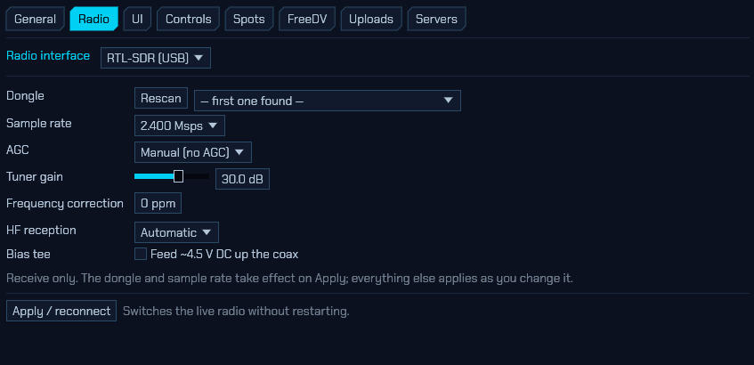

The **RTL-SDR (USB)** interface drives an RTL2832U dongle directly, using
sdroxide's own USB driver. There is no SoapySDR and no libusb involved, so this
works in every build — including the standard Windows `.msi` and macOS `.dmg` —
with nothing extra to install beyond access to the device itself (see the
README's *RTL-SDR permissions*).

Supported tuners are the **R820T**, **R820T2** and **R828D**, which between them
cover essentially every dongle still sold, including the RTL-SDR Blog V3 and V4.
Older E4000 and FC001x sticks are not supported; sdroxide names the button it
found and suggests the SoapySDR backend instead.

Receive only — there is no transmit path in this hardware.

- **Dongle** — which stick to open, by USB serial. **Rescan** re-lists the bus;
  it opens nothing, so it is safe to press while receiving. Dongles ship with the
  serial `00000001` from the factory, so if you run more than one, program
  distinct serials (with `rtl_eeprom`) before you can pin them individually.
  Leaving this at *first one found* is fine with a single dongle.
- **Sample rate** — the resampler reaches 225–300 kHz and 900 kHz–3.2 MHz, with
  nothing in between; the list offers only rates the hardware produces exactly.
  2.4 Msps is the default and the highest that runs reliably on most hosts.
  3.2 Msps is offered but drops samples on many machines.
- **AGC** — the tuner and the demodulator have independent automatic gain loops.
  *Manual* (no AGC) is the right setting for measurement and for weak-signal
  digital modes, where a gain loop pumping on a strong neighbour costs you the
  signal you were decoding.
- **Tuner gain** — applies immediately, no reconnect. The tuner has 29 discrete
  steps, so the value snaps to the nearest one it can actually produce.
- **Frequency correction** — the dongle's crystal error in parts per million.
  You do not have to guess it: run

  ```sh
  RUST_LOG=sdroxide_rtlsdr=debug sdroxide
  ```

  and after about twenty seconds the log prints a line like
  `clock: 2400017 sps, +7.0 ppm — set this as the ppm correction`. That is the
  number to type in. It is measured from the dongle's own sample clock, which is
  the same oscillator the tuner runs from, so correcting it corrects your
  frequency readout too.
- **HF reception** — the tuner itself starts at 24 MHz. Below that:
  - an **RTL-SDR Blog V4** upconverts in hardware, so HF simply works and the
    dial reads correctly with no offset to apply anywhere;
  - other dongles reach HF only by **direct sampling** the ADC's Q branch, which
    is what a V3's HF port is wired to. *Automatic* switches at 28.8 MHz (with
    hysteresis, so a dial parked near the boundary does not flap); *Direct
    sampling (Q branch)* forces it; *Off* disables HF entirely.

  Switching between the tuner and direct sampling re-initialises the tuner and
  briefly interrupts the stream.
- **Bias tee** — feeds roughly 4.5 V DC up the antenna coax for a mast-head
  preamplifier.

> **The bias tee puts DC on the feedline.** Never enable it with a transceiver,
> a DC-grounded antenna, or a preamplifier powered from somewhere else on the
> other end of the cable. sdroxide turns it off again on a clean shutdown, and
> shows a standing warning while it is on, because the setting is remembered
> across restarts and there is otherwise nothing to tell you.

If the dongle is unplugged, sdroxide notices within a few seconds and reconnects
by itself when you plug it back in — no need to press Apply. A dongle left
streaming by a program that was killed rather than closed is reset automatically
on the next open, so it does not need physically replugging either.

#### 5.2.6 SmartSDR (FlexRadio network radios)

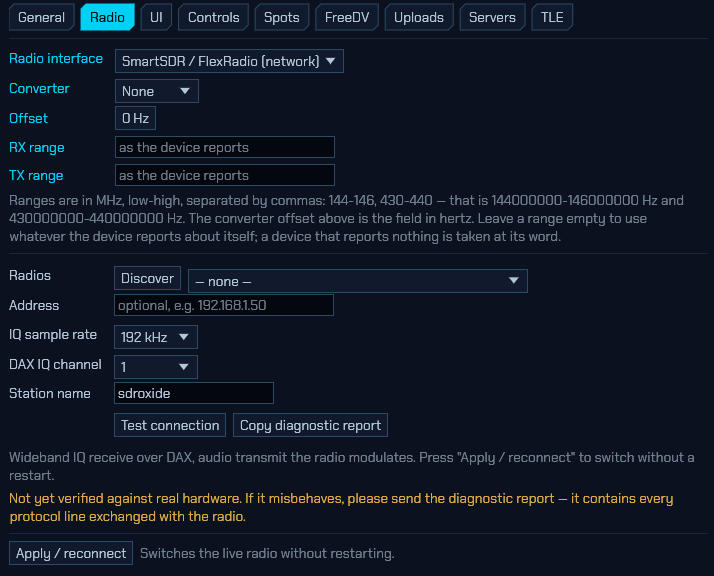

With the **SmartSDR / FlexRadio (network)** interface, sdroxide drives a
FLEX-6000 or FLEX-8000 over the LAN. It connects as a GUI client on TCP 4992,
creates a panadapter and a **DAX IQ** stream, and receives raw complex baseband
from it — so the panadapter, the waterfall, the skimmers and every digital mode
are sdroxide's own, working from the radio's samples rather than from a picture
the radio already drew. Transmit sends audio over a DAX TX stream, which the
radio modulates.

- **Radios / Discover** — a FlexRadio announces itself on the local network
  about once a second, so **Discover** listens for a couple of seconds rather
  than probing. A radio already claimed by another GUI client is listed but
  greyed out unless multiFLEX is enabled on it.
- **Address** — overrides the selection above. Radios reached through a router
  or a VPN never broadcast to you, so those have to be entered by hand.
- **IQ sample rate** — 24, 48, 96 or 192 kHz. **192 kHz is the radio's maximum
  for a DAX IQ stream**, and therefore the widest span this interface can show;
  it is not a limit sdroxide imposes.
- **DAX IQ channel** — the radio has four. Change this only if something else on
  the network already holds channel 1; the radio refuses the same channel twice.
- **Station name** — shown against this session in the radio's client list. The
  radio also remembers a client by it and restores that client's slices, so
  renaming makes the radio treat sdroxide as a new one.
- **Test connection** — checks the radio answers *without* registering as a GUI
  client, so it will not disturb a SmartSDR session already running.
- **Copy diagnostic report** — see below.

Tuning moves the radio's own slice, so its front panel and any second client
follow your dial rather than the other way round. TX power and TUNE power
command the radio's `rfpower`/`tunepower`, and SWR and forward power come back
from the radio's meters while you transmit.

> **Help wanted — this backend has not been verified against real hardware.**
> It was written from the published wire format and tested against a simulator,
> which proves the bytes are self-consistent but not that a FLEX agrees with
> them.
>
> Every session records a **protocol trace** — each control line in both
> directions, the first packet of each VITA-49 stream, and per-stream packet and
> loss counters. It is always recording, so there is no log level to set in
> advance and nothing to reproduce twice: press **Copy diagnostic report** and
> paste it into an issue. That report is what makes a fault diagnosable by
> somebody who does not own the radio.
>
> If you do not have a FLEX either, you can still exercise the backend: a
> wire-level radio simulator ships in the source tree. Run
> `cargo run -p sdroxide-smartsdr --example sim`, then point this tab at
> `127.0.0.1:4992`.

#### 5.2.7 PlutoSDR (ADALM-Pluto)

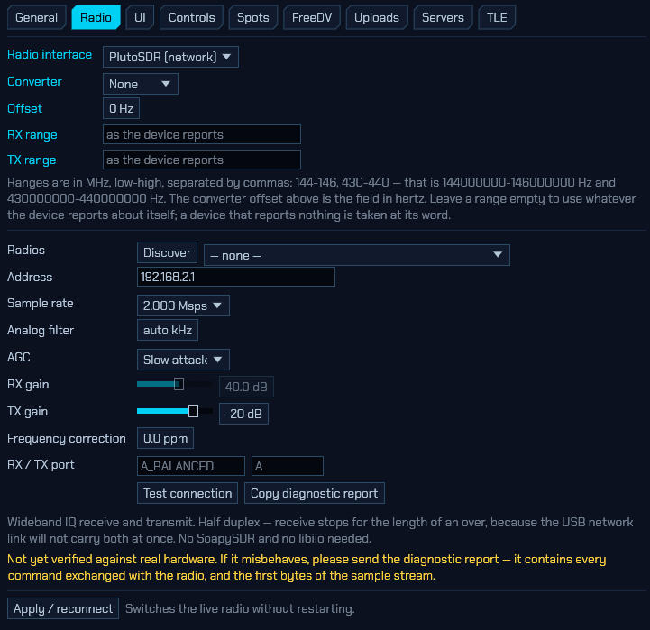

An **ADALM-Pluto** — the AD9361/AD9363 learning radio — driven directly over
**IIOD**, the protocol its on-board daemon speaks on TCP port 30431. sdroxide
implements that protocol itself, so **there is nothing to install**: no
SoapySDR, no libiio, no driver package. It is in every build, including the
standard Windows and macOS packages.

Wideband IQ receive *and* transmit.

**A Pluto is a network device, even on a USB cable.** This surprises people, so
it is worth stating plainly: plugging the Pluto in does not create a serial port
— it creates a **network adapter**. The radio takes `192.168.2.1` on that link
and your computer takes `192.168.2.10`. That is why this tab asks for an address
rather than for a serial number, and why a Pluto on your Ethernet LAN is
configured in exactly the same way as one on your desk.

- **Radios** and **Discover** — asks the network for IIO devices (`_iio._tcp`,
  which is what the Pluto's own daemon advertises) *and* tries `192.168.2.1`
  directly. The direct try matters: multicast across a USB gadget link is
  exactly the sort of traffic a host firewall drops without saying so, and the
  address works even when the announcement never arrives. Each answer is opened
  and identified, so nothing is listed on the strength of an announcement alone.
- **Address** — overrides the selection. `192.168.2.1` is the default; a
  hostname (`pluto.local`) or a `host:port` works too. If you have used libiio
  before: `ip:192.168.2.1` is accepted, and a `usb:` URI is refused with an
  explanation, because this backend reaches the radio over the network the USB
  cable already provides.
- **Receiver** — which of the AD9361's receive chains this radio runs. A
  2R2T-capable board — a Pluto+, or a rev. C Pluto unlocked to two channels —
  can serve two radio tabs from one box: one radio on **RX1** and a second,
  same address, on **RX2**, each with its own antenna
  ([§2.17](#217-running-more-than-one-radio)). Unlike a TCI rig or an HPSDR
  board, the chains are **not independently tunable**: one local oscillator
  serves both, so retuning either radio moves both, and both panadapters
  follow. What RX2 buys is a second *antenna* on the same spectrum — receive
  diversity, comparing polarisations, or A/B-ing two antennas live — not a
  second band. The radio's title says *shared LO* as a reminder. The
  transmitter belongs to the RX1 radio, and a stock 1R1T Pluto refuses RX2
  when it connects, with a message naming what it found.
- **Test connection** — opens the radio, reads what it says about itself, and
  reports the model, the firmware version, and **the tuning range this
  particular board has**. Worth pressing once (see AD9363 vs AD9364 below). It
  does not start a stream.
- **Sample rate** — the AD9361 reaches 61.44 Msps; the USB network link does
  not. 2 Msps of 16-bit I/Q is already 64 Mbit/s before framing, which is most
  of a USB 2.0 link, so the list stops where it does. Anything above 3.84 Msps
  is marked, and is realistic only over Ethernet. Takes effect on **Apply /
  reconnect**.

  **A stock Pluto cannot go below about 2.084 Msps.** With the AD9361's
  internal FIR decimator bypassed — which is how the radio arrives, and how
  sdroxide leaves it — the lowest rate the button's clock tree can produce is
  25 MHz ÷ 12. The rates under that are still offered, because a board someone
  has loaded a filter into can honour them, but on an ordinary Pluto they are
  rounded up and the connection message says so. They are marked in the list.
- **Analog filter** — the AD9361's baseband filter, or `auto`, which opens it to
  nine tenths of the sample rate. Wide on purpose: the receiver parks its
  oscillator a quarter of a span off your dial to keep signals clear of the DC
  spike a zero-IF radio has, and a filter narrower than that offset would cut
  off exactly the part it moved them to. If you narrow this by hand and the
  radio seems to get *worse* around the dial frequency, that is why.
- **AGC** — four modes, because the AD9361 has four and they behave differently
  on the air. **Slow attack** is the default and suits SSB and CW, where a fast
  loop pumps on every syllable. **Fast attack** suits signals that appear
  suddenly and at very different strengths. **Manual** is the setting for
  measurement and weak-signal digital modes. **Hybrid** is a digital loop with
  an analog fast-attack safety net. (SoapySDR can only say "AGC on" or "AGC
  off"; this is one of the reasons the native backend exists.)
- **RX gain** — 0–71 dB, applied as you move it. It only reaches the radio when
  the AGC is in manual: in the other modes the AD9361 owns that register and
  refuses the write outright, which is why the slider greys out. A value you set
  in manual is remembered and reapplied the next time you switch back, so
  changing AGC mode does not lose it.
- **TX gain** — negative, because the AD9361 states transmit level as
  *attenuation*: `0 dB` is full output and `−89.75 dB` is as close to off as the
  part gets. Applied as you move it. On connect the transmitter is set to its
  quietest *first* and your value applied second, so nothing the previous
  program left in the attenuator is ever live.
- **Frequency correction** — reference error in parts per million, applied by
  sdroxide to every frequency it asks for. It is deliberately **not** written to
  the radio's own `xo_correction`, which is persistent and would outlive the
  session and surprise the next program to open the radio. Run with
  `RUST_LOG=sdroxide_pluto=debug` and the log prints the measured clock error
  after about twenty seconds — that is the number to enter.
- **RX / TX port** — the AD9361's `rf_port_select`. A stock Pluto wires one of
  each (`A_BALANCED` and `A`), so leave these empty unless you have a board that
  does not.

**AD9363 or AD9364.** A stock Pluto is an AD9363 and covers **325 MHz–3.8 GHz**;
a great many have had the well-known firmware change applied, which turns them
into an AD9364 covering **70 MHz–6 GHz** with a 56 MHz filter. sdroxide does not
ask you which you have and does not guess — it reads the limits off the device
every time it connects, so the band buttons and the transmit gate follow the
radio you actually own. Press **Test connection** to see which it reported. (If
a firmware publishes no limits at all, sdroxide says so rather than quoting the
fallback figures as fact.)

**Half duplex.** The AD9361 genuinely is a full-duplex part, and sdroxide still
stops receive for the length of an over. The reason is the link, not the button: a
USB 2.0 Ethernet gadget will not carry a megasample-per-second stream in both
directions at once, and trying produces a transmission full of holes. The whole
link goes to transmit while you are keyed, exactly as the HPSDR backend does.

**Transmit, the first time.** Set TX gain to its minimum, key into a **dummy
load**, and check the signal is where the dial says before you raise it. The
transmit path of an AD9361 can be fed either by a DMA buffer or by four on-chip
tone generators, and the tone generators win by default; sdroxide silences them
on every key-up, but a steady carrier where your modulation should be is the
symptom to report if that ever fails.

> **Help wanted — this backend has not been verified against real hardware.**
> The protocol is implemented from libiio's own client and daemon sources, and
> tested against an in-process fake `iiod`, which proves the client is
> self-consistent but not that a Pluto agrees with it.
>
> Every session records a **protocol trace** — each IIOD command and its reply,
> the device's context description with the sample layouts the decoders were
> built from, and the first bytes of the sample stream verbatim. It is always
> recording, so there is no log level to set in advance and nothing to reproduce
> twice: press **Copy diagnostic report** and paste it into an issue.
>
> The first-bytes line is the one that matters most. The way `iiod` frames a
> buffer — a length, then the channel mask, then the data — is the part of this
> that cannot be checked without a device on the other end, and that one line
> settles it.
>
> From the source tree you can get the same information plus a live signal
> check:
>
> ```
> RUST_LOG=sdroxide_pluto=debug cargo run -p sdroxide-pluto --example probe -- 192.168.2.1
> ```
>
> It prints the limits the radio published, streams for two seconds, and reports
> the measured rate and signal level. A plausible rate with a level of zero
> means the link works and the sample layout does not; an implausible rate means
> the framing is wrong.


#### 5.2.8 SDRplay RSP (USB)

The **SDRplay RSP (USB)** interface drives any RSP — RSP1, RSP1A, RSP1B, RSP2,
RSPduo, RSPdx, RSPdx R2 — natively, with no SoapySDR in the path. Receive
only, 1 kHz–2 GHz, up to 10 Msps of complex IQ.

**This SDR needs a vendor package.** The **SDRplay API** is required. This is a
userland library plus a background service that owns the hardware. Install it
from [sdrplay.com/api](https://www.sdrplay.com/api/) (v3.x) and make sure the
service is running — on Linux `sudo systemctl enable --now sdrplay`; the
Windows and macOS installers start automatically. SDR Oxide finds the library
at runtime, so every build has this backend, and `sdroxide --probe` tells you
which piece is missing when the device list stays empty: the library, the
service, or the device.

- **Receiver** — which RSP to open, by the serial the API reports. **Rescan**
  asks the service for its device list; nothing is opened, so it is safe while
  receiving.
- **Sample rate** — the effective complex rate. Below 2 Msps the ADC still
  runs at 2 Msps and the service decimates, which is the normal way to run a
  narrow span. Above 6.048 Msps the ADC trades resolution for speed (12 bits
  up to 6.048 Msps, 10 to 8.064, 8 beyond) — worth knowing before picking
  10 Msps for weak-signal work. Takes effect on **Apply / reconnect**.
- **IF bandwidth** — the tuner's analog filter. *Auto* picks the widest one
  that fits the sample rate, which is what you want unless a strong
  off-channel neighbour argues otherwise.
- **AGC** — the RSP's own hardware IF-gain loop, run by the service at 5, 50
  or 100 Hz, with an adjustable **set point** in dBFS. *Off* hands the IF gain
  slider back to you — the setting for measurement and weak-signal digital
  modes. While a loop runs, the IF slider greys out and the gain readout
  follows what the loop actually did, not what the slider last said.
- **IF gain reduction** — the RSP's native gain unit, and deliberately kept
  that way so numbers translate directly from SDRuno/SDR++ practice: **20 dB
  is maximum gain**, 59 dB minimum.
- **LNA state** — the front-end attenuation ladder: state 0 is maximum gain,
  each step switches more attenuation in. How many states exist depends on the
  model *and the band* (an RSP1B has ten on VHF but seven on HF); pick more
  than the current band has and the driver clamps, keeps your choice, and
  restores it when you tune somewhere it fits. The default is state 4, not 0:
  full front-end gain on a real antenna drives the ADC straight into overload,
  which no amount of IF gain reduction can undo. This is also the control
  behind the main window's **Gain** slider — the IF gain belongs to the
  hardware AGC whenever a loop is running, the LNA is always yours.
- **Frequency correction** — reference error in parts per million, applied by
  the device itself.
- **FM broadcast / DAB notch** — hardware notch filters over 88–108 MHz and
  165–230 MHz, for when a local broadcaster overloads everything else. Models
  that lack one simply do not show the row.
- **Antenna** — on the RSP2 (A / B / Hi-Z), RSPdx and RSPdx R2 (A / B / C),
  and the RSPduo's tuner 1 (50 Ω / Hi-Z). Applied live; the Hi-Z inputs have
  a shorter LNA ladder, which the clamping above absorbs.
- **Tuner** (RSPduo) — which of the two tuners to run, one at a time, chosen
  when the device opens. Dual-tuner and master/slave operation are not
  supported.
- **HDR mode** (RSPdx / RSPdx R2) — the high-dynamic-range path below 2 MHz.
- **Bias tee** — about 4.7 V DC up the coax for an active antenna (every model
  except the original RSP1).

> **The bias tee puts DC on the feedline.** The same standing warning as the
> RTL-SDR applies: never enable it with a transceiver, a DC-grounded antenna,
> or a preamplifier powered from somewhere else on the other end of the cable.

If the service reports the ADC **overloaded**, sdroxide shows it on screen and
in the log: raise the LNA state, lower the IF gain, or turn the AGC on. If the
RSP is unplugged — or the service restarted under sdroxide — it notices within
a few seconds and reconnects by itself when the device returns.


### 5.3 UI: display preferences and voice announcements


The **UI** tab holds display preferences, stored in `config.toml` under `[ui]`, and the
spoken announcements below them under `[speech]`:

- **Layout** — which control strip the window wears. **Auto** picks one from the
  window size and is what you want; **Desktop**, **Tablet** and **Phone** force
  it, to see how the compact strips look without a phone to hand, or to keep the
  menus in a small desktop window rather than a strip wrapped over three rows.
  See [8.4](#84-phones-and-tablets) for what each one shows.
- **Theme** — the colour scheme for the whole UI: **Default** (the navy, cyan
  and hot pink every screenshot in this manual shows), **Green phosphor** and
  **Amber phosphor** (monochrome CRT looks), **Teal / orange**, or **Rainbow**
  (the accents spread across the spectrum). Applied the moment it is picked, no
  restart. The phosphor themes keep transmit, SWR and error indications red on
  purpose — whether RF is leaving the antenna is never left to a shade of
  green. Content colours (the waterfall palette below, the band plan, the map)
  are their own and do not change with the theme.
- **Button style** / **Window style** — the shape the buttons and the floating
  windows wear, chosen separately: **Angled** (the classic cut-corner look),
  **Rectangular**, **Rounded**, **Gradient** (a vertical shaded fill), or
  **3D bevel** (a raised lit edge). Also applied immediately.
- **Screen update rate** — the GUI/spectrum frame rate (30, 60, or 90 fps).
  Higher looks smoother and costs more CPU/GPU.
- **Waterfall scroll speed** — how fast the waterfall scrolls: **Slow** (5
  rows/s), **Medium** (28) or **Fast** (56). Fast trades screen time for
  vertical resolution, which is what you want when a CW or FT8 trace is smearing
  into the row above it; Slow keeps several minutes of band on screen at once.
- **Spectrum update speed** — how quickly the spectrum trace reacts; slower is
  more averaged and smoother.
- **Waterfall palette** — the waterfall colour scheme (see
  [2.8](#28-the-display-and-fft-controls) and the [appendix](#waterfall-colour-schemes)).
- **Spectrum background** — a vertical gradient behind the spectrum line, filled
  from the **top** colour down to the **bottom** colour (default dark red →
  black). Untick **Gradient** for a plain background.

Under **3D view**:

- **Cloud rendering** — how the `CLOUDS` layer of the solar-system window
  ([6](#6-solar-system-3d-view)) draws the weather. **Layered** stacks
  slices through the troposphere and is the cheap option. **Volumetric** walks a
  ray through it instead, so the Sun casts the cloud tops onto the deck below and
  lightning glows out *through* the storm making it rather than only brightening
  its outside — at several times the cost per pixel. Both draw the same weather;
  this only chooses how much the GPU spends on the light in it.

#### Voice announcements

The last section of the UI tab reads the radio out loud, so it can be operated
without seeing it. Tick **Speak changes to the radio** to switch it on; it is
off until you ask for it.

The voice is a neural one that ships with sdroxide and runs on your own machine.
Nothing is sent anywhere, no speech service has to be installed, and it works
with no network at all.

- **Voice** — **Shipped voice**, or any other Piper voice you have dropped into
  `speech_voices/` in the config directory (an `.onnx` and its `.onnx.json`,
  side by side). Changing it restarts the voice, which takes a moment.
- **Speed** — 0.5× to 2×. The voice stretches or compresses its own phrasing
  rather than being played faster, so the pitch does not change. Past about 2×
  it stops getting shorter — that is a limit of the voice, not of the slider.
- **Volume** — independent of the AF gain.
- **Output** — which sound device announcements come out of. Because speech has
  its own output stream it can be a *different* device from the receiver:
  announcements in the room, the band in the headphones.
- **Detail** — **Terse** says only what changed; **Normal** adds the numbers
  that go with it; **Full** adds units, band segments, and the settings that
  normally stay quiet.
- **Duck receiver** — dip the receiver while an announcement plays, and by how
  much. This never reaches a recording, but anyone listening to your station
  remotely does hear the dip.
- **Test** speaks a sample line. Beside it is the voice that loaded, or why one
  did not.

**What to announce**, the collapsing section below, is a switch per category.
The defaults are what most operators want: frequency, mode and band, VFO and
split, AGC, the drive/tune/mic levels, transmit and receive, RIT and XIT,
memories and scanning, band-edge warnings, and the engine's own messages.
Filters, squelch and noise reduction are off, because they move constantly while
chasing a signal.

Some behaviour worth knowing, because it is deliberate:

- **The frequency waits for the dial to stop.** Scrolling says nothing until you
  let go, then reads the frequency once. Spin two kilohertz up and back and it
  stays quiet, because you settled where you already were.
- **One button press is one phrase.** A band change moves band, frequency and
  mode together and is read as "forty meters, seven point one zero zero, L S B",
  not as three separate announcements.
- **Leaving an amateur band warns once**, on the way out, and keying up outside
  one warns immediately rather than waiting for the dial to settle.
- **SWR is read out while TUNE is held** — every two seconds by default, with
  the best match reached announced when you let go. A match that goes above 3:1
  interrupts with a warning, and clears again below 2.5:1. On a rig with no SWR
  bridge you are told so once and then left in peace.
- **Speech stops while you transmit**, since it goes to your speakers and
  therefore into your microphone. High-SWR warnings still get through.
- **Decoded messages**: FT8 calls addressed to you, JS8 and FSQ messages
  addressed to you. Ordinary CQs are not read — a busy evening on twenty metres
  is a hundred a minute — but you can switch them on.
- **Reading CW and RTTY aloud** is off by default. A decoder produces text
  faster than speech reads it, so anything that falls too far behind the live
  audio is dropped rather than queued: you hear what is being sent now, not what
  was sent a minute ago. CW is only read while the decoder reports lock.

Callsigns are read in phonetics — "kilo one alpha bravo charlie" — because a
callsign is the one thing that must not be misheard. Frequencies are read the
way an operator reads a dial, digit by digit after the decimal point, and always
"zero", never "oh". Both can be changed under **How things are read**.

Keys for **Speak status**, **Repeat last announcement**, **Stop speaking** and
**Announcements on/off** are on the Controls tab
([5.4](#54-controls-keyboard-mouse-and-midi)) under **Speech**. They have no
defaults; bind the ones you want.

sdroxide also exposes its whole window to the platform screen reader — NVDA on
Windows, Orca on Linux, VoiceOver on macOS — so the controls can be navigated
and read as well as heard.

### 5.4 Controls: keyboard, mouse and MIDI

Everything sdroxide can be told to do is an **action** — tune, PTT, change band,
cycle noise reduction, open the logbook — and the **Controls** tab binds actions
to whatever you would rather press or turn than click. The three sections of the
tab (keyboard, mouse, MIDI) all draw on the same list of actions.

Actions come in two kinds, and the *Step / mode* column changes to match. A
**continuous** action (tuning, volume, filter width) takes a *step* — the amount
one keypress or one detent moves it — and a *down* tickbox to make that control
move it the other way, which is how the left and right arrows share one action.
An **accel** above zero makes a held key move further the longer you hold it. A
**momentary** action (PTT, mute, split) is either *Hold* — asserted while the
key is down — or *Toggle*, which flips on each press.

#### 5.4.1 Keyboard

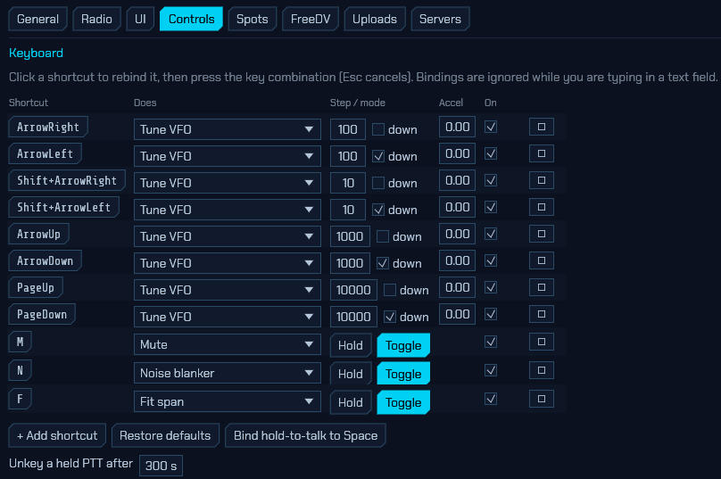

The table lists every shortcut, one per row: the key **Shortcut**, what it
**Does**, its **Step / mode**, its **Accel**, and an **On** tickbox to disable a
binding without deleting it. Click the shortcut button to rebind it, then press
the key combination you want (Esc cancels). **+ Add shortcut** creates a row,
**✕** removes one, and **Restore defaults** puts back the shipped set listed in
[13](#13-appendix). Shortcuts are ignored while you are typing in a text field
or a control has keyboard focus.

**Push-to-talk deserves a note.** No PTT key ships bound, on purpose: a
transmitter keyed by accident is the worst thing this feature could do to you.
(The voice-keyer digits *are* bound out of the box — see
[2.11](#211-voice-keyer) — because a key over an empty slot does nothing, and a
new installation has ten of them.)
**Bind hold-to-talk to Space** sets it up in one click. A held PTT is released
when you let go, when the window loses focus, when a text field takes the
keyboard, and after the **Unkey a held PTT after** timeout at the bottom of the
section (300 s by default, 0 disables it) — so alt-tabbing mid-over drops you
back to receive rather than transmitting your office.

#### 5.4.2 Panadapter mouse and mouse buttons

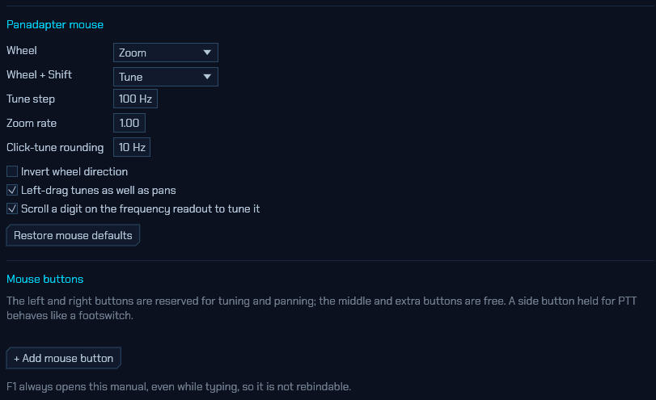

**Panadapter mouse** sets what the wheel does over the spectrum:

- **Wheel** and **Wheel + Shift** — the plain and shifted wheel actions; by
  default zoom and tune. Swapping them is a single dropdown if you would rather
  scroll to tune.
- **Tune step** — the Hz per wheel detent.
- **Zoom rate** — scales how far one detent zooms.
- **Click-tune rounding** — the step click-to-tune snaps to.
- **Invert wheel direction** — flips both wheel actions.
- **Left-drag tunes as well as pans** — turn it off to make left-drag pan only,
  like right-drag. It also turns off the dial's coast, since there is no longer a
  dial being turned.
- **Scroll a digit on the frequency readout to tune it** — the wheel over a digit
  of the VFO readout steps that digit.
- **Restore mouse defaults** puts the whole section back.

**Mouse buttons** binds the buttons themselves. The left and right buttons are
reserved for tuning and panning; the middle and extra (side) buttons are free, so
**+ Add mouse button** picks a button, an action and *Hold*/*Toggle* — a side
button held for PTT behaves like a footswitch.

F1 always opens this manual, even while you are typing, so it is not rebindable.
While the manual is open, the arrow, Page and Home/End keys scroll it instead of
running whatever you have bound them to.

#### 5.4.3 MIDI controller

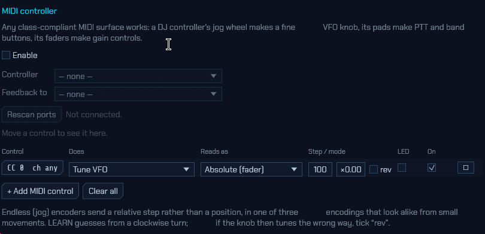

Any class-compliant MIDI surface works, and they are the cheapest real VFO knob
there is: a DJ controller's jog wheel tunes, its pads make PTT and band buttons,
its faders make gain controls. MIDI needs the native app — the browser client
has no MIDI access.

- **Enable** — the rest of the section stays greyed out until this is ticked.
- **Controller** — the input port to listen to. **Rescan ports** re-enumerates
  if you plugged the surface in after opening the dialog, and the line beside it
  reports the connected port or the reason it failed.
- **Feedback to** — the output port for LED/motor feedback (see below).
- **Last message** — names whatever control moved last, which is how you identify
  an unlabelled knob.

Each row of the binding table is one control: the **Control** button (click it,
then move the control you want — LEARN captures it), what it **Does**, how it
**Reads as**, its **Step / mode**, an **LED** tickbox, and **On**. **+ Add MIDI
control** adds a row and **Clear all** empties the table.

Endless "jog" encoders send a *relative step* rather than a position, in one of
three encodings that are indistinguishable from small movements. LEARN guesses
from the direction you turn; if the knob then tunes backwards, tick **rev**. A
plain fader or knob that sends a position instead should be set to *Absolute
(fader)*.

Tick **LED** on a binding to send the current value back to the controller, so a
PTT button lights while you transmit and a motor fader follows the volume. Not
every surface likes being written to, which is why it is off by default.

A controller unplugged mid-QSO releases anything it was holding and reconnects
by itself when you plug it back in.

> **Bindings live with the client.** They are stored in `input.json` on the
> machine running the *user interface*, not the one running the radio — so a
> knob plugged into your laptop works just as well against a remote engine
> (`--connect`, [7](#7-remote-operation)). Keyboard and mouse bindings work in
> the browser client too; MIDI needs the native app.

### 5.5 Spots: spot feeds


The **Spots** tab turns on the feeds that put other stations on your panadapter
and in the SPOTS window. What the spots then do — clicking one to work it, the
filters, the world map — is [§9.1](#91-spot-feeds-dx-cluster-pota-sota-psk-reporter).

- **Operator** — shown for reference only; your callsign and grid are set once
  on the **General** tab and used everywhere, including to log in to the DX
  cluster.
- **DX cluster (telnet)** — tick **Enabled**, then enter the node **Host** and
  **Port** (commonly 7300/7373/8000). **Login call** overrides the operator
  callsign if needed, and **Commands** (one per line, e.g. `SET/FT8`) are sent
  after login to set node-side filters.
- **Reverse Beacon Network** — the worldwide network of CW/RTTY skimmers,
  **on by default**. It puts nothing on the air, needs no account, and logs in
  with the callsign from the General tab — nothing to set up, and nothing
  happens until that callsign exists. Port `7000` is the CW and RTTY feed,
  `7001` the FT8/FT4 one. **Login call** overrides the operator callsign, and
  **Commands** narrows the feed (`set/filter cont=eu` and the like).

  RBN is not a spot feed and its spots do not appear in the SPOTS window: there
  are thousands a minute and they are measurements rather than invitations. They
  go to the [propagation heat map](#68-the-propagation-heat-map), which is what
  lets it show bands this radio is not listening to. Read that section for the
  one real caveat — RBN lines carry no locators, so paths are placed from
  country centres.
- **POTA / SOTA / PSK Reporter** — tick each feed to poll it. **POTA activator
  spots** and **SOTA spots** show current activators; **PSK Reporter (current
  band)** shows who is being heard on the band you are on. **Max age (s)** drops
  spots older than that many seconds.
- **APPLY** connects or disconnects the feeds and saves the settings.
- **Broadcast stations** — which broadcasting season's schedule is in use and
  whether it was downloaded, where your own station file lives, **Reload** to
  re-read it after an edit, and **Download schedule now** to refetch the season
  immediately. See
  [§9.6](#96-broadcast-stations-on-longwave-and-shortwave).

FreeDV Reporter is a spot source too, but has its own tab —
[5.6](#56-freedv-freedv-reporter).


**WSPRnet.** Two independent halves, both using the callsign and grid from the
General tab:

- **Upload my WSPR decodes** — on by default. Every reception goes to
  wsprnet.org, and so does a slot that decoded nothing, which is how the network
  distinguishes a shut band from a receiver that was switched off. This puts
  nothing on the air.
- **Download who heard me** — off by default, because it is a poll of somebody
  else's server on a timer. Turn it on and reports of your own callsign appear in
  the WSPR panel with a `→`, and their reporters go on the map. See
  [§3.11](#311-wspr-weak-signal-propagation-reporter).

### 5.6 FreeDV: FreeDV Reporter

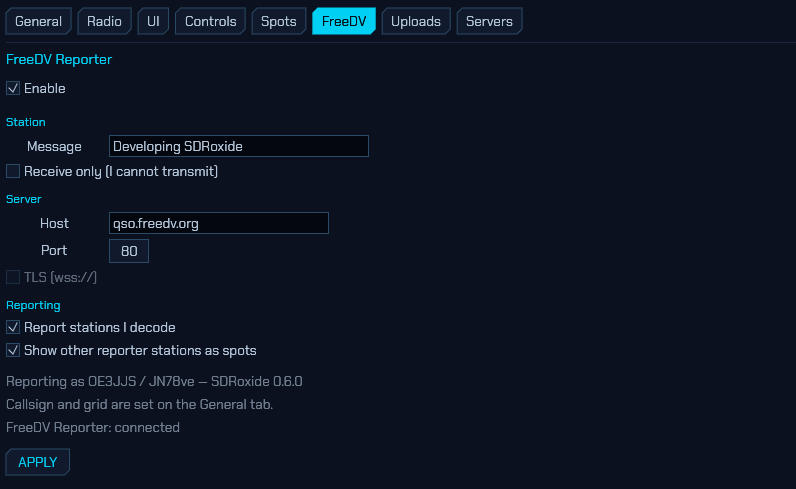

[FreeDV Reporter](https://qso.freedv.org/) is where FreeDV operators announce
where they are listening and who they are hearing; sdroxide talks to it in both
directions. What that gets you is [§9.5](#95-freedv-reporter-qsofreedvorg); the
tab itself is:

- **Enable** — connects while ticked. You are only *shown* to others while the
  radio is in **RADE** mode, so the site never lists you as working FreeDV when
  you are actually on CW.
- **Station → Message** — a free-text status shown beside your callsign.
  **Receive only (I cannot transmit)** marks you as a listener. You are reported
  under the callsign and grid from the **General** tab; *without both, the
  connection is view-only — you see other stations but do not appear yourself*.
- **Server → Host** and **Port** — the public server (`qso.freedv.org:80`) by
  default. **TLS (wss://)** is greyed out: it is not implemented yet, and FreeDV
  GUI uses plain `ws://` too.
- **Reporting → Report stations I decode** sends a reception report for each
  callsign recovered from a received End-of-Over frame. **Show other reporter
  stations as spots** adds them to the panadapter, world map and SPOTS window
  under the **FREEDV** filter.
- The status lines underneath show exactly how you are being reported
  (`OE3JJS / JN78ve — SDRoxide 0.8.0`) and whether the connection is up.
- **APPLY** connects or disconnects and saves.

### 5.7 Uploads: callsign lookup and QSL services


The **Uploads** tab holds every online account the logbook uses. All of it is
stored in plaintext in `net.json`. How the features behave is
[§9.2](#92-callsign-lookup) and [§9.3](#93-uploading-qsos-eqsl-qrz-club-log-lotw);
the fields are:

- **Callsign lookup → Provider** — `QRZ.com` (needs a QRZ username and password
  with an active XML-data subscription) or `HamQTH` (free). Fill in the pair
  belonging to your provider: **QRZ user / QRZ pass** or **HamQTH user /
  HamQTH pass**. **Auto-fill name/QTH/grid on spot click & QSO** looks a call up
  by itself instead of only on the **LOOKUP** button.
- **Upload — eQSL / QRZ / Club Log** — **eQSL user** and **pass**; the **QRZ log
  key** (your QRZ *logbook* API key, which is not the XML-lookup login above);
  **Club Log email**, **pass** and **key**. Tick **Auto-upload each new QSO** and
  then the services to push to — the **eQSL / QRZ / Club Log** tickboxes on the
  line below.
- **Confirmations (download)** — **LoTW user** and **pass**. LoTW *upload* stays
  manual, by design; only the download is automated.

At the bottom of the tab, **APPLY** saves everything above, and
**SYNC CONFIRMATIONS** pulls your LoTW/eQSL confirmations into the log.

### 5.8 Servers: letting other programs drive the radio

The **Servers** tab makes sdroxide the radio for other software. Three sections
share the tab, one above the other, and all can run at the same time.

> **Which server should I use?** rigctld carries *control only* and is understood
> by nearly everything. The built-in TCI server additionally carries receive
> audio, transmit audio and a wideband IQ stream, but only a handful of programs
> speak it. The WSJT-X UDP broadcast is not a control surface at all: it is how
> loggers and mapping tools learn what you are decoding and working.

Neither control protocol has any authentication, which is why both default to
`127.0.0.1`.

With more than one radio configured ([§2.17](#217-running-more-than-one-radio)),
each radio has its own copy of this tab and its own servers — a client connects
to a port and gets *that* radio, so two copies of WSJT-X on two ports can drive
two radios at once. Additional radios start with the TCI server disabled, since
its default port is already taken by the first radio's: enable it and pick a
free port here.

#### 5.8.1 Hamlib rigctld server

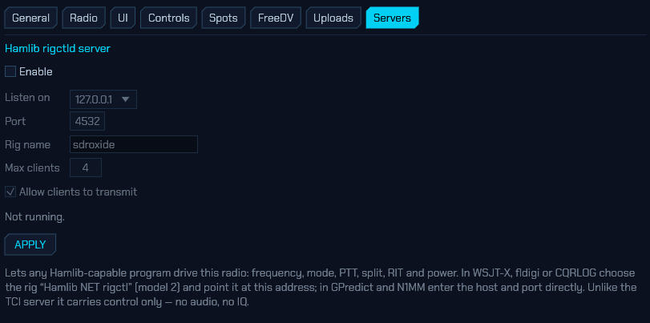

Most amateur software reaches a radio through **Hamlib**, over the network
protocol its `rigctld` daemon speaks. sdroxide serves that protocol directly, so
WSJT-X, fldigi, JS8Call, N1MM, Log4OM, GPredict and CQRLOG can drive it with no
extra daemon, no serial cable and no virtual COM port pair.

- **Enable** — off by default. Port 4532 is often already held by a real
  `rigctld`, and the protocol has no authentication of any kind, so turning
  this on should be a decision rather than a default.
- **Listen on** — `127.0.0.1` (this machine only) or `0.0.0.0` (your whole
  network).
- **Port** — 4532 by default, the port every rigctld client assumes.
- **Rig name** — what clients see from `get_info`.
- **Max clients** — how many programs may connect at once. They all see the same
  radio, and the last command wins.
- **Allow clients to transmit** — off refuses every key request *and* stops
  advertising a transmit range, so Hamlib declines to key before it even asks.

The status line shows whether the server is listening, on which address, and how
many clients are connected. Press **APPLY** to save and (re)bind. If the bind
fails on 4532, the usual cause is a real `rigctld` already running.

Supported: frequency, mode and passband, PTT, VFO A/B and split (including split
frequency and mode), RIT and XIT, the `RFPOWER` / `AF` / `MICGAIN` / `STRENGTH`
levels, the `NB` / `NR` / `ANF` / `MUTE` functions, the `XCHG` / `CPY` /
`TOGGLE` / `BAND_UP` / `BAND_DOWN` / `TUNE` VFO operations, and the voice keyer
(`send_voice_mem 1`…`10`, `stop_voice_mem` — see
[2.11](#211-voice-keyer)). The voice keyer obeys **Allow clients to transmit**
like PTT does.

Setting up clients:

- **WSJT-X / JTDX** — *Settings → Radio*, rig **Hamlib NET rigctl**, Network
  Server `127.0.0.1:4532`, PTT method **CAT**, mode **Data/Pkt**. Use *Test CAT*
  and *Test PTT*.
- **fldigi** — *Configure → Rig control → Hamlib*, rig **NET rigctl (2)**,
  device `127.0.0.1:4532`.
- **GPredict** — *Interfaces → Radios*, host `127.0.0.1`, port 4532.
- **N1MM+ / Log4OM** — pick the Hamlib/rigctld radio type and enter the same
  host and port.

sdroxide reports every digital mode (FT8, FT4, PSK, RTTY's neighbours, SSTV,
RADE…) as Hamlib's `PKTUSB`, because that is what they are on the air. Clients
that read the mode and periodically write it back — WSJT-X does — therefore
cannot knock a running FT8 session out of its mode: setting the mode already
reported changes nothing.

#### 5.8.2 Built-in TCI server

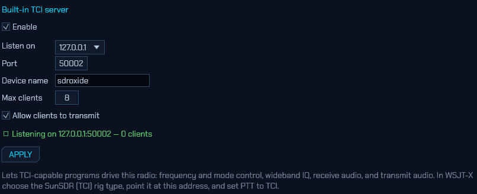

sdroxide also *is* a TCI server, so TCI-capable programs can use it as their
radio: frequency and mode control, a wideband IQ stream, receive audio to
decode, and transmit audio to put on the air. It is **on by default**.

- **Enable** — turn the whole server on or off.
- **Listen on** — `127.0.0.1` (this machine only, the default) or `0.0.0.0`
  (reachable from your whole network).
- **Port** — 50001 by default, the port TCI clients expect. The screenshot uses
  50002 because ExpertSDR3 has 50001 on that machine.
- **Device name** — what clients see in the connect handshake.
- **Max clients** — how many programs may connect at once. They all see the same
  radio, and the last command wins.
- **Allow clients to transmit** — turn this off to let programs read and tune
  but never key the transmitter.

The green status line shows whether the server is listening, on which address,
and **how many clients are connected right now**. Press **APPLY** to save and
(re)bind.

Setting up WSJT-X: under *Settings → Radio*, choose the **TCI Client RX1** rig,
put sdroxide's address in **TCI Server** (e.g. `127.0.0.1:50002`), set PTT to
**CAT**, and tick **TCI audio** so both audio devices come over TCI. JTDX and
MSHV are configured the same way. Verified against WSJT-X on this address.

If a client won't connect, run sdroxide with
`RUST_LOG=sdroxide_tci=debug` — the whole TCI conversation is logged in both
directions, which is usually enough to see which command it gave up on. WSJT-X
also records the reason in `~/.local/share/WSJT-X/wsjtx_syslog.log`
(`handle_transceiver_failure: reason: …`).

A few things worth knowing:

- **Port 50001 may already be taken.** If you also run ExpertSDR3 or Thetis on
  this machine, it owns that port and sdroxide's server can't bind — the status
  line says so. Move sdroxide's server to another port and point your clients
  there.
- **No authentication.** TCI has none, which is why the default is localhost. On
  `0.0.0.0`, anyone who can reach the port can tune and key your transmitter.
- **The transmitter has one owner.** A second program asking to transmit while
  another is mid-over is refused, and keying up yourself (PTT, TUNE, or a
  digital-mode burst) always takes the transmitter back from a client.
- **A CAT radio has no IQ to share.** On the CAT interface sdroxide only
  receives demodulated audio, so it offers control and audio to clients but no
  IQ stream.
- **Receive pauses while you transmit**, unless the radio is full-duplex — the
  same as any other TCI rig.

#### 5.8.3 WSJT-X UDP broadcast

The logging ecosystem around FT8 — **GridTracker**, **JTAlert**, **N1MM+** and
**Log4OM** — learns what a station is doing from the datagrams WSJT-X sends on
UDP port 2237. sdroxide sends the same ones, so those programs work with it
unchanged: decodes as they arrive, station status (frequency, mode, who you are
working, what you are about to transmit), and every completed QSO — as both the
structured message and an ADIF record, so a logger can take whichever it
prefers.

- **Enable** — off by default. What you decode and who you work is broadcast
  only when you say so.
- **Send to** — `127.0.0.1` for clients on this machine, a LAN address for
  another one, or a multicast group (`224.0.0.1`) to reach several at once.
- **Port** — 2237, the port every client defaults to.
- **Identify as** — the name clients see. It defaults to `WSJT-X` because some
  loggers accept nothing else.

This one is **output only**: nothing is read from the socket, so no program on
it can tune or key the radio. Programs that want to *drive* sdroxide use rigctld
or the TCI server above.

### 5.9 TLE: satellites and their frequencies

The **TLE** tab decides which satellites the tracker in the 3D view
([6](#6-solar-system-3d-view)) follows, and what frequencies it shows for them.

Out of the box it follows the **amateur radio** group and the **ISS**. Both are
ordinary subscriptions, so unlike earlier versions they can be switched off,
filtered, given orbit rings or pointed somewhere else — and anything else worth
tracking can be added beside them: a weather satellite, a cubesat too new to be
in the amateur group, a fresher element set than the one that arrived, or a
frequency the built-in table has wrong.

Everything on this tab is saved the moment you change it — there is no APPLY —
into `satellites.json`. The 3D view picks changes up on its next frame.

The file lives with the radio engine, not with the screen: the subscribed
listings are fetched and cached on that machine, which in server mode is also
what feeds the browser's 3D view. So this tab configures the same set of
satellites from anywhere — the shack machine, a native remote client, or a
browser tab — and **UPDATE NOW** asks the engine to do the fetching.

#### 5.9.1 Subscriptions

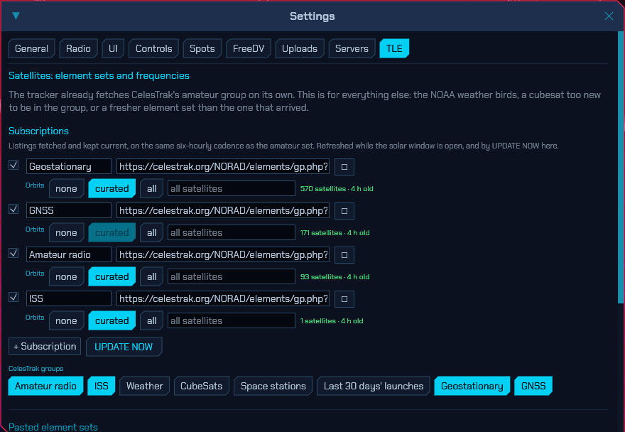

A two-line element set is only good for a few days: SGP4 accuracy decays
quickly, and sdroxide refuses to propagate elements more than a fortnight past
their epoch at all. So anything you mean to *keep* tracking wants a
**subscription** — a URL serving an element-set listing, refetched on the same
six-hourly cadence as the amateur set.

Each row has:

- a **tick** to track it or park it,
- a **name** (yours, for the row — the satellite names come from the listing),
- the **URL**, which must be `https://`,
- **Orbits** — which satellites in the listing get an orbit ring and a label.
  Three positions, because there are three useful answers:

  | | |
  | --- | --- |
  | **none** | Plain dots, visible only under `ALL SATS`. It really does mean none: the curated few are not exempt. |
  | **curated** | Rings and labels only for the satellites in sdroxide's own curated list — QO-100, the ISS, AO-7, FO-29, SO-50, AO-73, JO-97, RS-44, XW-3 and IO-117. |
  | **all** | Everything in the listing. |

  A whole group wants **curated**: ninety rings at once is unreadable, and none
  at all leaves ninety anonymous dots. A short listing like the ISS wants
  **all**.

  That curated list is ten *amateur* satellites, so for a weather, GNSS or
  launch-window listing the middle position would behave exactly like **none**.
  It is greyed out on those once a fetch has shown the listing contains none of
  them — the position is not hidden, so you can see why it is unavailable.
- a **filter** — catalogue numbers to keep, comma separated. Empty tracks
  everything the listing carries. This is what turns CelesTrak's fifty-satellite
  weather group into just the three NOAA APT birds.

The status beside each row is what the last fetch actually did: how many
satellites it yielded and how old the listing is, or why it failed.

The **CelesTrak groups** buttons below add the common listings in one click. A lit
button means you are already subscribed:

| button | What it is |
| --- | --- |
| **Amateur radio** | Every amateur satellite. **On by default** — this is what the tracker used to fetch unconditionally. |
| **ISS** | The ISS on its own, from its own element set. **On by default**: fresher than the copy inside the amateur group, and it keeps working if you unsubscribe from that. |
| **Weather** | The NOAA APT and Meteor LRPT birds on 137 MHz |
| **CubeSats** | Everything cubesat-sized, including amateur payloads too new for the amateur group |
| **Space stations** | The ISS, Tiangong and the vehicles docked with them |
| **Last 30 days' launches** | Where a brand-new amateur satellite turns up first |
| **Geostationary** | The geostationary belt, QO-100 among it |
| **GNSS** | GPS, Galileo, GLONASS and BeiDou |

The two default ones are added the first time this version runs and then left
alone: unsubscribing sticks, and if you have already customised one — renamed
it, turned its orbit rings on — your version is kept rather than replaced.

Subscribing to a group does **not** put ninety orbit rings on the globe: both
default subscriptions arrive on the **Orbits** setting that suits them, so the
amateur group shows the curated few with rings and labels and everything else as
dots behind `ALL SATS` — exactly as it behaved when it was built in.

Subscriptions refresh **while the 3D view is open**, which is the same rule the
rest of that window's network activity follows ([6](#6-solar-system-3d-view)).
**UPDATE NOW** fetches them all immediately without opening it. Fetched listings
are cached on disk, so they survive a restart and keep working offline.

#### 5.9.2 Pasted element sets

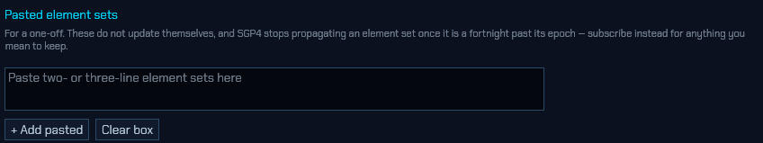

For a one-off, paste the two- or three-line set straight into the box and press
**+ Add pasted**. Both forms are understood, several at once are fine, and
pasting a set for a satellite already listed *refreshes* that entry rather than
adding a second one.

Each row shows its catalogue number and how old the elements are — green while
they are fresh, amber past three days, red once they are too stale to propagate.
Press **✎** to see and correct the two lines (in a monospace font, because the
format is column-addressed and a misaligned paste is otherwise invisible). A
malformed entry says what is wrong with it instead of quietly never appearing in
the sky.

Pasted satellites are always drawn with their orbit ring and label: typing a TLE
in by hand is a clear enough statement of interest. They also **override** a
subscribed element set for the same satellite, so this is how you put a fresher
ISS TLE in front of the one CelesTrak served this morning.

#### 5.9.3 Frequencies

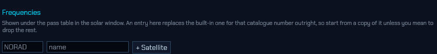

These are the rows the pass table shows underneath a pass
([6](#6-solar-system-3d-view)). Give a catalogue number and press **+
Satellite**: if the built-in table knows it, the entry starts as a copy of it,
so correcting one frequency does not mean retyping the beacon and the
transponder as well.

Each link is a row: what it is, the downlink, the uplink, the mode, and a note
for anything you have to know before keying up. A frequency is either one number
(`145.800`) or a transponder passband written `145.950-145.970`. Leave a
direction blank for a beacon.

An entry here **replaces** the built-in one for that catalogue number outright
rather than merging with it — which is why a new one starts from a copy. Delete
every link in an entry and it disappears, and the built-in table shows through
again.

---

## 6. Solar system 3D view

The **☀ 3D** button in the Display module opens the solar system in three
dimensions — the Sun, the Earth and the Moon, the other seven planets and
eighteen of their moons — with live solar imagery, sunspot regions and
coronal-mass-ejection trajectories. This enables operators to see if anything is
on its way here, and when it will arrive.

In the native app this is a second window. In the [web client](#8-web-operation) it
is a second browser tab, with the same controls, the same layers and the same
QSO visualisation; there, the data below is fetched by the server and relayed to
your browser rather than fetched by the browser itself. Several people may watch
the map at once — it controls nothing, so it does not take the single control
connection — but they share one feed, so changing the SDO channel changes it for
everyone watching.

> **If the browser crashes.** This view is the app's heaviest graphics
> consumer — a depth buffer, multisampling and a few dozen draws a frame — and
> browser WebGPU implementations vary in how well they take it. Firefox on Linux
> has been seen to abort the whole browser process with this page open. Adding
> `&gfx=webgl` to the URL pins the page to WebGL2, which draws the same scene and
> only gives up multisampling and a little depth precision:
> `http://<host>:4950/?view=solar&gfx=webgl`. `&gfx=webgpu` forces the other way.
> Without either, the browser's own preference is used.


The Earth carries a higher-resolution version of the same Natural Earth
coastline data as the FT8 world map, with international borders, lit by the real
Sun with a soft terminator. Your QTH is the green ring and the yellow dot is the
point the Sun is directly overhead; both appear once you zoom in far enough for
a point on the surface to mean anything.

The coastlines and borders keep a **faint glow of their own on the night side**,
fading in across the terminator the way city lights do. It is deliberately
subtle — the terminator is still the most obvious thing on the globe — but it
means the dark hemisphere stays a map rather than a slab, which matters because
almost everything worth looking at happens there: the far end of a grey-line
QSO, the auroral oval, a satellite footprint crossing at 3 a.m.


### 6.1 Navigating: the camera, targets and the auto tour

**Mouse:**

| Action | Effect |
| --- | --- |
| Drag | Rotate around the focused body |
| Scroll | Zoom in and out |
| Click a body or its label | Make it the camera's target |

Any mouse input cancels **AUTO**.

**Target** — the **◎** button names what the camera pivots around and opens a
picker with everything in the system: `SUN`, `EARTH`, `MOON` and `E+M` (the
Earth–Moon midpoint), then a row per planet with its own moons beside it.
Choosing a target pulls the camera in to frame it. You can also simply click a
planet, a moon or its name in the view — hovering marks the body with a reticle
first, so there is no guessing about what a click will grab. **▶ AUTO** flies a
continuous camera path through
eight framed viewpoints — overhead of the whole system, over the Earth's
shoulder towards the Sun, face-on to the solar disk, along the day/night
terminator, over the Sun's pole, a diagonal on the Earth–Moon pair, a long look
back at the Earth from out by the Sun, and a wide inner-system view. The path is
a spline through those viewpoints, so the camera curves between them rather than
stopping and restarting at each. Moving between viewpoints that frame different
bodies flies the camera across the gap — Earth to Sun is a 1 AU trip — rather
than cutting; it holds each one for ten to sixteen seconds
with a slow drift, and the whole loop takes about two minutes. Re-enabling AUTO
picks up at whichever viewpoint is nearest your current view.

While you are working a station, AUTO leaves the loop and flies down to the
contact instead, holding it for as long as the QSO lasts — the readout calls it
`QSO PATH`. The shot is centred on your QTH, the station you are working and the
arc between them, from off to one side of the path and at a shallow angle, so
the horizon curves across the frame and the arc's rise off the surface is plain
rather than flattened into a line by an overhead view. It frames itself to the
path: a neighbouring country is a low pass over the horizon, an antipodal
contact pulls back until both ends and the whole arc are in the picture. When
the QSO ends the camera rejoins the tour at whichever viewpoint is nearest.
Switching the `QSO` layer off leaves AUTO on its normal loop.

### 6.2 The layers

**Layers** — `ORBITS` (orbital paths, sampled from the real ephemeris, so they
are the true eccentric orbits), `CLOUDS`, `PLANETS`, `CME`, `SUN OBS`, `LABELS`,
`SMALL BODIES`, `QSO`, `SATS`, `AURORA`, `PROP` and `AWARDS`. All but `PROP` and
`AWARDS` are on to begin with — those two each paint the whole planet (one with a
marker on all three hundred-odd DXCC entities, the other with a wash of colour),
so they wait until you ask for them. Switching either on stands the other down,
because two full-globe washes at once is neither.

`SUN OBS` is solar *observations* on the Sun's disk: the sunspot active regions
and the flare source locations, which used to be two buttons and are one idea.
The name also settles a collision — everywhere else in this manual, **SPOTS**
means the DX cluster.

The star field and the heliographic graticule (the solar rotation axis, equator
and parallels) have no buttons: they are the backdrop and the coordinate frame
everything else is read against, and are always drawn.

### 6.3 The planets, moons and small bodies

**The PLANETS layer** adds the rest of the solar system: the seven other
planets, eighteen major moons, and Saturn's and Uranus's rings. Names are shown
for every planet however small it is on screen — from anywhere in the inner
system Neptune is a fraction of a pixel, and the label is the only thing that
makes it findable — and a body's own name disappears once you have flown close
enough to it that the name would be stamped across the picture. A planet's moons
are named once the planet itself is big enough on screen for the names not to
pile up.

Where the numbers come from, and how good they are:

| | Source | Accuracy |
| --- | --- | --- |
| Planet positions | JPL's Keplerian element set for 1800–2050 | Measured against JPL Horizons over 2015–2045: better than 0.02° for the inner planets, 0.12° for Saturn |
| Orientations | IAU/WGCCRE rotational elements | Poles and rotation rates; the small periodic terms are dropped |
| Moon orbits | Circular orbits fitted to JPL Horizons | Under 1° of orbital phase for most, up to 4° for Titan and Iapetus, whose real orbits a circle cannot express |

The Moon, Jupiter and Saturn are drawn from published spacecraft maps — LRO's
lunar albedo mosaic and Cassini's global maps of the two giants. The other
bodies are procedural: Mars gets its polar caps and dark albedo markings, Io its
sulphur yellows, Iapetus its black leading hemisphere. Radii are exaggerated by
the **body** scale like the Earth's, but capped so that no planet ever outgrows
the Sun; each planet's moons are scaled by the same factor as the planet, so a
moon at six planet radii is drawn at six planet radii.

**The dwarf planets, asteroids and comets** ride on the same `PLANETS` layer.
Forty bodies: Pluto, Ceres, Eris, Haumea and Makemake; twenty asteroids; and
fifteen periodic comets.

They are there because the next fifty years turn on them, and that is a query
rather than an opinion. `tools/fit_smallbodies.py` asks JPL's close-approach
database for everything that passes inside 0.02 AU of the Earth between now and
2076 and is big enough to be worth naming — which is how Apophis, 2001 WN5 and
1999 AN10 got in — and adds the bodies anyone would expect to find: the dwarf
planets, the large main-belt asteroids, the mission targets (Bennu, Ryugu,
Itokawa, Didymos, Psyche, the two Lucy Trojans), and every periodic comet with a
perihelion inside the window. Swift-Tuttle is absent for that last reason: the
Perseids' parent does not come back until 2126.

Point the camera at one and the info card gives its distance, its perihelion and
aphelion, the length of its year, and one line on why it is in the table — the
date and distance of the close approach, straight out of JPL's database, or the
spacecraft that went there.

**Finding one** is what the box under the clock is for. It searches the small
bodies and the satellites together, on name, catalogue number or designation:
`apophis`, `99942`, `1P`, `2024 YR4`. A match is drawn with its orbit and its
name whether or not it otherwise would be, and **↵** on a single match flies the
camera to it. The asteroids have no layer button of their own on purpose — a
button answers "show me all thirty-five of these", which is not a question
anyone has; the question people have is *where is Apophis*, and that is a search
box. The `SMALL BODIES` button is a different thing: it governs their **names**,
because thirty-five designations at once bury the planets. Whatever it is set
to, the body the camera is on and anything the search has matched stay named.

**Comets grow tails**, and the tails are geometry rather than decoration:

- The **ion tail** is CO⁺ fluorescing at 420 nm — blue, and not reflected
  sunlight at all. It is swept by the solar wind, so it points *away from the
  Sun* rather than back along the orbit, and it is drawn dead straight, narrow,
  and broken into the rays and travelling knots the plasma makes as the field it
  is frozen into varies. It does not point exactly anti-sunward: the comet meets
  the 400 km/s wind while crossing it at its own orbital speed, so the tail lies
  along the difference and lags the radial line by a few degrees. That angle is
  what makes a photograph of a comet look the way it does.
- The **dust tail** is grains reflecting sunlight — warm, broader, smoother, and
  *curved*, because the grains are far too heavy for the wind to sweep and keep
  the orbital velocity they were released with while radiation pressure eases
  them outwards.
- The **coma** is the head: a hundred thousand kilometres of gas, green from
  diatomic carbon, which is the part of a comet that is actually bright.

All of it switches on and off with the comet's distance from the Sun. Water ice
stops sublimating past about 3 AU, so a comet spends most of its orbit as a bare
dot and lights up for the months around perihelion; the tails grow as the
inverse square of the distance and with the cube root of the nucleus radius.
Phaethon is the exception that shows the model is doing something: it is a rock,
not a comet, and gets a short dust tail and no ion tail at all, inside a fifth
of an AU of the Sun where its own surface is being cooked apart.

Use the **Time** module's `±1 mo` steps to watch it happen — Encke returns every
3.3 years, Tempel-Tuttle in 2031, Halley in 2061.

Where the numbers come from, and how good they are:

| | Source | Accuracy |
| --- | --- | --- |
| Small-body positions | A chain of Keplerian arcs fitted to JPL Horizons across 2026–2076 | Measured against Horizons: inside 0.16° for every body but Apophis, whose 2029 Earth encounter changes its orbit and leaves it at 0.66° worst case, 0.03° typical |
| Which bodies | JPL's close-approach database, plus the dwarf planets, large asteroids and mission targets | The close-approach dates and distances quoted in the info card are JPL's, not this model's |
| Tail lengths | A visual model, stated as one | Scaled so Halley at its 2061 perihelion draws the tail Halley actually had; the *directions* are physics |

Outside 2026–2076 the arcs simply run on, which is a two-body extrapolation of a
perturbed orbit and decays quickly. Scrub the clock past either end and the info
card says so rather than letting the body sit there looking authoritative.

### 6.4 Clouds

**The CLOUDS layer** puts the weather on the globe, live, from NOAA/NESDIS's
Global Mosaic of Geostationary Satellite Imagery — GOES-East and GOES-West, both
Meteosats and Himawari, stitched into one picture of the planet every hour.

Like the aurora it is drawn as a depth of air rather than as a picture stuck on
a sphere, and for the same reason: that is what it is. What makes that possible
is the infrared channel. Brightness in the infrared is cloud-top *temperature*,
and temperature is *altitude* — so the renderer is handed a height field taken
from measurement, and a thunderhead stands fifteen kilometres tall over the
stratus beside it because it really does. The Sun lights the tops and they shade
their own undersides, which is what makes a deck read as three-dimensional
rather than as fog, and the limb shows the deck standing off the surface because
a grazing line of sight crosses a great deal more of it.

Two channels are fetched. Infrared is the backbone and works in the dark.
Visible is a correction on the sunlit half only: low warm cloud is nearly
invisible to infrared — the top of a marine stratus deck is within a few kelvin
of the sea under it — and obvious in visible light, so where the Sun is up that
channel fills in what the first cannot see.

**What is real and what is not.** The cloud field is measured. The
*lightning is simulated* — and the readout along the bottom of the window says
so, because a globe that flickers with plausible-looking strikes must not be
read as showing strikes. What comes from the data is where the thunderstorms
are, how large, how tall, and how often each should flash: cold-top area is the
oldest satellite proxy there is for flash rate and a good one. What is invented
is which millisecond a given stroke fires. No free worldwide feed of individual
strikes exists to use instead. The flashes light the cloud from inside rather
than being drawn as marks on it, so an anvil goes bright from below.

Four honest limits, all of them stated in the readout or visible in the
picture:

* **Nothing is known above about 73°.** A ring of geostationary satellites
  cannot see the poles, so the layer fades out towards them rather than guessing.
  The aurora owns those latitudes anyway.
* **The picture is an hour or more old.** The mosaics are published hourly and
  run about an hour and a quarter behind the clock. The readout gives the hour
  the picture is *of*, never the moment it was fetched.
* **Cloud-top height is a fit, not a retrieval.** The mosaic is a rendered
  image rather than a calibrated field, so the brightness-to-temperature ramp is
  a fit to the standard infrared enhancement. The shapes are exactly what the
  satellites saw; the heights are the right heights to within a kilometre or two.
* **A cloud field is a difference.** Cloud is measured as brightness above a
  locally estimated clear-sky background — which is what stops the cold winter
  hemisphere and the polar night being read as an overcast, and what makes the
  deserts come out clear. The cost is at the other end: an overcast broader than
  the window used to estimate it sets its own background and reads thinner than
  it is.

The vertical scale is exaggerated about six times. Eighteen kilometres on a
six-thousand-kilometre planet is a quarter of one per cent of the radius, and a
hairline cannot be volumetric; six times over is enough for a storm to stand up
out of the deck and shallow enough that nobody would mistake the result for a
mountain range. Altitudes are fractions of the radius the globe is *drawn* at,
so the deck stays glued to the surface at any setting of the **body** scale.

**Cloud rendering** on the UI settings tab
([5.3](#53-ui-display-preferences-and-voice-announcements)) chooses how the deck
is drawn. *Layered* stacks slices through the troposphere and is the cheap
option. *Volumetric* walks a ray through it instead, so the Sun casts the cloud
tops onto the deck below and a flash glows out *through* the storm making it
rather than only brightening its outside — at several times the cost per pixel.
Both draw the same weather.

### 6.5 The aurora

**The AURORA layer** puts the auroral oval on the globe, live, from NOAA's
OVATION model — a 1°×1° grid of the probability of seeing aurora, issued every
few minutes and valid about forty minutes ahead.

It is drawn as a stack of glowing shells at the altitudes the atmosphere
actually radiates at, not as a texture painted on the surface, and everything
about how it looks falls out of that. The colour changes with height because the
emission lines do: green oxygen at 557.7 nm around 110 km, the forbidden red
line at 630 nm hundreds of kilometres above it, and a violet nitrogen fringe
underneath when the precipitation is hard — which is why a quiet oval is green
and a storm goes crimson at the top. The limb is far brighter than the disk,
because a grazing line of sight crosses a great deal more of every shell, giving
the thin bright ribbon on the horizon that is the most recognisable thing about
aurora seen from orbit. The fine structure runs in arcs along the oval and in
rays through the stack, because auroral precipitation is field-aligned. And
because the emission is only *drowned out* by daylight rather than stopped by
it, the sunlit half of the oval fades to a floor rather than to nothing — you
can still see where it is.

The structure is shaping, not invention: it multiplies what the grid says and
can never put aurora where NOAA has none. **The green contour on the surface is
the honest boundary** — the equatorward edge of the 10 % line, straight off the
grid, drawn to be compared against your own latitude. It bulges towards the
equator on the night side and over the magnetic poles, which is where it really
does; the southern oval reaches much lower geographic latitudes than the
northern one for exactly that reason.

**Aurora panel** — under the propagation numbers on the right:

| Row | What it is |
| --- | --- |
| `power N/S` | Gigawatts being deposited in each auroral zone. This is the number that says how big the event is. |
| `activity` | The same figure as NOAA's Hemispheric Power Index, 1–10, with a word for it. Yellow from HPI 6, pink from 8. |
| `edge N/S` | How far towards the equator the 10 % contour reaches in each hemisphere, read off the grid. |
| *your grid square* | The probability of visible aurora directly over your QTH. Green when there is anything at all, yellow past 10 %, pink past 25 %. |
| `Kp peak 24 h` | The worst three-hour bin still ahead of you in NOAA's planetary K forecast, and how far away it is. |
| `viewline` | Roughly how far towards the equator that Kp puts the aurora, as a **geomagnetic** latitude. A rule of thumb — see below. |

Under the rows, one bar per three-hour bin over the next day: the shape answers
"is it worth staying up" faster than eight numbers would. Green is quiet, yellow
worth watching, pink a storm. The footer says what the picture is *valid for*
and how old the fetch is — never what time it is now, because the grid is a
forecast for about forty minutes ahead and may itself be half an hour old.

The `viewline` row is the one number here that is not measured. It is a
straight-line fit to SWPC's published table (66.5° at Kp 0, falling about 2° per
unit of Kp) and it says nothing about cloud, moonlight or how dark your sky is;
geomagnetic latitude is also several degrees from geographic at most longitudes.
The oval on the globe needs none of those caveats, so prefer it when the two
seem to disagree.

### 6.6 Satellites

**The SATS layer** puts amateur-radio satellites in orbit around the globe, live,
propagated with SGP4 from CelesTrak element sets. Ten popular ones are drawn by
default with their orbit rings — QO-100, the ISS, AO-7, FO-29, SO-50, AO-73,
JO-97, RS-44, XW-3 and IO-117. Geostationary orbits are green, low ones cyan.
`ALL SATS` in the Sun module adds every satellite in the subscribed listings as
a plain dot; the orbit rings stay on the curated few, because ninety rings at
once is unreadable.

Which satellites arrive at all is set in the **TLE** settings tab
([5.9](#59-tle-satellites-and-their-frequencies)) — the amateur group and the
ISS are subscribed by default, and you can add the weather birds, the cubesats
or your own element sets beside them. A set you paste in there is always drawn
with its ring and label, and overrides a fetched one for the same satellite.
Those fetches happen while this window is open, like every other fetch it
makes.

With `LABELS` on, each of the curated satellites is named with **its elevation
from your QTH right now** — a number means it is above your horizon and
workable, `▼` means it is not.

**Finding one by name.** The search box under the clock takes a designator or a
catalogue number — `AO-73`, `o-7`, `25544` — and matches are pulled out of the
crowd in yellow, with their orbit ring and their name, whether or not they were
being drawn a moment ago. That is the point of it: a satellite outside the
curated set has no label at all until `ALL SATS` is on, and then there are
ninety unlabelled dots. Matching is case-insensitive and on any part of the
name, so a partial designator is enough. The line underneath says how many of
the tracked satellites matched; **Enter** on a single match opens its pass
table, and **✕** clears the box. The same box finds the dwarf planets,
asteroids and comets — see the `PLANETS` layer above — and **Enter** on a single
body flies the camera to it instead. It appears whenever either the `SATS` or
the `PLANETS` layer is on, since those are the two populations it can find
anything in.


**Click a satellite's label** for its pass table:

| Column | Meaning |
| --- | --- |
| `START` / `END` | Rise and set times, UTC |
| `DUR` | How long the pass lasts |
| `AOS` / `LOS` | Azimuth at the horizon on acquisition and loss — where to point, and where it ends up |
| `MAX EL` | Highest elevation reached, with a word for how good that makes the pass |

A pass already under way is shown in green, one starting within the hour in
yellow. QO-100 is geostationary, so instead of a table it tells you the fixed
azimuth and elevation to point at — it never sets. A satellite whose orbit never
reaches your latitude says so rather than showing an empty table. Click the label
again, or close the window, to dismiss it.

Predictions come from SGP4 on the current element set, and the window shows how
old those elements are. A day-old TLE is good to a second or so on rise time; a
week-old one is not, which is why the age is on display.

Below the pass table is the satellite's **frequency list** — what to actually
tune to once it comes over the horizon:

| Column | Meaning |
| --- | --- |
| `LINK` | What the link is: a linear transponder, an FM repeater, a beacon, a telemetry or APRS downlink |
| `DOWNLINK` | Where to listen, in MHz. A transponder shows its whole passband |
| `UPLINK` | Where to transmit, in MHz. `—` for a beacon, which only transmits |
| `MODE` | The emission: `SSB/CW`, `FM`, `BPSK 1k2`, `DVB-S2`, … |

Anything you have to know before keying up — a CTCSS tone, an inverting
transponder, a bird that only runs to a schedule — is spelled out under the
table and repeated as a tooltip on the link name. Remember that these are the
nominal frequencies: Doppler moves a LEO downlink by several kilohertz across a
pass, upwards on the way in and downwards on the way out. The **LOCK ON**
button above the table hands the satellite to
[satellite mode](#216-satellite-operation-sat), which corrects for exactly
that — the locked bird is highlighted on the globe with a line drawn from your
QTH to it, and with AUTO the camera frames the two of you through the pass.

The built-in list covers the satellites drawn by default plus a few more, and it
is reference data transcribed from the AMSAT list rather than anything derived
from the element set — transponders do get switched and schedules do change. Add
your own or correct a wrong one in the **TLE** settings tab
([5.9](#59-tle-satellites-and-their-frequencies)), where your entries override
the built-in table. They belong to the station, so the browser's 3D view shows
them too — it is fed by the same engine — and a correction made at the shack
machine is on screen in every open tab.

### 6.7 Your QSOs on the globe

**The QSO layer** puts your FT8/FT4 traffic on the globe. Every station decoded
in the last two minutes is a white dot that fades as it ages — the same set the
flat map in the FT8 panel shows, so the two never disagree. Behind them, every
decode of the last hour is an arc from your QTH to the station that sent it,
cyan when it is fresh and cooling to violet as it ages out of the trail, with a
spark running the newest ones in the direction the signal travelled. That is the
band's shape over the last hour, drawn: which paths were open, and when they
opened.

The station you are working is joined to your QTH by a heavy cyan beam with a
ring on each end and a pulse running the path — outwards to them while you
transmit, back to you the rest of the time — so the QSO in progress is
unmistakable among an hour of traffic. A decode you have clicked but not yet
answered gets a thin yellow arc. All of them are true great circles lifted off
the surface, bowing further out the longer the path: an antipodal contact
springs well clear of the planet, which is the only way both ends stay visible
at once on a sphere.

**Activity** — the controls for that hour of traffic:

| Control | What it does |
| --- | --- |
| `LIVE` | Follow the band as it happens (where it starts every session). |
| `▶ REPLAY` | Sweep the replay head from an hour ago to now, over and over, at the chosen speed. |
| `min ago` | Park the head anywhere in the last hour by hand. Dragging it stops a running replay. |
| `trail` | How long a decode's arc stays on the globe behind the head (default 10 minutes). |
| `speed` | How many times real time the replay runs at (default 60×, so the hour takes a minute). |

Wound back off `LIVE`, the white "decoded just now" dots go away: what is on the
globe then is the hour being replayed, not the present, and the two are not
mixed. The history is kept only while sdroxide runs, so a fresh start begins
with an empty hour that fills as the decodes come in.

### 6.8 The propagation heat map


**The PROP layer** paints where signals are actually getting through, band by
band, from every mode this station runs. Everything this station hears is
evidence about the ionosphere, and it is all pooled into one picture: WSPR both
ways, FT8/FT4 and JS8 decodes, and the logbook. With the
[Reverse Beacon Network](#55-spots-spot-feeds) switched on, so is everything
*everyone else* hears. The **PROP** button above the flat map in the FT8 and WSPR
operating panels draws the same thing under the panel map.

**What a bright patch means.** Each reception is placed at the **midpoint of its
path** — the patch of ionosphere that bent the signal — and not at the far
station. That is the whole design: a map of remote stations would tell you where
radio amateurs live, which you already know. This tells you where the sky is
working. A path longer than about 3000 km came down and went up again, so it
gets a control point per hop.

**Two displays:**

- **ALL BANDS** gives each band its own hue and mixes them where two overlap, so
  a patch that is open on both 20 m and 10 m reads as a blend rather than as
  whichever band happened to win. This is the "what are conditions like" view and
  it needs no configuration.
- **ONE BAND** runs a single band through a blue → green → yellow → red ramp.

On the flat map the controls are the **PROP** button above it; on the globe they
are the `PROP` button in the menu bar, which adds the source filter and the
half-life. Both draw the same field.

**Signal reports are made comparable before they are pooled.** WSPR, FT8, FT4 and
JS8 all quote SNR in a 2500 Hz bandwidth, but their decode floors are ten
decibels apart — so what is stored is the margin above each mode's *own* floor.
Without that, the most sensitive mode on the band would paint as the worst
propagation on it. WSPR also declares its transmit power, so a 200 mW beacon is
credited for the power it did not use. A logged QSO contributes a path and **no
signal report at all**: an RST is not an SNR, and it counts towards how busy a
cell is without ever moving its average.

**Memory.** An observation's contribution halves every 45 minutes by default
(adjustable in the PROP menu). The ionosphere's own memory is short, and an
opening from two hours ago should not be arguing with one from two minutes ago.

**What it cannot show.** Without the Reverse Beacon Network, only paths this
station has been one end of — so a band the radio is not listening to has no
evidence at all, however open it is. Oceans light up because the midpoints of
long paths fall there, which is the single biggest thing this adds to an
ionosonde map — but Antarctica stays dark because nobody is transmitting from
it. The legend gives the absolute path count the brightest cell stands for, so
the colours are never relative without saying so.

**The Reverse Beacon Network layer.** **RBN is on by default** (under
[Settings → Spots](#55-spots-spot-feeds), and it needs only the callsign from
the General tab). It reads the network of CW and RTTY skimmers that listen to
whole bands continuously, worldwide, and feeds every spot they publish into this
same field. That is the one thing that fills in the bands this radio is not on:
while you work 20 m, the map can still tell you 15 m is open to South America,
because a few hundred other receivers just heard it.

The difference is not subtle. Monitoring 20 m FT8 alone, the propagation field
knows about one band; with RBN running it knows about seven within a minute —
including a 40 m that the published forecast calls "Poor" and the skimmers show
as the busiest band on the air. Where the forecast and the measurement disagree,
the measurement is the one that was actually observed.

It comes with a real limitation, and the map keeps it on its own switchable
source for that reason. **An RBN line carries two callsigns and no locators**,
and the network publishes no machine-readable list of where its skimmers are —
so both ends of every RBN path are placed at their DXCC entity's nominal centre.
For San Marino that is within the blur the map already applies; for the United
States or Russia it can be two thousand kilometres out. Turn the **RBN** button off
in the globe's PROP menu to see the field without it.

RBN spots never appear in the spot list. There are thousands a minute, they
would bury every human spot in the window, and they are measurements rather than
invitations to call anyone. Narrow the feed with a `set/filter` line in the RBN
settings if you only care about one continent.

**The `HEARD ≥` row.** The [propagation panel](#612-the-propagation-panel) gains
a line under the ionosonde MUF: the highest frequency that has demonstrably got
through near your QTH, normalised to a 3000 km path so short and long paths are
comparable. It is a **floor**, not an estimate — the signal got through, so the
ionosphere was at least this good; how much better is exactly what a reception
report cannot say, because nobody transmits on the frequencies that would have
failed. A cell needs two independent paths before it will claim anything, and
paths under 300 km are excluded because they may never have touched the
ionosphere at all.

The two numbers sit together because they fail in opposite directions: the
sounder is a real measurement with dreadful spatial coverage, and this covers the
oceans but only bounds. When the observation is above the sounder, the panel says
so — *the band is better than modelled* is the most actionable thing either
number can tell you.

**The `BANDS OPEN` chart.** The same field, read per band instead of per place,
in a box under the propagation numbers on the globe: one bar for each band with
anything in it, showing **how much of the world that band is currently getting
through to**. It is the map's answer to "which band should I be on" without
having to turn the globe and compare patches by eye.

What the bar measures is *reach* — the share of the Earth's surface with
evidence on it, weighted by area so a polar cell does not count for more than an
equatorial one. Deliberately **not** a count of contacts: forty decodes out of
one corner of Europe are one direction open, and a count would call that the
best band of the evening. The number beside each bar is that share, and the
footer gives the top of the scale, which auto-ranges in steps (1 %, 3 %, 10 %,
30 %) rather than stretching the best band to a full bar — a chart normalised to
its own leader would draw the same picture on a dead night as on a good one.

Bands stay in frequency order so the shape of the chart is the familiar
spectrum, and each bar takes the hue the ALL BANDS view paints that band in. It
inherits the heat map's memory exactly, because it is read off the same decayed
field: whatever the half-life is set to is how long a band lingers here after it
shuts. The same caveat applies as to the map itself — a band nobody has listened
to has no evidence and no bar, which the footer says out loud.

The heat map is also relayed to the [browser's 3D tab](#8-web-operation), unlike
the awards layer: it is live data about the station's own conditions, which is
what that relay is for.

### 6.9 The awards layer

**The AWARDS layer** paints your logbook's DXCC coverage on the Earth as a map
of what is *missing*. Every entity in the bundled country file gets a marker at
its nominal centre: orange and slowly breathing where you have never worked it,
amber where you have worked it but no QSL has come back, and a dim green dot
once one has. The gaps are what stands out — an evening's chase has somewhere to
aim. A key in the bottom-right corner counts the three states.

It follows the band filter in the **AWARDS** window
([§9.4](#94-award-tracking)), so setting that to `20m` repaints the globe as
"what am I still missing on twenty". The layer needs the Earth to fill a fair
part of the view before it draws — three hundred markers on a planet a few
pixels across is noise, not information — and it is off by default. In the
browser tab it is absent entirely: the logbook lives in the main window, and the
relay carries live data rather than your records.

### 6.10 The Sun

**Sun** — which SDO product wraps the Sun:

| Button | Product |
| --- | --- |
| `HMI` | HMI continuum — white light. **This is the one that shows sunspots.** |
| `193` | AIA 193 Å — corona and coronal holes |
| `304` | AIA 304 Å — chromosphere and filaments |
| `171` | AIA 171 Å — quiet corona and coronal loops |
| `211` | AIA 211 Å — active-region corona |
| `MIX` | The 211/193/171 composite |

`↻` fetches everything again immediately. Next to the buttons is the age of the
solar image — green when it is current, yellow when the last fetch failed and
you are seeing a cached picture, pink when there is nothing at all. It always
tells you what you are actually looking at; a cached image is never presented as
a live one.

Sunspot markers are sized by each region's real spot area and coloured by NOAA's
own next-24-hour flare probability — grey for quiet, yellow for likely, pink for
a region worth watching. Regions on the far side of the Sun are hidden by the
Sun itself, as they should be. CME cones grow from the Sun at the measured
speed, so the picture is a direct read-out of where the plasma has got to; a
cone drawn faint has its direction estimated from the source region rather than
fitted, and cones are coloured cyan through pink with increasing speed.


### 6.11 Scale and time

**Scale** — the Earth is 23 000 times smaller than its distance from the Sun, so
at true scale it is invisible whenever the Sun is in frame. `body` exaggerates
Earth and Moon radius (default 20×) and `moon orbit` stretches the
Earth–Moon distance. **Positions are never exaggerated** — only sizes — so the
orbits and the CME geometry stay physically truthful. Body scale is capped
against the moon-orbit scale, because past that point the enlarged Moon would
render inside the Earth. Every body also has a glow with a minimum on-screen
size, so nothing is ever invisible however you set these.

**Time** — `NOW`, `−24h`, `−6h`, `+6h`, `+24h` scrub the whole scene, bodies and
all, forwards and backwards.

**Clock** — a UTC time readout sits in the top-left corner. Scrubbing the time 
with the `±6h`/`±24h` buttons turns it yellow and relabels it `SIM`, denoting  
that the time displayed is not the current real time.

### 6.12 The propagation panel

**Propagation panel** — top right, the numbers worth checking before you call CQ:

| Row | What it is |
| --- | --- |
| `MUF` | Maximum usable frequency for a 3000 km path near your QTH, interpolated from the ionosonde network. Green above 24 MHz, cyan above 14, yellow below. |
| `HEARD ≥` | The highest frequency that has demonstrably got through near your QTH, from what this station has actually decoded, normalised to a 3000 km path. A **floor**, not an estimate — see [§6.8](#68-the-propagation-heat-map). Only appears once two independent paths agree. |
| `Kp / A` | Planetary geomagnetic indices. Green when quiet, yellow from Kp 4, pink from Kp 5 (a storm — polar paths degrade and aurora becomes possible). |
| `F10.7` | 10.7 cm solar radio flux in solar flux units, the standard proxy for ionisation. Under about 90 the high bands stay shut; over 150 they open up. |
| `X-ray` | Current GOES soft X-ray class. Turns pink at M class and above, which is when the D layer starts absorbing HF on the daylit side. |

**Bands-open chart** — under the propagation numbers: one bar per band, showing
how much of the world each band is getting through to right now, read off the
same propagation field and with the same memory. See
[§6.8](#68-the-propagation-heat-map) for what the bars measure and why it is
not a contact count.

The line under the MUF says how far away the nearest contributing ionosonde is
and how much to trust the number. MUF is interpolated, not measured at your
location, and the ionosphere changes sharply across the day/night terminator —
a value drawn from sounders 3000 km away on the other side of it is a guess, and
the panel says so rather than hiding it. When no sounder is in range it reads
`no sounder`.

### 6.13 Readouts and the CME arrival banner

**Readouts** — the card at the bottom left gives UTC, the sub-solar point, the
solar disk's B0 and L0 angles, the Sun's elevation and azimuth from your QTH
(and whether it is day or night there), and how many CMEs and sunspot groups are
being shown. When an Earth-directed CME is in the data, a banner across the
bottom names it with its speed and estimated arrival:

```
EARTH-DIRECTED CME  2026-07-10 09:48Z  ·  516 km/s  ·  ETA 2026-07-12 14:20Z (+38 h)
```

Arrival is a straight-line constant-speed estimate from the fitted cone. Proper 
forecasts model the CME's drag against the solar wind and are typically good to 
about ±6 hours; treat this the same way.

### 6.14 Where the data comes from

Everything on this list is fetched **only while this window is open** —
closing it stops the background fetcher entirely, and
never opening it means no request is ever made. The one exception is the band
conditions row: those colour the band menu in the main window, so they are
fetched hourly for as long as the program is running, whether or not this window
has ever been opened. The two share a cache, so it stays one request an hour
either way. The hosts contacted:

| Host | Data | Refresh |
| --- | --- | --- |
| `sdo.gsfc.nasa.gov` | Solar disk imagery (NASA SDO — AIA and HMI) | 10 min |
| `kauai.ccmc.gsfc.nasa.gov` | CMEs and solar flares ([NASA CCMC DONKI](https://ccmc.gsfc.nasa.gov/tools/DONKI/)) | 20 min |
| `services.swpc.noaa.gov` | Sunspot regions, planetary K/A, 10.7 cm flux, GOES X-ray level (NOAA SWPC) | 5–60 min |
| `services.swpc.noaa.gov` | The OVATION auroral oval grid, auroral hemispheric power, and the three-day planetary K forecast | 15–60 min |
| `nowcoast.noaa.gov` | Global infrared and visible cloud mosaics (NOAA/NESDIS GMGSI, served by nowCOAST) | 10 min |
| `prop.kc2g.com` | Ionosonde soundings for the MUF estimate (GIRO network, aggregated by KC2G) | 15 min |
| `www.hamqsl.com` | Calculated band conditions (N0NBH) — see [§2.15](#215-band-conditions). **Fetched whether or not this window is open** | 1 h |
| `celestrak.org` | Orbital element sets: the listings you subscribe to (the amateur group and the ISS by default), plus QO-100 | 6 h |

`hamqsl.com` is the one entry here that is a single operator's server rather than
an institution's, and its published request is hourly polling at most. That is
the interval used, and it is not adjustable.

Everything fetched is cached under `solar/` in the config directory and is
loaded *before* the first network request, so the window opens instantly with
the last data it had and stays useful with no connection at all.

The OVATION grid is issued every five minutes but fetched every thirty: it is
900 kB, by far the largest thing here after the solar imagery, and the oval does
not move far in half an hour. Nothing is hidden by that — the aurora panel says
what the picture is valid for, so a half-hour-old forecast is labelled as one
rather than presented as this instant's sky.

*Credits: solar imagery courtesy of NASA/SDO and the AIA and HMI science teams;
CME and flare data from NASA CCMC's DONKI; sunspot regions, geomagnetic indices,
solar flux, X-ray data and the OVATION aurora model from NOAA SWPC; cloud
imagery from NOAA/NESDIS's Global Mosaic of Geostationary Satellite Imagery,
served by NOAA nowCOAST; ionosonde soundings from the GIRO
network via [prop.kc2g.com](https://prop.kc2g.com/); satellite element sets from
[CelesTrak](https://celestrak.org/), propagated with SGP4. Planetary positions
from JPL's approximate element set, moon orbits fitted to JPL Horizons, and body
maps from NASA/GSFC's LRO mosaic (Moon) and NASA/JPL-Caltech/SSI's Cassini
global maps (Jupiter, Saturn); coastlines and borders from
[Natural Earth](https://www.naturalearthdata.com/).*

---

## 7. Remote operation

sdroxide can run as a headless server and be controlled from a second sdroxide
instance (a native remote client) elsewhere on the network.

### 7.1 Start the server

```
sdroxide --server --port 4950
```

The server opens the configured radio, streams spectrum and audio, and accepts a
WebSocket control connection. The default port is **4950** and the default bind
address is **all interfaces** (`0.0.0.0`).

Set a username and password first — see
[§ 7.3](#73-sign-in-who-may-operate-the-station). Without one the server is open
to anyone who can reach the port, and says so in its log at startup.

### 7.2 Connect a native remote client

On another machine:

```
sdroxide --connect HOST:4950
```

`--connect` accepts `host`, `host:port`, or a full `ws://…` URL. The remote
client is the full sdroxide GUI running against the server: control, state,
memories, meters, spectrum, FT8 decodes and logging, and skimmer spots all work.
Receive audio streams down (48 kHz mono), and your microphone is sent up to the
server while you transmit. The remote client uses your local speakers and
microphone for audio.

### 7.3 Sign-in: who may operate the station

The server can ask every remote client for a username and password. Set them on
the machine the radio is attached to, either in **Settings → General → Remote
access** ([5.1](#51-general-station-audio-and-remote-access)) or by hand in
`config.toml`:

```toml
[remote_access]
username = "oe1test"
password = "a long passphrase"
```

Leave `username` empty to be asked only for the password. Leave **both** empty —
which is the default, and what every version before this one did — and the
server is open to anyone who can reach it.

Nothing crosses before the sign-in is accepted, and — the part that matters most
— an unauthenticated connection does **not** take the single-client slot. A
stranger cannot lock you out of your own radio by opening a socket to it.

> **Sign-in is not encryption.** It stops the wrong people operating the radio;
> it does not hide what you are doing from anyone watching the network, and the
> password itself crosses in the clear over plain `ws://`. On anything but a
> trusted LAN, run the server behind a VPN or an HTTPS reverse proxy — which is
> also what the browser client needs before it will give you audio
> ([8.3](#83-audio-needs-a-secure-context)).

### 7.4 What to know

- **One client at a time.** A second connection is refused with a "server busy"
  message.
- **If the link drops**, the client shows what went wrong in place of the
  panadapter, with a **Reconnect** button under it. Pressing it dials the same
  server again and picks the session back up — the radio keeps running
  meanwhile, so nothing is lost by a client that was away. This applies to the
  browser client as well; reloading the page does the same thing.
- **A "server busy" message right after pressing Reconnect** means the server has
  not finished letting go of the old session yet. Press it again.
- **A sign-in is asked for again after a reconnect.** Each socket is challenged
  on its own; *remember* is what makes that invisible.
- **No encryption.** The server speaks plain `ws://` and binds to all interfaces
  by default. The sign-in ([7.3](#73-sign-in-who-may-operate-the-station))
  decides who may operate the radio, but nothing here is confidential in
  transit. Put the server behind a VPN or an HTTPS reverse proxy if it is
  reachable from an untrusted network.

---

## 8. Web operation

The same server serves a browser client, so you can operate from any device with
a web browser.


### 8.1 Serve the web client

Builds that bundle the web UI (compiled with the `embed-web` feature, including
the packaged binaries) serve it automatically:

```
sdroxide --server
```

Then open a browser at:

```
http://HOST:4950/
```

The page connects back to the server over a WebSocket at `/ws` automatically.

If you are running a build without the embedded web UI, point the server at a
trunk-built web directory:

```
sdroxide --server --web-root path/to/sdroxide-web/dist
```

### 8.2 What works in the browser

The web client mirrors the native UI: tuning, mode and band changes, the
panadapter and waterfall, receive audio, FT8/FT4, the logbook, memories, and
meters. Microphone transmit is supported where the browser grants microphone
access — see [audio needs a secure context](#83-audio-needs-a-secure-context)
below. **Settings → Radio** shows the server device's gains and antenna
drop-downs, so you can swap feedline or wind an LNA back from the browser; which
interface the server opens, and how it is configured, stays on the machine that
runs it. The [solar system 3D view](#6-solar-system-3d-view) works too: **☀ 3D**
opens it in a new tab, which connects to a separate read-only endpoint and so
does not consume the single control connection — though it is challenged for the
same sign-in, since it is shown your QTH and everything the station is decoding.
The same single-client and sign-in notes as
[remote operation](#7-remote-operation) apply, and nothing here is encrypted —
put the server behind HTTPS if it is reachable from an untrusted network.

### 8.3 Audio needs a secure context

Browsers only hand out the two APIs the web client's audio is built on —
`AudioWorklet` for playback and `getUserMedia` for the microphone — to pages in
a *secure context*. Over plain `http://` that means **localhost only**, so:

| How you open the page | Receive audio and microphone |
| --- | --- |
| `http://localhost:4950` / `http://127.0.0.1:4950` | work |
| `https://…` (reverse proxy, tunnel) | work |
| `http://<lan-or-wan-address>:4950` | **silent** — the browser withholds both |

Everything else — the panadapter and waterfall, tuning, decodes, the logbook —
works either way; it is only audio that the browser gates. A page opened on a
non-secure origin says so in a banner across the top.

This is a browser rule, not a server setting: sdroxide cannot opt out of it. To
get audio from another machine, put the server behind an HTTPS reverse proxy (a
[VPN](#7-remote-operation) or tunnel with TLS), or forward the port to your own
machine so the browser sees `localhost`:

```
ssh -N -L 4950:localhost:4950 user@radio-host
# then open http://localhost:4950
```

The native remote client (`sdroxide --connect`) has no such restriction — it
uses your local sound devices directly and carries audio over the same
WebSocket.

### 8.4 Phones and tablets

The control strip is eight boxes of a fixed width. On a desktop they sit in a
row; on a narrow screen they cannot shrink, only wrap, so the strip would eat
the screen and the widest boxes would still run off the side of it. Below about
1100 points wide the strip is replaced by menus, and below about 600 — or on
anything shorter than 440 points, which is a phone held sideways — by a compact
strip. **Settings → UI → Layout** ([5.3](#53-ui-display-preferences-and-voice-announcements)) forces a
particular one; **Auto** is the default and picks from the window.

The same rule applies to the native app, so dragging a desktop window narrow
gets the same treatment.

**On a tablet**, the frequency readout and the S-meter stay as they are — the
digits shrink a little in portrait so both fit one row — and the rest becomes a
row of menu buttons:

| Button | What it holds |
| --- | --- |
| **PTT** | Keys the transmitter. Hold it down; letting go unkeys. |
| **RX** | Volume, front-end gain, AGC, squelch, NB, ANC, NR |
| **VFO** | A↔B, A→B, SPLIT, SUB, and the RIT/XIT offsets |
| **SUB** | The second receiver's frequency, mode, filter and level (only while it is running) |
| **TX** | TUNE, the voice keyer, and the drive, tune and mic levels |
| **DISP** | FIT, PEAK, SPEC, WIDE, the skimmers, and the spectrum floor/ceiling and FFT size |
| **SYS** | LOG, SPOTS, AWARDS, BANDS, MEM, SETTINGS, HELP |

A menu stays open until you tap outside it or tap its button again — the top-bar
popups do not fade away on a touch screen the way they do under a mouse, because
there is no hovering pointer to hold them open.

**On a phone** the readout shrinks too, and the A/B selector and the other VFO's
frequency move into the **VFO** menu; a small `A` or `B` before the digits says
which one you are tuning. The band/mode button stays beside the digits where the
width allows and moves to the menu row where it does not. The S-meter becomes a
short strip, giving up exactly the width the menu buttons need so they stay on its
row rather than wrapping — and it wears the **bar** face, because the needle's
arc is a chord across its box and needs height a phone has not got to spare.
Clicking it still cycles between the bar and the trace. The panadapter shows
**the waterfall only** — no spectrum trace and no full-band strip, whatever the
DISP buttons were last left set to. Both come back exactly as you left them on a
wider screen; nothing is thrown away.

**PTT is press-and-hold on both**, unlike the desktop's latching button: a
latching control an inch from a waterfall you pan with your thumb is one mis-tap
away from a transmitter left on. Lifting your finger always drops it, including
when the browser takes the touch away because you switched tabs.

#### The digital-mode panels

Every operating panel ([3](#3-digital-modes)) is two columns side by side — an
activity list and a working area, or a picture and a gallery. A tablet keeps
them that way. A phone cannot: the two want 180 and 220 points before either has
drawn anything, which is more than the screen, so it shows one at a time with a
row of buttons above them.

The panes, by mode:

| Mode | Buttons |
| --- | --- |
| FT8, FT4 | **DECODES** · **QSO** · WFALL |
| JS8 | **HEARD** · **CHAT** · WFALL |
| FSQ | **HEARD** · **TRAFFIC** · WFALL |
| SSTV, RIFP | **RECEIVE** · **SEND** · WFALL |
| Weather fax | **CHART** · **SAVED** · WFALL |
| RF Paint | **TEXT** · **IMAGE** · WFALL |
| PSK, RTTY, Olivia, THOR, Contestia, Hell, RADE | **PANEL** · WFALL |

**WFALL** is the waterfall, zoomed to the mode's sub-band and filling the
screen. It is a view of its own rather than a strip above the panel because a
third of a phone's height is not enough to work a mode *and* watch a band —
split that way, both were too small to use.

In FT8 and FT4 the count of stations decoded in the last slot sits at the right
of the button row, so it reads from all three views, and answering somebody from
the decode list switches to **QSO** by itself — you started an exchange, so the
panel shows you the exchange. In SSTV the live picture and the received gallery
stack one above the other instead of sharing the width.

**The FT8/FT4 world map** is gone on both compact layouts. It is the largest
thing in that column and the only part of it that is neither the state of the
contact nor a control that changes it, and on a tablet it was taking the room
the transmit buttons needed. The same stations are still on the panadapter and
in the [3D view](#6-solar-system-3d-view).

Touch gestures on the waterfall:

| Gesture | What it does |
| --- | --- |
| Drag | Pans the view and takes the dial with it, with the same flywheel coast as a mouse |
| Two-finger pinch | Zooms the span about the point between your fingers — there is no scroll wheel to do it with |
| Tap | Tunes to that frequency |
| Drag a passband edge | Sets the filter. The grab zone is wider than under a mouse, but never more than a third of the passband, so tapping inside a narrow CW filter still tunes |

Buttons, sliders and entry fields are all drawn larger on a touched layout, so a
row of controls is a row of finger-sized targets rather than 22-point ones.

Remember that **audio needs a secure context**
([8.3](#83-audio-needs-a-secure-context)): a phone opening the server over plain
HTTP on the LAN gets the waterfall and the controls but no sound at all.

---

## 9. Spotting, awards, and QSL upload

SDR Oxide features spots you can click to work, automatic callsign lookup, 
one-click QSO upload, and award tracking. This chapter is about what they *do*;
the settings behind them are on the **Spots** ([§5.5](#55-spots-spot-feeds)),
**FreeDV** ([§5.6](#56-freedv-freedv-reporter)) and **Uploads**
([§5.7](#57-uploads-callsign-lookup-and-qsl-services)) tabs of the Settings
window, and they are surfaced by the **SPOTS** and **AWARDS** buttons in the
System module. Your callsign and grid come from the **General** tab and are used
by all of them.

All of this runs on the machine with the radio (the server, in remote/web mode),
so a browser or remote client uses it too. Credentials are stored in plaintext in
`net.json` (see [§11](#11-configuration-files)).

### 9.1 Spot feeds (DX cluster, POTA, SOTA, PSK Reporter)

> FreeDV Reporter is configured separately, on its own Settings tab — see
> [§9.5](#95-freedv-reporter-qsofreedvorg).


Enable the feeds you want — DX cluster, POTA, SOTA, PSK Reporter — on the
**Spots** tab of Settings ([§5.5](#55-spots-spot-feeds)) and press **APPLY**.
Spots then appear two ways:

- **On the panadapter** — colour-coded, clickable boxes along the bottom of the
  waterfall (DX = cyan, POTA = green, SOTA = amber, PSK = violet, FREEDV = pink,
  BC = orange), each with a leader line down to the spotted frequency. Located
  spots (POTA parks, PSK reporters, FreeDV stations, broadcast transmitters) also
  appear as dots on the FT8 world map.
- **In the SPOTS window** — a filterable list (toggle **DX / POTA / SOTA / PSK /
  FREEDV / BC**, or **IN VIEW** to show only spots inside the current panadapter
  span). Each row
  shows the source, callsign, frequency, mode, age and reference/comment, and a
  green **NEW** flag when it is a DXCC entity you haven't worked yet.

Switching a category off hides it everywhere at once — the list, the panadapter
labels and the world-map dots — and the six category buttons are remembered
between sessions, so a category you have no use for stays off. (**IN VIEW** is
not: it is a way to read a crowded band for a moment, not a standing
preference.)

**Search** — the **⌕** box below the buttons does a fuzzy search over everything in
the list: callsigns, station and transmitter names, comments, park and summit
references, and the frequency written either way, so `9420`, `9.420` and `avlis`
all find the same station. Letters need only appear in order, so `bbcws` finds
"BBC World Service"; several words are all required, so `bbc asc` narrows to the
BBC transmissions from Ascension. Matching rows are ranked best-first while you
type, and a counter under the box says how many of the total matched. The search
narrows the list only — the panadapter labels stay where the frequencies are.

**Click a spot** — on the panadapter or in the SPOTS list — to tune your VFO onto
it, switch to its mode, and open a **pre-filled New Entry** in the logbook (call,
frequency, mode, and any grid/reference from the spot). If auto-lookup is on
(below), the name/QTH/grid are filled in too. CW spots are tuned a sidetone pitch
low so the signal lands in the CW passband. Broadcast stations only tune — they
have no callsign to log or look up.

### 9.2 Callsign lookup

Auto-fill operator details from an online callsign database — **QRZ.com** (needs
an active XML-data subscription) or **HamQTH** (free). Pick the **Provider** and
enter its credentials on the **Uploads** tab of Settings
([§5.7](#57-uploads-callsign-lookup-and-qsl-services)).

Tick **Auto-fill name/QTH/grid on spot click & QSO** to look a call up
automatically when you click a spot, start an FT8 QSO, or finish typing a call in
the entry form. Either way, the **LOOKUP** button in the New/Edit Entry form does
it on demand. Lookups only fill fields you've left blank, so they never overwrite
what you typed; results also enrich the matching logged QSO (name, grid, DXCC,
zones).

### 9.3 Uploading QSOs (eQSL, QRZ, Club Log, LoTW)

Enter your eQSL, QRZ Logbook and Club Log accounts on the **Uploads** tab
([§5.7](#57-uploads-callsign-lookup-and-qsl-services)). Then either tick
**Auto-upload each new QSO** and the target service(s) to push every QSO as it is
logged, or upload individual QSOs from the logbook with the per-row **UP**
button. Each upload sets that QSO's status flag (the **↑** in the logbook), and
failures are reported in the SPOTS window's status line.

**LoTW** upload is deliberately not automated — LoTW requires a signed upload via
ARRL's TQSL. Export your log to **ADIF** from the logbook and sign/upload it with
TQSL as usual.

**Confirmations** — enter your **LoTW** login (and/or use your eQSL credentials)
and press **SYNC CONFIRMATIONS**. sdroxide downloads your LoTW/eQSL confirmations
and matches them against the log to set the **✓** (confirmed) status, which drives
worked-vs-confirmed in the awards view. (LoTW upload stays manual; only the
confirmation download is automated.)

### 9.4 Award tracking


The **AWARDS** button opens a live tally computed from your log:

- **DXCC** (entities), **WAZ** (CQ zones), **WAS** (US states) and **grid
  squares**, each shown as *worked* and *confirmed* counts, with a per-band
  filter across the top.
- The WAS and WAZ grids colour each slot **grey** (not worked), **amber**
  (worked) or **green** (confirmed); the DXCC list marks confirmed entities.

DXCC entity and CQ/ITU zone are resolved from the callsign using a bundled
country file (`cty.dat`), so awards work even for QSOs you never looked up —
though a lookup adds exact zones and state. A QSO counts as *confirmed* once any
of LoTW, eQSL or a paper card is received for it. The same entity resolution
flags **new** DXCC entities in the SPOTS list, so you can spot an all-time-new
one at a glance.

**Nothing here is ever reset**, and there is no control to reset it: the tally is
recomputed from the logbook every time it is shown, so it is only ever a
statement about the log as it stands. Delete a QSO and the entity it brought in
goes with it; import an ADIF and its entities appear. There is no per-year or
per-season rollover either — DXCC, WAS, WAZ and grids are all-time awards. The
band filter is the only thing that narrows what is counted, and it is a view, not
a state.

**On the globe** — the 3D view's `AWARDS` layer
([§6](#6-solar-system-3d-view)) paints the same tally on the Earth as a "what am
I still missing" heat map: every DXCC entity in the country file gets a marker at
its nominal centre, orange and breathing where you have never worked it, amber
where you have but it is unconfirmed, and a dim green dot once a QSL has come
back. A key in the bottom-right corner gives the counts. It follows the same band
filter as this window, so switching to `20m` here repaints the globe as "what is
missing on twenty".

### 9.5 FreeDV Reporter (qso.freedv.org)

[FreeDV Reporter](https://qso.freedv.org/) is where FreeDV operators announce
where they are listening and who they are hearing. SDRoxide talks to it in both
directions: your station appears on the site, and everyone else's appears in
SDRoxide as spots.

Turn it on and point it at a server on the **FreeDV** tab of Settings
([§5.6](#56-freedv-freedv-reporter)). You are only *shown* to others while the
radio is in **RADE** mode; in any other mode the connection stays up but your
station is hidden, so the site never lists you as working FreeDV when you are
actually on CW.

While the feature is on, SDRoxide reports your transmit frequency as you tune and
your transmit/receive state as you key up, and reports your software as
`SDRoxide <version>`.

**Callsign exchange.** RADE carries a callsign in the frame at the end of each
over. SDRoxide transmits the callsign from your digital-mode configuration there,
so other FreeDV stations can identify you, and decodes the far end's, showing it
as the DX call and reporting it. This uses the same over-the-air format as
FreeDV GUI, so the two interoperate.

**Checking it works without going on air:** `sdroxide --freedv-reporter-probe 20`
connects read-only for twenty seconds and prints the stations and events it saw.
It uses the server's view role, so it needs no radio and never makes you visible
to anyone.

### 9.6 Broadcast stations on longwave and shortwave

SDRoxide labels longwave and shortwave broadcast stations on the waterfall in
orange, alongside the network spots — so a carrier on 225 kHz comes up as
*Polskie Radio Program 1, Solec Kujawski* rather than as an unexplained signal.
Click one to tune it in AM; unlike a cluster spot it opens no log entry and looks
up no callsign.

Only stations **on the air now** are labelled, which is what makes a schedule of
this size usable: it holds around 4,600 transmissions, of which roughly 350–550
are on the air at any moment. Each carries a UTC window and, where the broadcast
does not run daily, a day mask; the list is re-filtered against the clock every
minute. Entries with no window — the longwave transmitters, the standard-time
stations, the round-the-clock private shortwave stations — are always shown. Turn
the whole category off with the **BC** button in the SPOTS window.

A band is still busy at prime time (the 31 m band carries 50–95 transmissions at
midday UTC), so zoom in or use **IN VIEW** when the labels crowd each other —
only five rows of labels are drawn, and the rest are dropped.

Because every entry names a real transmitter site with its coordinates, the
stations also appear as dots on the FT8 world map, and **tuning one draws its path
on the 3D globe**: a great-circle arc from your grid square to the transmitter,
labelled with the station and site, exactly as a QSO or a weather-fax chart is.
That turns "a signal on 15400" into "this came 8,000 km from Ascension Island".
It needs your grid set on the **General** tab, and the **QSO** layer on.

#### The schedule downloads itself

Shortwave schedules are reissued twice a year, so SDRoxide keeps its own copy
current instead of shipping a snapshot that goes stale:

- **On first run** it downloads the current season's schedule from
  [EiBi](https://www.eibispace.de/) in the background and caches it under
  `broadcast/` in the config directory ([§11](#11-configuration-files)).
- **At each season change** — the last Sunday in March and the last Sunday in
  October — the cache no longer matches the season SDRoxide is in, so the new
  file is fetched. The check happens at startup and once a day thereafter, and
  the previous season's file is deleted once the new one lands.
- **Until then, or if there is no network**, the copy compiled into the binary is
  used. A failed download changes nothing except how fresh the schedule is; it is
  reported on the **Spots** settings tab and retried on the next start.

The download runs on a worker thread, so it never delays startup, and it is only
written to the cache after it parses into a plausible schedule — a captive
portal's login page cannot replace your station list. The **Spots** tab shows
which season is in use and whether it came from the network, with **Download
schedule now** to fetch it again immediately.

The schedule is fetched over plain HTTP because eibispace.de's certificate is
expired. Nothing is trusted on the strength of the transport: the file is parsed
into typed rows and rejected unless it looks like a season's worth of
transmissions.

#### Your own stations

`broadcast_stations.json` in the config directory is yours alone. SDRoxide never
writes it, and merges it over the downloaded schedule each time it loads:

- an entry with the **same name and frequency** as a scheduled one **replaces**
  it — that is how you correct a wrong site or time;
- anything else is **added** — a local station, a pirate, a relay the schedule
  does not carry.

The file does not exist until you create it, and holds only your entries rather
than a copy of everything, so it stays small and never goes stale. **Reload** on
the **Spots** tab re-reads it after an edit. (Upgrading from an earlier SDRoxide
that seeded a full copy here: that copy is moved aside to
`broadcast_stations.json.bak` on first start, because laying a stale season back
over a fresh one would duplicate hundreds of transmissions. Nothing you wrote
yourself is touched.)

Each entry needs only a name and a frequency in kHz:

```json
{ "name": "BBC", "freq_khz": 15400, "site": "Ascension Island",
  "country": "Ascension Island", "lat": -7.9, "lon": -14.3833,
  "lang": "English", "target": "West Africa",
  "start_utc": 1800, "end_utc": 1900, "days": "12345" }
```

| Field | Meaning |
| --- | --- |
| `name`, `freq_khz` | Required. Frequency in kHz, as broadcast schedules print it. |
| `site`, `country` | Transmitter site — the country is where the transmitter stands, not where the broadcaster is from. |
| `lat`, `lon` | Transmitter position in degrees. Both or neither; without them there is no map dot and no globe arc. |
| `power_kw`, `lang`, `target` | Shown in the spot row. |
| `mode` | Only if it is not plain `AM` — `SAM`, `USB`, … |
| `start_utc`, `end_utc` | UTC `HHMM`. Leave both out for a round-the-clock station. `end_utc` below `start_utc` wraps past midnight, so `2200`–`0200` works. |
| `days` | Digits `1` (Monday) to `7` (Sunday), e.g. `"12345"` for weekdays. Empty means daily. |
| `season` | `"A"` (last Sunday in March to last Sunday in October) or `"B"`. Absent means both. |

#### Where the data comes from

The shortwave entries are EiBi's seasonal schedule, parsed by SDRoxide itself —
the same code path for a downloaded file and for the compiled-in one, so they
cannot behave differently. Transmitter coordinates and the language, country and
target-area names come from EiBi's README, which changes very rarely and is
therefore compiled in rather than fetched; `tools/gen_broadcast_codes.py`
refreshes those tables and the offline fallback schedule:

```sh
tools/gen_broadcast_codes.py --season b26
```

Longwave and the HF standard-time stations are not in EiBi's file — it starts at
2300 kHz and skips time signals — and are maintained by hand in
`crates/sdroxide-types/src/broadcast_seed.json`.

---

## 10. Command-line reference

| Option | Description |
| --- | --- |
| `--device <ARGS>` | SoapySDR device args, e.g. `driver=hackrf` (default: config, then first device). |
| `--probe` | List devices and their probed capabilities, then exit. |
| `--console` | Terminal (text) waterfall instead of the GUI. |
| `--siggen` | Use the built-in signal generator instead of hardware. |
| `--file <PATH>` | Play a raw interleaved CF32 IQ file instead of hardware. |
| `--freq <HZ>` | Center frequency in Hz (default: where the last session was left, or 14,200,000 on a first run). |
| `--rate <HZ>` | Sample rate in Hz (default: from config). |
| `--gain <DB>` | Overall RX gain in dB (default: hardware AGC or a moderate value). |
| `--mode <MODE>` | Initial mode (USB, LSB, CW, AM, SAM, NFM, WFM, DIGU, DIGL, DSB, SPEC, FT8, FT4, PSK, RTTY, OLIVIA, THOR, FSQ, SSTV, RIFP, WEFAX, RFPAINT, RADE). Default: the mode the last session was left in. |
| `--antenna <NAME>` | RX antenna port, as the device names it (LNAH, TX/RX — `--probe` lists them). Default: the port the last session was left on, and failing that whatever the driver selects. |
| `--tx-antenna <NAME>` | TX antenna port, likewise (BAND1, BAND2). |
| `--server` | Run as a server (web client + WebSocket streaming backend). |
| `--connect <HOST[:PORT]>` | Connect as a native remote client to a running server. |
| `--port <PORT>` | Server port (default: from config, 4950). |
| `--web-root <DIR>` | Directory with the built web client (default: embedded assets). |
| `--fft <SIZE>` | Spectrum FFT size (default 4096). |
| `--fps <N>` | Console waterfall lines per second (default 15). |
| `--db-floor <DBFS>` | Display floor in dBFS (default −110). |
| `--db-ceil <DBFS>` | Display ceiling in dBFS (default −10). |
| `--width <CHARS>` | Console spectrum width in characters (default 100). |
| `--freedv-reporter-probe <SECS>` | Connect to FreeDV Reporter read-only for SECS seconds and print what arrives. Uses the server's view role, so nothing is reported and you do not appear on the site. Needs no radio. |
| `--freedv-reporter-host <HOST[:PORT]>` | FreeDV Reporter host for the probe (default `qso.freedv.org`). |
| `--oob-tx` | Allow transmit on **any** frequency the hardware supports, not just the amateur bands. See below. |

**Testing without a radio:** `--siggen` (built-in signal generator), `--file`
(replay an IQ recording), `--probe` (list SoapySDR devices), and `--console`
(a text-mode waterfall) are handy for trying things out.

### Transmitting outside the amateur bands: `--oob-tx`

sdroxide refuses to key up outside the amateur allocations. That lockout is the
last thing standing between a mistyped frequency and an out-of-band
transmission, so it is on by default and there is no button in the interface to
turn it off.

`--oob-tx` lifts it **for that run only**. It overrides `tx_ham_only` in
`config.toml` and cannot be saved, so lifting the lockout is a deliberate act
every single time sdroxide starts:

```sh
sdroxide --oob-tx
```

A warning appears in the middle of the window on startup and stays there until
you dismiss it by hand. It comes back on the next launch, because the flag has
to be passed again on the next launch.

The flag can only ever *loosen* the lockout, never tighten it: without it,
sdroxide behaves exactly as it always has.

> **This is for licensed out-of-band use** — MARS/CAP, a commercial or
> experimental licence, a service-monitor or dummy-load bench — where you are
> authorised to use the frequencies you are about to key on. Transmitting
> outside your licence is an offence in every country that issues one, and the
> penalty for interfering with aeronautical, maritime or emergency traffic is
> not a fine.

Running `--server --oob-tx` lifts the lockout for **every** client that
connects, local or remote, and each of them gets the warning: the licence at
risk belongs to whoever is at the controls, who need not be whoever started the
engine.

---

## 11. Configuration files

sdroxide stores its settings under the per-user config directory:

| Platform | Location |
| --- | --- |
| Linux | `~/.config/sdroxide/` |
| macOS | `~/Library/Application Support/org.sdroxide.sdroxide/` |
| Windows | `%APPDATA%\sdroxide\sdroxide\config\` |

| File | Format | Contents |
| --- | --- | --- |
| `config.toml` | TOML | General settings: `device_args`, `sample_rate`, `cal_offset_db`, `spectrum_fft`, `spectrum_fps`, `server_bind`, `server_port`, `tx_ham_only`, `audio_output`, `audio_input`, plus the `[ui]` display preferences (including `theme`, `button_style` and `window_style`), the `[speech]` announcement settings ([§5.3](#53-ui-display-preferences-and-voice-announcements)) and the `[remote_access]` sign-in that server mode demands ([§7.3](#73-sign-in-who-may-operate-the-station), stored in plaintext). Belongs to the machine the engine runs on. |
| `radio.json` | JSON | Which radio interface is selected and everything that configures it — the CAT/HPSDR/TCI/SmartSDR/RTL-SDR/RX-888/SDRplay/PlutoSDR sections, the converter offset and stated tuning ranges, and the radio's sound-card device names. |
| `digi.json` | JSON | Digital-mode operator settings: your callsign and grid, FT8/FT4 TX period, auto-sequence and message templates, and the WSPR beacon's duty cycle, power and band-hop list. |
| `memories.json` | JSON | Saved memory channels. |
| `bandstacks.json` | JSON | Per-band memory of your last frequency/mode/filter (up to three per band). |
| `session.json` | JSON | Where you left the radio: the dial frequency, the mode and the RX/TX antenna ports, restored the next time you start. Written by the engine as you tune, so `--freq`, `--mode`, `--antenna` and `--tx-antenna` override it for a run without changing it. |
| `qso_log.json` | JSON | The logbook (digital and manual QSOs, with contest/QSL fields). |
| `net.json` | JSON | Network cockpit: DX cluster / POTA / SOTA / PSK / FreeDV Reporter / WSPRnet feed settings, and callsign-lookup / eQSL / QRZ / Club Log / LoTW credentials (stored in plaintext). |
| `tciserver.json` | JSON | Built-in TCI server: enabled, bind address, port, advertised device name, whether clients may transmit, and the client limit. |
| `rigctld.json` | JSON | Built-in Hamlib rigctld server: enabled, bind address, port, reported rig name, whether clients may transmit, and the client limit. |
| `wsjtx.json` | JSON | WSJT-X UDP broadcast: enabled, destination host and port, and the name clients see. |
| `scanner.json` | JSON | The scanner: memories or a range, the range and channel step, the level that counts as busy, the dwell, how it resumes, and which memories to skip. |
| `skimmer.json` | JSON | Skimmers: which of CW / PSK / RTTY run, and each one's spot squelch in dB. Restored at startup; a narrowband (audio-mode) radio still forces them off without disturbing what you picked. |
| `input.json` | JSON | Control inputs: keyboard bindings, panadapter mouse behaviour, mouse-button bindings, and the MIDI controller mapping. Belongs to the machine running the user interface, not the engine. |
| `remote_login.json` | JSON | A sign-in to *somebody else's* server that you asked this client to remember ([§7.3](#73-sign-in-who-may-operate-the-station)). Written only when the **Remember on this device** box is ticked, holds the password in plaintext, and deleted when you untick it or the server refuses it. Belongs to the user interface, like `input.json`; the browser client keeps the same thing in local storage instead. |
| `satellites.json` | JSON | Satellite additions for the 3D tracker: subscribed element-set listings, element sets pasted in by hand, and frequency entries that override the built-in table. Belongs to the engine, like `net.json`: the listings are fetched and cached where the radio is, so remote and browser clients track the same satellites. |
| `broadcast_stations.json` | JSON | *Your own* broadcast stations and corrections, merged over the downloaded schedule ([§9.6](#96-broadcast-stations-on-longwave-and-shortwave)). Never written by sdroxide, and absent until you create it. |
| `broadcast/` | CSV | The broadcasting season's schedule as downloaded from eibispace.de, one file per season. Managed by sdroxide: refetched when the season changes, and safe to delete. |
| `sstv_messages.json` | JSON | The overlay message stored for each of the five SSTV transmit slots. |
| `voice_names.json` | JSON | The label given to each of the ten voice-keyer slots. |
| `voice/` | dir | The voice-keyer recordings (`slot1.wav`…`slot10.wav`), 48 kHz mono. Drop your own WAV in to replace a message. |
| `speech_voices/` | dir | Extra voices for the spoken announcements: a Piper `.onnx` model and its `.onnx.json` config, side by side. Absent until you create it — the shipped voice lives with the program, not here. Note this is *not* `voice/`, which is the voice keyer. |
| `sstv_tx/` | dir | The five SSTV transmit-image slots (`slot0.png`…`slot4.png`). |
| `sstv_rx/` | dir | Received SSTV and RIFP pictures, kept for the gallery. |
| `wefax_rx/` | dir | Weather-fax charts received by an earlier version. Charts now go to `~/Pictures/sdroxide/wefax/`, but this is still read so an existing collection stays in the gallery. |
| `solar/` | dir | Cached solar imagery, space-weather JSON and subscribed element-set listings for the 3D view, with an index of HTTP validators so refreshes stay cheap. Safe to delete; it is re-fetched on demand. |
| `radios.json` | JSON | The roster of configured radios ([§2.17](#217-running-more-than-one-radio)): each radio's id and the name you gave it (empty = named after its interface). Absent until you add a second radio. |
| `radio-<N>/` | dir | An additional radio's own copies of the files that describe *a radio*: `radio.json`, `session.json`, `scanner.json`, `tciserver.json`, `rigctld.json` and `wsjtx.json`. The first radio keeps those files at the root, exactly where a single-radio installation has always had them, so adding and removing other radios never touches it. Kept on disk when the radio is closed. |

Every file has sensible defaults, so a missing or partial file always loads. You
normally edit these through the GUI rather than by hand.

### 11.1 Choosing the radio interface without a GUI

Settings → Radio is the normal way to pick an interface, and a remote or browser
client deliberately cannot use it: which radio the engine talks to is a property
of the machine the radio is plugged into ([§8.2](#82-what-works-in-the-browser)).
On a headless server — a container, a systemd unit, a box with no display — that
leaves `radio.json`, so here is what it contains.

Only the keys you want to change need to be present. Everything else falls back
to its default, and a partial file is normal rather than a special case.

```jsonc
{
  "backend": "Pluto",          // which interface to open — see the list below
  "converter_offset_hz": 0.0,  // external up/down-converter in the antenna line
  "freq_ranges_rx": [],        // tuning ranges you state yourself, in Hz
  "freq_ranges_tx": [],        //   e.g. [[144000000.0, 146000000.0]]
  "radio_audio_in": null,      // sound-card names, for the CAT interface only
  "radio_audio_out": null,
  "pluto": { "address": "192.168.2.1", "sample_rate_hz": 2500000.0 }
}
```

`backend` is one of:

| Value | Interface | Its settings live in |
| --- | --- | --- |
| `"Soapy"` | SoapySDR device | `device_args` in `config.toml` |
| `"Cat"` | CAT control + sound card | `"cat"` |
| `"Hpsdr"` | OpenHPSDR network radio | `"hpsdr"` |
| `"Tci"` | TCI over WebSocket | `"tci"` |
| `"SmartSdr"` | FlexRadio SmartSDR | `"smartsdr"` |
| `"Pluto"` | ADALM-Pluto over IIOD | `"pluto"` |
| `"RtlSdr"` | RTL-SDR dongle | `"rtlsdr"` |
| `"Rx888"` | RX-888 Mk2 | `"rx888"` |
| `"SdrPlay"` | SDRplay RSP | `"sdrplay"` |

The per-interface object is only read when `backend` names it, so leaving the
others out — or leaving them configured for a radio you have unplugged — changes
nothing. The keys of each are the settings on that interface's tab in
[§5.2](#52-radio-choosing-and-configuring-the-rig), and the defaults are what the
tab shows before you touch it. `"pluto"`, for example, takes `address`,
`sample_rate_hz`, `rf_bandwidth_hz`, `rx_gain_db`, `agc` (`"Manual"`,
`"SlowAttack"`, `"FastAttack"` or `"Hybrid"`), `tx_gain_db`, `rx_port`,
`tx_port`, `ppm`, `buffer_samples` and `rx` (which receive chain, for a 2R2T
board — like `"tci"`'s `rx` and `"hpsdr"`'s `ddc`, it counts from 0 where the
dialog counts from 1).

To see the whole file with every default filled in, start sdroxide once and read
what it wrote: it saves a complete `radio.json` on exit, and that file is the
authoritative list of keys for the version you are running.

A worked example — a Pluto on a headless server, reached over its USB gadget
link:

```json
{
  "backend": "Pluto",
  "pluto": {
    "address": "192.168.2.1",
    "sample_rate_hz": 2500000.0,
    "agc": "SlowAttack",
    "rx_gain_db": 40.0
  }
}
```

```ini
# /etc/systemd/system/sdroxide.service
[Service]
ExecStart=/opt/sdroxide/sdroxide --server --port 4950
```

No `--device`, `--freq` or `--rate` is needed once the file is in place;
`--device` configures SoapySDR only, and `--rate` reaches the SoapySDR and
PlutoSDR interfaces but not the rest — where it does not apply, sdroxide says so
in the log rather than ignoring it silently.

One trap worth knowing if you clone a working install: `session.json` remembers
the dial frequency, and a frequency that was valid on the previous radio may be
outside the new one's range. The engine says so on connect rather than sitting
there silently — but if a freshly cloned server comes up receiving nothing, the
remembered frequency is the first thing to check.

Two things are kept outside the config directory, because they are things you
will want to open in an ordinary file manager rather than program state:
audio recordings go to `<Music>/sdroxide/`, and received weather-fax charts to
`<Pictures>/sdroxide/wefax/`. Where the platform exposes no such folder, both
fall back to the config directory.

---

## 12. Troubleshooting

**"Waiting for spectrum" and no receive audio (CAT radio).**
The radio's capture device could not be opened. Common causes:

- The device is being held by the system audio server (PipeWire/PulseAudio). On
  Linux, for a dedicated radio sound card, disable that card in WirePlumber so
  sdroxide can open it exclusively:

  ```
  # ~/.config/wireplumber/wireplumber.conf.d/51-radio.conf
  monitor.alsa.rules = [
    {
      matches = [ { device.name = "alsa_card.usb-<your-card>" } ]
      actions = { update-props = { device.disabled = true } }
    }
  ]
  ```

  Then run `systemctl --user restart wireplumber`. (Find the exact
  `device.name` with `wpctl status` or `pw-dump`.)
- The device is in use by another program, or was unplugged. sdroxide shows a
  warning banner naming the device; use **Dismiss** to hide it after fixing the
  device.

**"No radio" at startup, or the radio disappears mid-session.**
sdroxide shows the reason it could not open the interface and keeps trying it in
the background — every second at first, then more slowly — so a rig that is
merely late (ExpertSDR3 not up yet, an SDR still booting) attaches on its own
within a few seconds of appearing. The same applies when a network rig hangs up:
it reconnects once the radio is back. You only need **Apply / reconnect** to
switch to a *different* interface, or to apply a settings change.

**The dial jumps back, with a banner saying the frequency is out of range.**
The receiver cannot tune there. sdroxide checks the range the front end reports
before it asks the hardware for anything, and returns the dial to the last
frequency that worked, because a driver asked for the impossible does not always
fail cleanly — a LimeSDR asked for a frequency below its range stops receiving
altogether until it is set up again. If it happens anyway (the driver accepted
the request and then failed), the front end is restarted on the last good
frequency by itself, and reopened from scratch if that is not enough. Nothing
needs restarting by hand; **Dismiss** clears the banner.

**IQ shows no spectrum, or a warning that the device is mono.**
IQ requires a two-channel (stereo) capture device. A mono USB adapter cannot
carry I and Q. Use a stereo line-input interface for IQ, or switch **Sound
format** to **Demod audio**.

**The CAT radio does not change mode.**
On the **Radio** tab, set **Mode control** to **CAT**. For FT8/FT4, set
**Digimode mode** to **USB** or **DIGI** as your rig expects. Check the serial
port, baud, and (for Icom/Xiegu) the **Radio ID**.

**Two identical USB sound cards are hard to tell apart.**
Device names include the manufacturer, model, ALSA card id, and USB id in
brackets (e.g. `… [Device_1 · 0d8c:0014]`), which disambiguates identical
adapters. Re-select the intended device in the **General** tab if the names
changed after an update.

**A setting did not take effect.**
Backend, serial, sound-format, and radio-audio-device changes apply when you
press **Apply / reconnect** (Radio tab, or under the CAT radio-audio settings).
Audio output/input device changes apply immediately. If a change still seems
stuck, press Apply / reconnect again.

---

## 13. Appendix

### Keyboard shortcuts

| Key | Action |
| --- | --- |
| Left / Right arrow | Tune ±100 Hz (with Shift, ±10 Hz). |
| Up / Down arrow | Tune ±1 kHz. |
| Page Up / Page Down | Tune ±10 kHz. |
| M | Toggle mute. |
| N | Toggle noise blanker. |
| F | Fit the view to the full receiver span. |
| V | Flip the waterfall (scroll upwards). |
| 1 – 9, 0 (numpad) | Transmit voice-keyer slots 1–10 (nothing if the slot is empty). |
| − (numpad) | Stop a voice-keyer message. |
| F1 | Open this manual (works even while typing). |

Shortcuts are ignored while typing in a text field.

While this manual is open it takes the scrolling keys for itself, so reading it
never tunes the radio at the same time: Up / Down scroll a few lines, Page Up /
Page Down scroll a screen, Home / End jump to the ends, and Left / Right step to
the previous / next section in the CONTENTS outline. Esc or F1 closes it and the
keys go back to tuning.

These are the **defaults**. Every one of them can be rebound — and PTT, band
changes, filter width and much else bound to keys, mouse buttons or a MIDI
controller — on the **Controls** tab; see [5.4](#54-controls-keyboard-mouse-and-midi).
F1 is the exception: it always opens the manual, so it is not rebindable.

The spoken-announcement actions ([5.3](#53-ui-display-preferences-and-voice-announcements))
ship with no default keys, since any choice would take a key somebody is already
using. Bind them under **Speech** on the Controls tab:

| Action | What it does |
| --- | --- |
| Speak status | Reads the whole radio out: band, frequency, mode, VFO, split, and the SWR while keyed. |
| Repeat last announcement | Says the last one again — for the word that a burst of noise landed on. |
| Stop speaking | Stops mid-sentence and drops whatever is queued. |
| Announcements on/off | The master switch, confirmed out loud when switching on. |

### Modes

| Mode | Description |
| --- | --- |
| LSB / USB | Lower / upper sideband voice. |
| CW | Morse (continuous wave). Decoded on a waterfall cursor, with type-ahead keyboard sending — see [2.13](#214-cw-decoding-and-keyboard-sending). |
| AM | Amplitude modulation. |
| SAM | Synchronous AM. |
| NFM / WFM | Narrow / wide FM. WFM decodes broadcast stereo automatically. |
| DIGU / DIGL | Data over USB / LSB (general digital). |
| DSB | Double sideband. |
| SPEC | Spectrum only (no demodulation). |
| FT8 / FT4 | Automatic digital modes with decoding, QSO sequencing, and logging. |
| JS8 | JS8 — conversational messaging on FT8's waveform. Four speeds (Normal 15 s / Fast 10 s / Turbo 6 s / Slow 30 s); directed queries, heartbeats and multi-frame free text. |
| WSPR | Weak Signal Propagation Reporter — a two-minute beacon carrying a callsign, grid and power. Not a QSO mode: it measures paths, uploads them to WSPRnet, and feeds the propagation heat map. See [3.11](#311-wspr-weak-signal-propagation-reporter). |
| PSK | PSK31 keyboard mode (BPSK31 / varicode). |
| RTTY | RTTY keyboard mode (Baudot; selectable shift and baud). |
| OLIVIA | Robust MFSK keyboard mode (selectable tones/bandwidth). |
| THOR | DominoEX-family IFK keyboard mode with FEC (THOR4…THOR32). |
| FSQ | Fast Simple QSO — 33-tone IFK with directed (FSQCALL) messaging and images. |
| HELL | Hellschreiber — facsimile "dot" mode read by eye, not decoded (Feld Hell, Slow, X5, X9, FSK Hell 245/105, Hell 80). |
| SSTV | Slow-scan TV image mode (Scottie, Martin, Robot). |
| RIFP | Radio Image Framing Protocol (draft-dulaunoy-rifp-00): packetised images over continuous-phase FSK. Centred on the dial, ~25 kHz wide — 70 cm, 2 m/6 m all-modes, or 10 m FM. |
| RFPAINT | RF Paint — transmit-only spectrum painting of text and images onto the waterfall. |

### Bands

`160M`, `80M`, `60M`, `40M`, `30M`, `20M`, `17M`, `15M`, `12M`, `10M`, `6M`,
`2M`, and `GEN` (general coverage). Bands your device cannot receive are
disabled in the selector.

### Waterfall colour schemes

`Classic` (PowerSDR-style), `Viridis`, `Gray`, `Icom` (Icom-style palette,
peaking at red with no white blow-out), `Neon`, `Synthwave`, `Matrix`, and
`Tron`. Chosen on the **UI** tab of the Settings window ([5.3](#53-ui-display-preferences-and-voice-announcements)).
